# The Cursed Moon Kernel (TCMK) — Rust Portu

Yuksek hata toleransli, cift uyumluluklu (Linux/Windows) mikro-cekirdek.
Bu depo, onceden C ile planlanan TCMK mimarisinin Rust'a tasinmis halidir —
mimari degismedi, sadece uygulama dili degisti.

Katmanlar (Ring donanim izolasyonuna dayanir):

- **Level-1** (Ring 3): ELF + PE uygulamalari.
- **Level-0b2**: Merkezi Denetleyici — Dispatcher, State Monitor (heartbeat),
  Load Balancer, Fallback Interface. Tum interrupt/exception/syscall
  mantiksal olarak once buraya duser.
- **Level-0b1**: Uyumluluk/ceviri katmani — POSIX/NT subsystem, ELF/PE loader.
- **Level-0a** (Ring 0): Ana cekirdek — GDT/IDT/PIC/PIT/klavye/VGA,
  ileride scheduler/VMM/VFS.

Roadmap ve teknik detaylar icin proje dokumantasyonuna bakin.

**Tamamlanan fazlar:**

| Faz | Icerik | Durum |
|-----|--------|-------|
| 1 | Boot & Level-0b2 temeli (GDT/IDT/PIC/PIT/VGA/klavye) | ✅ |
| 2 | Level-0a cekirdek temeli (kmalloc/paging/scheduler/syscall zinciri) | ✅ |
| 3 | Level-0b1 ELF32 yukleyici + Ring 3 userland (TSS/iret) | ✅ |
| 5 | POSIX dosya cagrilari + VFS/RAMFS + FD tablosu + brk | ✅ |
| 7 | **Windows NT/PE**: PE32 yukleyici + reloc + `int 0x2E` | ✅ (i386) |
| 7b | **Derlenmis PE32 GUI uygulamasi** + `win32k` cagri tablosu | ✅ (i386) |
| 7b | **Ithal tablosu (IAT)**: `KERNEL32.dll` cozumu + thunk uretimi | ✅ (i386) |
| 7c | **Ordinal ile ithal** (adsiz ihracatlar) | ✅ (i386) |
| 7d | **PE32+ (64-bit Windows)**: DIR64 reloc + Win64 thunk | ✅ (x86_64) |
| 4 | **x86_64 portu**: Long Mode, 4 seviyeli sayfalama, ELF64, `syscall` | ✅ |
| 4b | **x86_64 Rust userland**: ayni kaynak, `syscall` ABI, GUI | ✅ |
| 13 | **Framebuffer/grafik**: 1024x768x32, bitmap font, cift tampon | ✅ (i386) |
| 14 | **Pencere yoneticisi**: kompozitor, fare, surukleme, GUI syscall'lari | ✅ (i386) |
| 6 | AArch64 portu (EL1/EL0, GIC, `svc #0`) | ⏳ yapilmadi |
| 8 | **Surec basina adres uzayi** (cerceve ayirici + CR3 degisimi) | ✅ (i386 + x86_64) |
| 8 | **Preemptive zamanlama** + uyku durumu (`sleep`) | ✅ |
| 8 | **Oncelik**: `nice`, donem butcesi, `setpriority` | ✅ |
| 9 | **Kalici depolama**: ATA PIO, MBR, TCMKFS (yazilabilir) | ✅ (i386) |
| 9b | **TCMKFS dizinleri** (gercek agac, `mkdir`/`rmdir`) | ✅ |
| 9d | **Calisma dizini** (`cd`/`pwd`, `.`/`..`, goreli yollar) | ✅ |
| 9c | **IRQ14**: disk kesmeyle bekler (`TaskState::IoWait`) | ✅ |
| 7e | **`WriteFile`**: PE ikilisi diske yazar (`CreateFileA`+`WriteFile`) | ✅ (PE32 + PE32+) |
| 5b | **`lseek`/`fstat`** + Win32 ikizleri (`SetFilePointer`/`GetFileSize`) | ✅ (i386 + x86_64) |
| 5c | **Dizin gezinmesi**: `getdents` + `FindFirstFileA`/`FindNextFileA` | ✅ (i386 + x86_64, ELF + PE) |
| 5d | **Dosya sistemi yazma**: `mkdir`/`rmdir`/`unlink` + Win32 ikizleri | ✅ (i386 + x86_64, ELF + PE) |
| 5e | **`rename`/`MoveFileA`** (tasima = tek inode alani; veri kopyalanmaz) | ✅ (i386 + x86_64, ELF + PE) |
| 7f | **`GetLastError`/`SetLastError`** (surec basina Win32 hata kodu) | ✅ (PE32 + PE32+) |
| 9e | **`chdir`/`getcwd`** + Win32 ikizleri (surec basina calisma dizini) | ✅ (i386 + x86_64, ELF + PE) |
| 3b | **Program argumanlari**: SysV `argc`/`argv` + `GetCommandLineA` | ✅ (i386 + x86_64, ELF + PE) |
| 3c | **Ortam degiskenleri**: `environ` dizisi + `GetEnvironmentVariableA` | ✅ (i386 + x86_64, ELF + PE) |
| 3d | **Surec basina ortam**: `setenv` + `SetEnvironmentVariableA` (fork/execve mirasi) | ✅ (i386 + x86_64, ELF + PE) |
| 3e | **`execve(yol, argv, envp)`** -- cagiranin verdigi ortam tabloyu yerine gecer | ✅ (i386 + x86_64) |
| 3f | **`PATH` aramasi + `PATHEXT`** (`which`, `run`, `execve`) | ✅ (i386 + x86_64, ELF + PE) |
| 5f | **`stat`/`access`** + `GetFileAttributesA` (acmadan sormak) | ✅ (i386 + x86_64, ELF + PE) |
| 9f | **Saat**: `time`/`clock_gettime` + `GetSystemTime(AsFileTime)` | ✅ (i386 + x86_64, ELF + PE) |
| 9g | **`uname`** + `GetVersionExA`, **`fsync`** + `FlushFileBuffers` | ✅ (i386 + x86_64, ELF + PE) |
| — | **Klavye: shift + caps lock** (US duzeni, buyuk harf ve noktalama) | ✅ (i386 + x86_64) |
| — | **Kendi onyukleyicisi** + diske kurulum (`install`) | ✅ (i386) |
| 8 | **`execve`** (surec kendi yerine program yukler) | ✅ (i386 + x86_64) |
| 8 | **`fork`** (adres uzayi kopyasi + iki kez donen cagri) | ✅ (i386 + x86_64) |
| 8 | **Copy-on-write `fork`** (referans sayaci, `CR0.WP`, #PF'te cogaltma) | ✅ (i386 + x86_64) |
| 8 | **Talep uzerine sayfalama** (`PTE_DEMAND`, ilk dokunusta cerceve) | ✅ (i386 + x86_64) |
| 8 | **`mmap`/`munmap`** (anonim; cerceveler havuza geri doner) | ✅ (i386 + x86_64) |
| 8 | **`waitpid`** (`Waiting` durumu, cikis kodu, `WNOHANG`, `-1`) | ✅ (i386 + x86_64) |
| 8 | **Gorev yuvasi geri kazanimi** + zombi/oksuz toplama | ✅ |
| 8 | **`pipe`** + surec basina fd tablosu | ✅ |
| 8 | **`dup`/`dup2`** (stdout yonlendirme) | ✅ (i386 + x86_64) |
| 8 | **`poll`** (`POLLIN`/`POLLOUT`/`POLLHUP`, zaman asimi) | ✅ (i386 + x86_64) |
| 8 | **Surec basina program break** (`brk`) + **`read(0)` = klavye** | ✅ |
| 8 | **POSIX sinyalleri** (`kill`/`signal`/`sigreturn`, isleyici cagrisi) | ✅ (i386 + x86_64) |
| 8 | **Sinyal maskesi + `alarm`** (`sigprocmask`, PIT'ten `SIGALRM`) | ✅ (i386 + x86_64) |
| 8 | **`pause`/`sigsuspend`** (sinyali **uyuyarak** beklemek) | ✅ (i386 + x86_64) |
| 8 | **`sigaction`** + **ic ice teslim** (`SA_NODEFER`, `SA_RESETHAND`, `sa_mask`) | ✅ (i386 + x86_64) |
| 8+ | musl/busybox | ⏳ yapilmadi |

## Grafiksel Alfa

`make ARCH=i386 run` ile acilan masaustu:

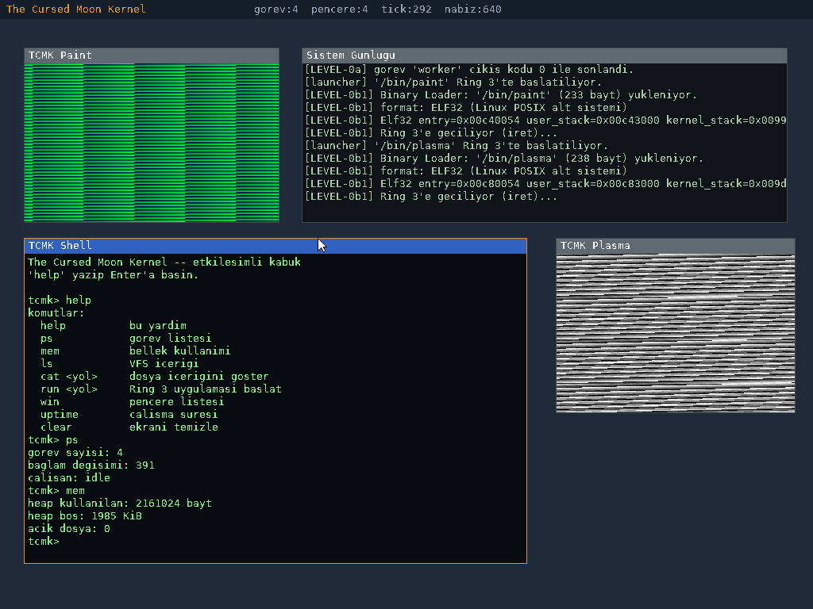

Ekranda gorunenler:

- **TCMK Paint** ve **TCMK Plasma** -- Ring 3'te calisan iki ayri **kullanici
  uygulamasi** (Rust ile yazildi, bkz. `userland-rs/`). Her biri kendi
  scheduler gorevinde kosar, kendi piksel tamponuna **dogrudan yazar**
  (cizim cekirdekten gecmez) ve `win_poll_key`/`mouse_state` ile olay okur.
  Paint fareyle gercekten cizim yapar:

  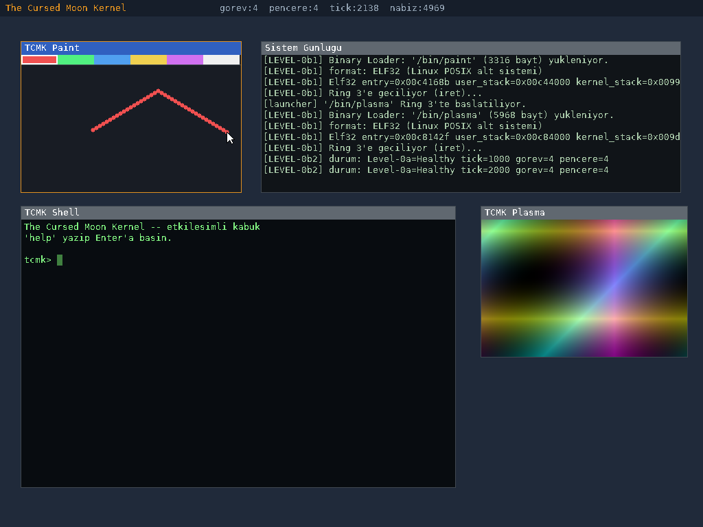
- **TCMK Shell** -- etkilesimli kabuk. Komutlar:

  | Grup | Komutlar |
  |---|---|
  | sistem | `ps` `top` `kill <id>` `signal <id> <sinyal>` `sigs` `svc` `health` `uptime` `date` `ver` |
  | Level-0b2 | `load` `ipc` `faults` `stall <sn>` |
  | bellek/disk | `mem` `disk` `df` `format onayla` `sync` `install onayla` |
  | dosya | `ls [dizin]` `mkdir <yol>` `rmdir <yol>` `cat <yol>` `save <yol> <metin>` `cp <kaynak> <hedef>` `mv <kaynak> <hedef>` `rm <yol>` |
  | uygulama/pencere | `apps` `run <ad> [argumanlar]` `win` `focus <id>` `mouse` |
  | uygulamalar (ELF) | `paint` `plasma` `notes` `menu` `twins` `relay` `echo2` `sigdemo` `race` `reaper` `redirect` `mux` `masked` `arena` `seeker` `browse` `waiter` `heir` `nested` `bequest` `probe` `crash` `hog` `spin` |
  | uygulamalar (PE) | `winclock` (ham `int 0x2E`) `winpad` `winfiles` `winenv` `winprobe` (IAT) -- i386'da PE32, x86_64'te PE32+ |
  | ortam | `cd [dizin]` `pwd` `env` `set AD=deger` `which <ad>` |
  | diger | `echo <metin>` `pipes` `clear` `help` |
- **Sistem Gunlugu** -- cekirdek kaydinin canli goruntusu (konsol halka
  tamponu her karede pencereye cizilir).
- Ust cubukta canli gorev/pencere/tick/nabiz sayaclari, altta fare imleci.

Pencereler baslik cubugundan **suruklenebilir**, tiklama ile one alinir ve
odak degistirir. Klavye odakli pencereye yonlendirilir.

### GUI sistem cagrilari

POSIX/NT'de karsiligi olmayan islevler icin `0x500+` araligi ayrildi:

| Numara | Cagri | Islev |
|---|---|---|
| 0x500 | `win_create(baslik, (x<<16)\|y, (w<<16)\|h)` | pencere ac |
| 0x501 | `win_buffer(id)` | piksel tamponunun adresi |
| 0x502 | `win_size(id)` | (genislik<<16)\|yukseklik |
| 0x503 | `win_flush(id)` | kareyi bitir, CPU'yu birak |
| 0x504 | `win_poll_key(id)` | bekleyen tus (0 = yok) |
| 0x505 | `mouse_state()` | fare konumu + tus durumu |
| 0x506 | `yield()` | CPU'yu birak (pencere gerektirmez) |
| 0x507 | `win_pos(id)` | (x<<16)\|y -- pencere suruklendiginde tazelenir |
| 0x508 | `sleep(ms)` | sureci uyut (zamanlayici hic secmez) |
| 0x509 | `execve(yol)` | surecin yerine baska bir program yukle |

Pencere tamponu **yalnizca sahibinin** adres uzayina eslenir (bkz. "Surec
basina adres uzayi"); uygulama piksellerini kendisi yazar, cekirdek
yalnizca kompozisyon yapar.

Windows uygulamalari ayni islevlere `int 0x2E` uzerinden, `NtUser*`/
`NtGdi*` adlariyla ve 0x2000 araligindan ulasir (bkz. "win32k: pencere
cagrilari icin ayri tablo"). Iki tablo da altta ayni `gui_api`'ye baglanir,
yani PE ve ELF uygulamalari **ayni pencere yoneticisini** paylasir.

## Desteklenen mimariler

| | i386 | x86_64 |
|---|---|---|
| Boot | Multiboot1 | Multiboot2 + Long Mode gecisi |
| Sayfalama | 2 seviye, 4 KiB, 4 MiB identity | 4 seviye, 2 MiB huge + 4 KiB split, 1 GiB identity |
| Linux syscall | `int 0x80` | `syscall` komutu (MSR: EFER/STAR/LSTAR/SFMASK) |
| Windows syscall | `int 0x2E` | `int 0x2E` (ayni vektor) |
| Ikili formatlar | ELF32 + PE32 | ELF64 + PE32+ |
| Ring 3 uygulamalari | Rust (ELF32) + Rust (PE32) | Rust (ELF64) + Rust (PE32+) |
| DLL thunk gelenegi | `__stdcall` (`ret imm16`) | Win64 (golge alan) |
| Surec modeli | fork / execve / waitpid / pipe | fork / execve / waitpid / pipe |
| Kesme denetleyici | PIC 8259A (slave 0x70) | PIC 8259A (slave 0x70) |

```
make ARCH=i386   run
make ARCH=x86_64 run
```

### x86_64 userland

`make userland-x86_64` ayni `userland-rs` kaynagini ELF64 olarak derler.
Uygulama kodunun tek satiri degismez; degisen yalnizca `sys.rs`'in icidir:

| | i386 | x86_64 |
|---|---|---|
| giris | `int 0x80` | `syscall` komutu |
| numara | EAX | RAX |
| arg1..3 | EBX/ECX/EDX | RDI/RSI/RDX |

Linux numaralari da mimariye gore ayrilir (`write` i386'da 4, x86_64'te
1) -- bunu tek kumeyle gecistirmek cekirdek tarafinda daha once gercek
bir hataya yol acmisti, o yuzden userland'de de ayri tutuluyor.

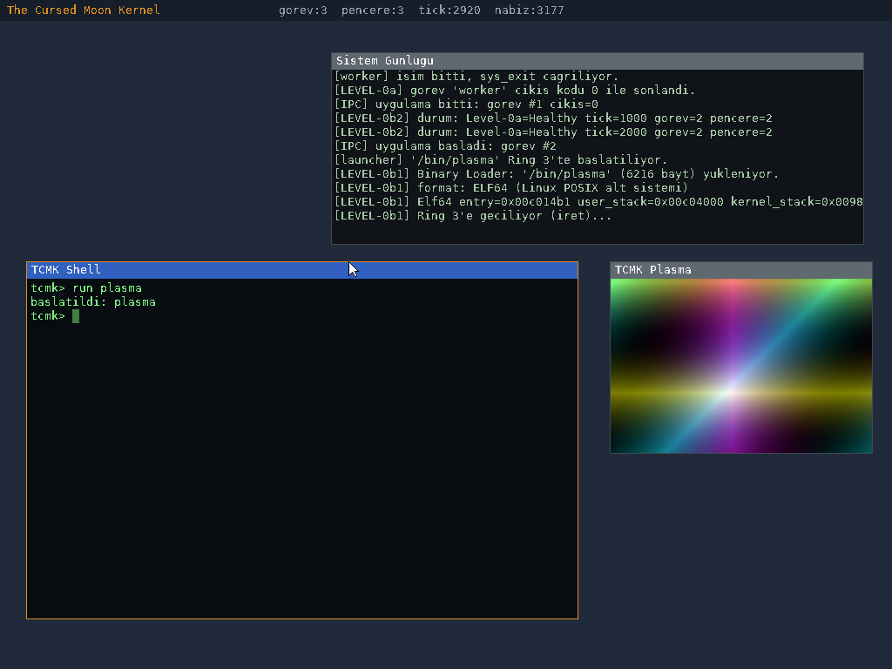

Ekrandaki Plasma bir **ELF64** ikilisidir, Ring 3'te kosar ve cizim
cagrilarini `syscall` ile yapar. Onceki durum yalnizca elle kodlanmis bir
"hello" idi; artik i386'daki uygulamalarin aynisi calisiyor.

### x86_64'te surec basina adres uzayi

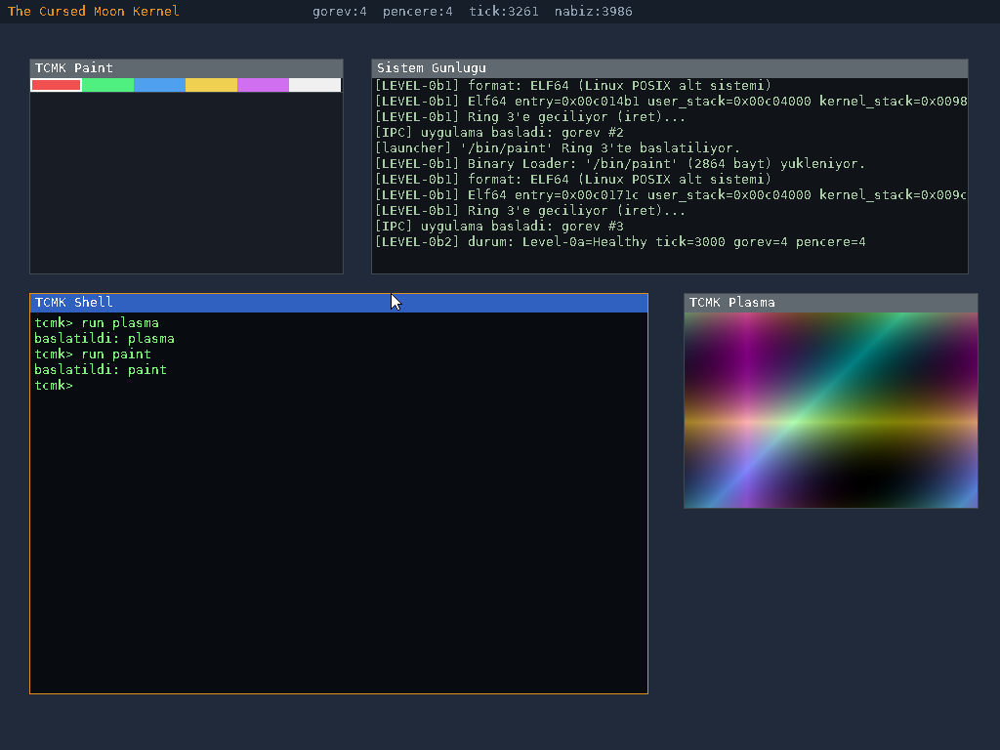

Artik x86_64'te de her surec kendi adres uzayini alir; iki uygulama ayni
anda kosabilir:

```
tcmk> ps
  id durum      ad         cagri  adres-uzayi
   2 uyuyor     plasma       735  0x01000000 (187 sayfa)
   3 uyuyor     paint        647  0x01085000 (191 sayfa)
```

Fikir i386'nin aynisi, bir seviye daha derinde: surec kendi
PML4/PDPT/PD ucusunu alir, **cekirdek girdileri kopyalanir** (heap,
cerceve havuzu ve LAPIC her uzayda gorunur kalir) ve yalnizca kullanici
bolgesini kaplayan PD girdileri surecin kendi sayfa tablolarina
yonlendirilir.

Kullanici bolgesi neden **iki** PD girdisi tutar: bir PD girdisi 2 MiB
kapsar. Program imaji 0x00C00000'da durur, ama pencere piksel tamponlari
0x00D00000'dan baslayip dort yuvayla 0x00F00000'a uzanir -- yani ikinci
girdiye tasar. i386'da bir PDE 4 MiB kapsadigi icin bu sorun hic
cikmamisti.

Uzay **kopyalanabildigi** icin (`clone_user_space`) `fork` ve `waitpid`
de x86_64'te calisir:

```
[LEVEL-0b1] fork: gorev #2 -> #3 (eip=0x00c01adb, 128 sayfa kopyalandi)
[twins] fork dondu: 3 -- ben ebeveyn
[twins] fork dondu: 0 -- ben cocuk
[twins] ebeveyn: cocuk 42 ile bitti.
```

Cocugu Ring 3'te canlandirmak icin `sysretq` degil **`iretq`** kullanilir:
`sysretq` RCX ve R11'i kendi sozlesmesi icin ister (donus RIP'i ve
RFLAGS), oysa `fork`'ta ikisi de geri yuklenmesi gereken gercek kullanici
degerleridir.

`execve` zaten mimariden bagimsizdi (0x500 araligindaki TCMK cagrilarindan
biri, `launcher` dongusune dayanir); yalnizca `menu` uygulamasi x86_64'e
derlenmedigi icin gosterilemiyordu:

```
[launcher] '/bin/menu' sonlandi.
[launcher] execve -> '/bin/plasma'
[launcher] '/bin/plasma' Ring 3'te baslatiliyor.
```

Hata izolasyonu da ayni: `run crash` sureci page fault alir, Level-0b2
onu sonlandirir, sistem calismaya devam eder.

Ortak katmanlar (`level0a`, `level0b1`, `level0b2`) **tek bir kod tabanidir**;
mimariye ozel her sey `arch/<arch>/`, `level0a/gdt/<arch>.rs`,
`level0a/idt/<arch>.rs` ve `level0a/core/mmu_<arch>.rs` icinde izole
(doc S.15 ilke 2). Ortak kod donanima her zaman `arch::cpu` uzerinden erisir.

## Gereksinimler

Once neyin eksik oldugunu sorun -- `make check` her araci, ne ise
yaradigini ve durumunu listeler:

```
$ make check
arac                 gerekli oldugu yer                      durum
-------------------- --------------------------------------- -----
cargo/rustc          cekirdek + userland derlemesi           var
rust-src             -Z build-std (core, compiler_builtins)  YOK
grub-mkrescue        make iso / run                          var
...
```

Debian/Ubuntu icin hepsi:

```
rustup toolchain install nightly --component rust-src,llvm-tools
sudo apt install qemu-system-x86 grub-pc-bin grub-common xorriso mtools
sudo apt install llvm            # llvm-dlltool: PE ithal kutuphaneleri
```

Her hedef **yalnizca kendi ihtiyacini** denetler: cekirdegi derlemek icin
QEMU ya da GRUB kurmaniz gerekmez, eksikse yalnizca `make iso`/`make run`
uyarir.

### Hangisi ne zaman gerekir

| arac | olmadan calismayan |
|---|---|
| `cargo` + **`rust-src`** | her sey (`make`) |
| `grub-mkrescue`, `xorriso`, `mtools` | `make iso`, `make run` |
| `qemu-system-i386` / `-x86_64` | `make run`, `make run-disk` |
| `python3` | `make disk`, `make userland-legacy` |
| `llvm-dlltool` | `make userland-win`, `make userland-win64` |

**En sik takilan yer `rust-src`.** Cekirdek `-Z build-std` ile `core` ve
`compiler_builtins`'i **kaynaktan** derler; bilesen yoksa hata
"can't find crate for `core`" olur ve gercek neden hic gorunmez. Bu
yuzden `make` bunu onceden denetleyip acikca soyler.

### Nightly sart, ve bunu yalnizca rustup uygular

Cekirdek stable ile **derlenemez**: ozel JSON hedefleri, `-Z build-std`
ve `abi_x86_interrupt` gibi kararsiz ozellikler kullanir; hicbirinin
stable karsiligi yoktur.

`rust-toolchain.toml` nightly'yi zaten secer -- ama o dosyayi **yalnizca
rustup** uygular. Dagitim paketinden gelen cargo (Arch'ta `rust`,
Debian'da `cargo`) onu yok sayar ve stable ile derlemeye calisir:

```
error: the `-Z` flag is only accepted on the nightly channel of Cargo,
       but this is the `stable` channel
```

En sinsi hali, rustup'in **kurulu oldugu** ama PATH'te dagitim
cargo'sunun once geldigi durumdur: `rustup` calisir, `rustup toolchain
list` nightly'yi gosterir, yine de derleme stable ile denenir. Cozum
PATH sirasi:

```
export PATH="$HOME/.cargo/bin:$PATH"
```

Arch'ta dagitim paketini kaldirmak da cozumdur:

```
sudo pacman -S rustup && sudo pacman -Rs rust
rustup toolchain install nightly --component rust-src,llvm-tools
```

`make check` bunu ayri bir satirda gosterir (`cargo NIGHTLY mi`), ve
derleme hedefleri baslamadan once acikca uyarir.

### Nightly kaymasi

Kanal sabit bir tarih degil `nightly` oldugu icin arac zinciri zamanla
degisir ve kararsiz ozellikler kural degistirebilir. Simdiye kadar
yasanan bir ornek: JSON hedef tanimlari 2026 ortasinda acik bir bayrak
istemeye basladi.

```
error: `.json` target specs require -Zjson-target-spec to be added
       to the cargo invocation
```

Makefile bu bayragi zaten veriyor. Bir gun kararli hale gelip `-Z`
listesinden cikarsa kapatmak icin:

```
make JSON_TARGET_FLAG=
```

`make info` hangi bayragin ve hangi cargo surumunun kullanildigini
yazar -- bu tur bir sorunda ilk bakilacak yer orasidir.

### Derlenmis ikililer depoda hazir gelir

`userland/*.elf`, `*.elf64` ve `*.exe` surumlenmis durumda; cekirdek
onlari `include_bytes!` ile gomer. Yani **`make userland` calistirmaniz
gerekmez** -- yalnizca uygulama kaynagini degistirdiyseniz gerekir, ve o
zaman `llvm-dlltool` istenir.

### Platform

`make` ve `make ARCH=x86_64` (cekirdek derlemesi) Rust'in calistigi her
yerde calisir. `make iso` **Linux'a ozgudur**: `grub-mkrescue` macOS ve
Windows'ta yoktur. macOS/Windows'ta ISO uretmek icin bir Linux konteyneri
ya da WSL kullanin.

Windows tarafi icin **hicbir Windows arac zinciri gerekmez**: `rust-lld`
zaten PE32/PE32+ uretebiliyor, `llvm-dlltool` da ithal kutuphanelerini
`.def`'ten olusturuyor.

## Derleme / ISO / Calistirma

```
make ARCH=i386       # cargo build (freestanding, custom i686-tcmk target)
make iso             # grub-mkrescue ile bootable ISO
make run             # ISO'dan calistir (CD-ROM)
make bootloader      # iki asamali TCMK onyukleyicisi (duz ikili)
make disk            # kalici TCMKFS bolumu + onyukleyici olan disk imaji
make run-disk        # DISKTEN acilis (CD yok) -- kalicilik boyle dogrulanir
make info            # secili ayarlari yazdirir
make check           # gereken araclari ve eksikleri listeler
```

## Faz 1 Dogrulama Listesi

QEMU'da (`make run`, veya headless `qemu-system-i386 -cdrom build/tcmk.iso
-serial stdio -display none`) su bes madde dogrulandi:

1. ✅ GRUB menusunden cekirdek yuklenir (Multiboot1).
2. ✅ Ekranda/seri portta `[LEVEL-0b2] Central Controller: Active` gorunur.
3. ✅ Klavyeden basilan tuslar ekrana/seri porta yazilir (QMP `send-key` ile
   dogrulandi).
4. ✅ Cekirdegin kendi tetikledigi `int 0x80` self-test'i sonucu
   `[LEVEL-0b2] Dispatcher: syscall vektoru 0x80 alindi ...` mesaji gorunur.
5. ✅ **Heartbeat/Fallback:** `kernel/src/level0a/idt.rs` icindeki
   `pit_handler`'da `pit::on_tick()` cagrisi gecici olarak yorum satirina
   alinip yeniden derlendiginde, ~5 saniye sonra State Monitor Level-0a'yi
   "olu" sayip Fallback Interface'i tetikliyor
   (`Level-0a YANIT VERMIYOR (heartbeat kayboldu)` mesaji).

## Faz 2 Dogrulama Listesi

`make run` ciktisinda:

1. ✅ **Sayfalama:** `paging=acik identity=4 MiB` -- 0-4 MiB identity map,
   CR0.PG acik (kernel@1M, heap@2M, VGA@0xB8000 hepsi bu araliktadir).
2. ✅ **kmalloc:** 1 MiB bump heap (0x00200000-0x002FFFFF); worker gorevinin
   16 KiB yigini buradan tahsis edilir.
3. ✅ **Scheduler:** idle + worker arasinda round-robin gecis
   (`gecis=` sayaci artar); `sys_exit` sonrasi worker `Terminated` olur ve
   bir daha secilmez.
4. ✅ **Tam syscall zinciri:** worker'in `int 0x80`'i
   Level-0b2 dispatcher -> Level-0b1 POSIX -> Level-0a `kernel_api`
   yolunu izler; `sys_write` 38 bayt doner, gecersiz fd `-9` (-EBADF) doner,
   `sys_exit` gorevi sonlandirir.
5. ✅ **Servis yonetimi:** `vmm`, `kmalloc`, `scheduler` servisleri
   `[ACTIVE]` olarak raporlanir (systemd-benzeri kayit tablosu).
6. ✅ **Co-Service / Hata Toleransi:** scheduler durursa (nabiz=0) State
   Monitor Level-0a'yi `Dead` isaretler; syscall'lar Level-0b1'e HIC
   ugramadan Fallback Interface'in `emulate_syscall`'ina duser ve
   `[co-service]` onekiyle islenmeye devam eder -- sistem ayakta kalir.

## Faz 3 / Faz 5 Dogrulama Listesi

1. ✅ **Ring 3 gercekten CPL=3:** `qemu -d int` ciktisi
   `v=80 cpl=3 IP=001b:00300068 SP=0023:...` -- CS=0x1B (user code, RPL 3),
   SS=0x23, kullanici yigininda.
2. ✅ **ELF32 yukleme:** `/bin/hello` VFS'ten okunur, PT_LOAD segmenti
   kullanici bolgesine kopyalanir, `.bss` sifirlanir.
3. ✅ **Sayfa izolasyonu:** `user@0x300000=true`, `kernel@0x100000=false`,
   `heap@0x200000=false` -- Ring 3 cekirdek belleğine erisemez.
4. ✅ **POSIX dosya zinciri:** Ring 3 programi `sys_open("/boot/msg.txt")`
   -> `sys_read` -> `sys_write(stdout)` -> `sys_close` -> `sys_brk` ->
   `sys_exit` yapar; dosya icerigi ekrana basilir.
5. ✅ **FD sizintisi yok:** `sys_exit` sonrasi acik tanimlayici sayisi 0.
6. ✅ **Guvenlik:** `sys_open`'a cekirdek isaretcisi verilirse `-EFAULT`
   (-14) doner -- kullanici alanindan gelen her isaretci
   `mmu::is_user_accessible` ile dogrulanir.

### Faz 2 manuel testi (Co-Service)

`scheduler.rs::yield_now` icindeki `pit::beat()` cagrisini yorum satirina
alip yeniden derleyin: ~5 saniye sonra Level-0a `Dead` olur ve syscall'lar
`[co-service]` onekiyle Fallback tarafindan islenmeye baslar.

## Bilinen Tuzaklar (debugging notlari)

Faz 1 gelistirilirken iki kritik hataya rastlandi; ileride x86_64/AArch64
portlarinda benzer tuzaklara dikkat:

- **`mov esp, stack_top` bir BELLEK DEREFERANSIDIR, adres yuklemesi degil.**
  LLVM'in Intel-syntax `global_asm!`'inde bare bir sembol adi `mov reg, sembol`
  seklinde kullanilirsa, sembolun ADRESI degil, o ADRESTEKI DEGER yuklenir.
  Sonuc: `esp` rastgele/ROM-shadow bolgesine (`0xFFFFFFxx`) isaret eder ve ilk
  `push`/`pop`'ta sessizce her seyi bozar (triple fault'a kadar fark
  edilmeyebilir). **Dogrusu:** `lea esp, [stack_top]`.
- **Bootloader'in IF=0 birakacagina guvenilmemeli.** Kesmeler IDT/PIC hazir
  olmadan asla kabul edilmemeli; `kernel_main`'in ilk satiri kosulsuz
  `disable_interrupts()` olmalidir (bkz. `main.rs`).
- Yukaridaki stack hatasi aktifken belirti, VGA ekraninin TAMAMEN
  `0xFE` (gecersiz karakter placeholder'i) ile dolmasiydi -- `write_str`'in
  filtre mantigi dogruydu, ama bozuk `esp` yuzunden `pushf`/`pop` ile
  kaydedilen "kesme durumu" ROM-shadow bolgesinden okunan rastgele/kod
  baytlariydi. Boyle bir belirti gorulurse once ESP/stack kurulumunu
  supheli goruntuleyin.
- **Heartbeat "gecis sayisi" degil, "dongu ilerliyor mu" olcmelidir.**
  Faz 2'de nabiz once yalnizca baglam DEGISIMINDE artiriliyordu; worker
  bitip geriye tek basina idle kalinca gecis olmadigi icin nabiz durdu ve
  Fallback tamamen saglikli bir sistemde yanlislikla devreye girdi. Dogrusu:
  `yield_now`'un basinda, erken donusten once `beat()`.
- `extern "x86-interrupt"` syscall girisi icin YETERSIZDIR: Linux ABI'si
  numara/argumanlari registerlarda tasir, o ABI ise registerlara erisim
  vermez. int 0x80 girisi `pusha` + frame isaretcisi ile elle yazilmalidir
  (bkz. `level0a/idt/i386.rs::syscall_entry`).

Faz 4 (x86_64) sirasinda cikan uc hata:

- **Linux syscall numaralari mimariye gore DEGISIR.** i386'da `write`=4,
  `exit`=1; x86_64'te `write`=1, `exit`=60. Tek kumeyle gecistirilince
  x86_64 userland `write`(=1) cagirdi, cekirdek bunu i386'nin `exit`'i
  sandi ve programi "cikis kodu 1" ile sonlandirdi -- program hicbir sey
  yazmadan "basariyla" bitmis gibi gorundu.
- **`syscall` komutu Ring 0'dan cagrilamaz.** Donusu `sysretq`'tir ve
  `sysretq` HER ZAMAN Ring 3'e doner; Ring 0'daki bir cagiran kendini
  Ring 3'te bulur. Cekirdek ici `syscall3` yardimcisi bu yuzden x86_64'te
  de `int 0x80` kullanir (bkz. `arch/x86_64/mod.rs`).
- **Boot stub'inda User biti dagitmayin.** Long Mode'a gecerken kurulan
  2 MiB'lik identity girdilerine User biti konursa cekirdegin TAMAMI
  Ring 3'e acilir. Dogrusu: bit verilmez, kullanici bolgesi sonradan
  `mmu::protect_user_range` ile ilgili 2 MiB girdisi 4 KiB'lik tabloya
  bolunerek sayfa sayfa acilir (ayni 2 MiB'i paylasan cekirdek heap'i
  boylece kapali kalir).

## Neden Rust, neden bu araclar

- Multiboot1 basligi ve `_start` giris kodu `global_asm!` ile Rust icinde
  yazildi (NASM'e gerek kalmadi).
- GDT/IDT tamamen elle yazildi (harici crate yok); `x86-interrupt` ABI
  (nightly `abi_x86_interrupt` feature) IRQ/exception/syscall handler'lari
  icin kullanildi.
- `grub-mkrescue` + `xorriso` + `qemu-system-i386` orijinal C projesindeki
  gibi aynen korunuyor.
- Tum `println!` ciktisi VGA'nin yaninda COM1 (0x3F8) seri porta da
  yansitilir, boylece `-serial stdio` ile GUI olmadan da dogrulanabilir.

## Cift Uyumluluk (projenin cekirdek vaadi)

Ayni cekirdek, ayni Ring 3 ortami, iki farkli isletim sistemi ikilisi.
`make run` ciktisindan:

```
[LEVEL-0b1] VFS'ten yukleniyor: /bin/hello
[LEVEL-0b1] format: ELF32 (Linux POSIX alt sistemi)
Hello from Ring 3 userland!
/boot/msg.txt: VFS uzerinden okundu (RAMFS).

[LEVEL-0b1] VFS'ten yukleniyor: /bin/hello.exe
[LEVEL-0b1] format: PE32 (Windows NT alt sistemi)
Hello from Ring 3 PE (Windows NT uyumluluk katmani)!
/boot/msg.txt: VFS uzerinden okundu (RAMFS).
```

Iki program da **ayni dosyayi ayni VFS uzerinden** okur; tek fark
Level-0b1'deki cevirmendir:

| | Linux ikilisi | Windows ikilisi |
|---|---|---|
| Format | ELF32 | PE32 (`.reloc` ile) |
| Kesme | `int 0x80` (vektor 128) | `int 0x2E` (vektor 46) |
| ABI | EAX=numara, EBX/ECX/EDX=arg | EAX=servis, EBX/ECX/EDX=arg |
| Cevirmen | `linux_subsystem::posix_syscalls` | `nt_subsystem::nt_syscalls` |
| Hata kodu | negatif errno (`-EBADF`) | NTSTATUS (`0xC0000008`) |
| Ortak hedef | `level0a::kernel_api` | `level0a::kernel_api` |

`qemu -d int` ile dogrulanmis Ring 3 kaniti:

```
v=80 cpl=3 IP=001b:00300068  EAX=00000004   (POSIX sys_write)
v=2e cpl=3 IP=001b:00301014  EAX=00001001   (NT NtWriteConsole)
```

PE ikilisinin `ImageBase`'i 0x00400000, cekirdek onu 0x00300000'e
yukluyor; IP'nin 0x00301014 olmasi taban yeniden yerlesiminin (`.reloc`)
gercekten uygulandigini gosterir.

### Derlenmis bir Windows uygulamasi: `winclock.exe`

Yukaridaki `hello.exe` elle kodlanmis, tek bolumlu bir PE'dir --
yukleyicinin dogrulugunu kanitlar ama "Windows uygulamasi yazilabiliyor"
demez. Bu yuzden TCMK artik **gercek bir derleyiciyle uretilmis** PE32
GUI uygulamasi da tasiyor:

```
make userland-win     # -> userland/winclock.exe   (PE32)
make userland-win64   # -> userland/winclock.exe64 (PE32+)
```

`rust-lld`'nin `msvc-lld` kipi COFF/PE uretebildigi icin bunun icin
**Windows arac zinciri gerekmez**: `targets/i686-tcmk-win.json` hedefi
`/subsystem:console`, `/base:0x00400000` ve `/fixed:no` ile linkler.
Sonuc, `file` komutunun tanidigi sahici bir ikilidir:

```
winclock.exe: PE32 executable (console) Intel 80386, for MS Windows, 4 sections
  .text  vaddr=0x1000   .rdata vaddr=0x3000
  .eh_fram vaddr=0x4000 .reloc vaddr=0x5000  (104 bayt, derleyici uretimi)
```

`.reloc` bolumunun **derleyici tarafindan** uretilmis olmasi onemli:
yukleyicinin yeniden yerlesim motoru artik elle yazilmis bir tabloyla
degil, gercek bir linker'in ciktisiyla sinaniyor.

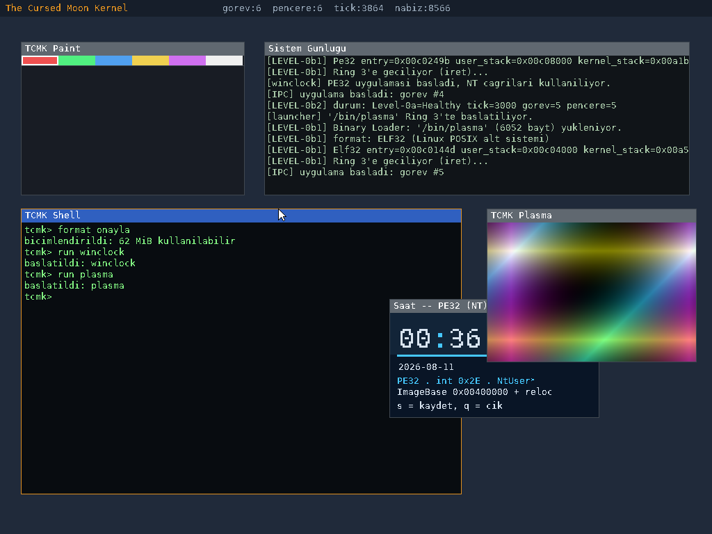

Ekranda solda ELF32 uygulamalari (Paint, Plasma, Shell), sagda PE32
uygulamasi. Sistem gunlugunde iki yukleyici arka arkaya gorunur:

```
[LEVEL-0b1] Pe32  entry=0x00c0249b  user_stack=0x00c08000
[LEVEL-0b1] Elf32 entry=0x00c0144d  user_stack=0x00c04000
```

Windows uygulamasi burada bir uyumluluk katmaninin konugu degil,
cekirdegin **birinci sinif surecidir**: kendi adres uzayi (`ps` ciktisinda
kendi CR3'u), kendi pencere tamponu ve zamanlayicida esit hakki vardir.

### win32k: pencere cagrilari icin ayri tablo

Windows'ta sistem cagrilari tek bir tabloda degildir -- cekirdek
yurutucusu (`ntoskrnl`, `Nt*`) ile pencere/cizim cagrilari
(`win32k.sys`, `NtUser*`/`NtGdi*`) ayrilir ve **donus sozlesmeleri de
farklidir**. TCMK bu ayrimi korur:

| Aralik | Tablo | Donus | Ornekler |
|---|---|---|---|
| 0x1000+ | yurutucu | NTSTATUS | `NtCreateFile` `NtWriteFile` `NtQuerySystemTime` `NtDelayExecution` |
| 0x2000+ | win32k | tutamac/deger | `NtUserCreateWindowEx` `NtGdiGetBits` `NtUserGetMessage` |

Yani pencere acan cagri NTSTATUS degil **HWND** dondurur -- bir Windows
programcisinin bekledigi anlam degismez. Iki tablo da altta Level-0a'nin
ayni `gui_api`/`kernel_api`'sine baglanir; POSIX tarafiyla paylasilan sey
tam olarak burasidir.

`winclock.exe` diske de yazar ve bunu yalnizca NT cagrilariyla yapar
(`NtCreateFile(FILE_CREATE)` -> `NtWriteFile` -> `NtClose`). Yazdigi
dosya, makine kapatilip yeniden acildiktan sonra kabuktan okunabiliyor:

```
tcmk> ls
  disk  /clock.txt                18 bayt  2026-08-11 00:37
tcmk> cat /clock.txt
26-08-11 00:37:15
```

TCMKFS dosyanin hangi ABI'den geldigini bilmez; Level-0b1'de ayrisan iki
dunya Level-0a'da tek bir dosya sisteminde bulusur.

### Ithal tablosu: `KERNEL32.dll` (Faz 7b)

Yukaridaki iki PE de sistem cagrilarini **elle** yapiyor (`int 0x2E`).
Gercek bir Windows programi bunu asla yapmaz: `WriteConsoleA` cagirir,
cagri `KERNEL32.dll`'in **ithal tablosu** (IAT) uzerinden cozulur. Ithal
tablosunu cozmeyen bir cekirdek, derleyicinin urettigi siradan hicbir
Windows ikilisini calistiramaz -- bu yuzden Faz 7b, "Wine'in yapamadigini
yapmak" iddiasinin gercek esigidir.

**Cozum: DLL'i yuklerken var et.** Diskte `KERNEL32.dll` diye bir dosya
yok ve olmasi da gerekmiyor. Yukleyici ithal edilen her fonksiyon icin
**surecin kendi adres uzayina** kucuk bir thunk yazar ve IAT girdisini
oraya yonlendirir:

```
    mov eax, <servis numarasi>
    lea edx, [esp+4]          ; cagiranin yigin argumanlarina isaretci
    int 0x2E
    ret <bayt>                ; stdcall: yigini cagirilan temizler
```

`EDX = arguman blogu` sozlesmesi Windows'un kendi secimidir (gercek NT
stub'i `mov edx, esp; sysenter` yapar) ve onemli bir sey saglar:
**parametre sayisi sinirsizdir**. Uc registere sigdirma zorunlulugu
olsaydi `CreateFileA`'nin yedi parametresi ya da `WriteConsoleA`'nin
*cikti* parametresi desteklenemezdi. Su an cozulen adlar:

| DLL | Ihracatlar |
|---|---|
| `KERNEL32.dll` | `ExitProcess` `Sleep` `GetTickCount` `CloseHandle` `WriteConsoleA` `CreateFileA` `ReadFile` |
| `TCMKGUI.dll` | `TcmkCreateWindow` `TcmkGetWindowBits` `TcmkGetClientRect` `TcmkGetWindowRect` `TcmkUpdateWindow` `TcmkGetMessage` `TcmkGetCursorPos` |

`KERNEL32.dll` adlari ve **parametre sayilari gercek Win32 imzalarinin
aynisidir**. GUI tarafi bilerek `Tcmk` onekli: `CreateWindowExA` on iki
parametre alir ve bir pencere sinifi + `WndProc` bekler; TCMK'de pencere
sinifi yoktur. Gercek adi farkli bir imzayla ihrac etmek yaniltici
olurdu.

Ikili tarafta ortada gercek bir DLL yok; `llvm-dlltool` ile
`userland-rs/win/*.def`'ten uretilen **ithal kutuphaneleri** yalnizca
baglayiciya "bu adlar `KERNEL32.dll`'den gelecek" demenin bicimsel
yoludur. Sonuc, ikilinin icinde sahici bir ithal tablosudur:

```
DLL: KERNEL32.dll   INT=0x38ac IAT=0x38dc
    CloseHandle  CreateFileA  ReadFile  Sleep  WriteConsoleA
DLL: TCMKGUI.dll   INT=0x38c4 IAT=0x38f4
    TcmkCreateWindow  TcmkGetClientRect  TcmkGetMessage ...
```

Acilista cekirdek bunlari cozer:

```
[LEVEL-0b1] PE ithal: KERNEL32.dll -- 7 fonksiyon baglandi.
[LEVEL-0b1] PE ithal: TCMKGUI.dll -- 5 fonksiyon baglandi.
[winpad] IAT uzerinden KERNEL32.dll + TCMKGUI.dll kullaniliyor.
```

`winpad` (`userland-rs/src/win/notepad.rs`) bunun gosterimidir: **tek bir
elle yazilmis sistem cagrisi icermez**. Pencereyi `TcmkCreateWindow` acar,
tuslari `TcmkGetMessage` okur, notu `CreateFileA` + `WriteConsoleA`
yazar, acilista `ReadFile` geri okur, cikisi `ExitProcess` yapar.
Yazilan not makine kapatilip acildiktan sonra yerindedir.

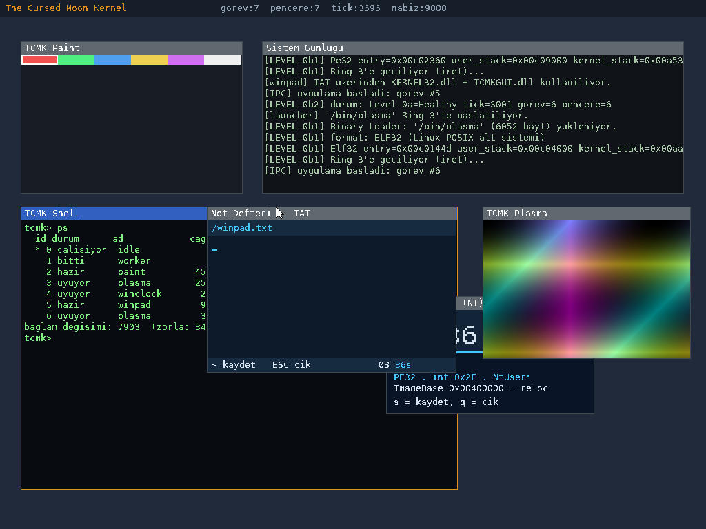

`ps` ciktisinda yedi gorev var: iki **PE32** (`winclock` ham `int 0x2E`,
`winpad` ithal tablosu uzerinden) ve uc **ELF32** uygulama, hepsi ayni
zamanlayicida, ayni pencere yoneticisinde, her biri kendi adres uzayinda.

Cozulemeyen bir ad surecin baslatilmamasina yol acar -- Windows'un
"The procedure entry point could not be located" davranisinin karsiligi:

```
[LEVEL-0b1] PE ithal: KERNEL32.dll!HeapAlloc bulunamadi -- surec baslatilmiyor.
```

#### Ordinal ile ithal (Faz 7c)

Bazi DLL'ler fonksiyonlari **adsiz**, yalnizca sira numarasiyla ihrac
eder; o zaman ikilide ad hic gecmez ve IAT girdisinin ust biti isaretli
olur. Gomulu tablo bu yuzden ada ek olarak bir de ordinal tasir ve
numaralar `userland-rs/win/*.def` icinde **acikca** verilmistir -- iki
taraf birbirinden bagimsiz kaymasin diye.

`GetTickCount` bilerek `NONAME` olarak ihrac ediliyor, boylece her
derlemede ordinal yolu da sinaniyor:

```
KERNEL32.dll
    CloseHandle  CreateFileA  ExitProcess  [ordinal] #3  ReadFile ...
```

```
[LEVEL-0b1] PE ithal: KERNEL32.dll -- 7 fonksiyon baglandi (1 ordinal ile).
```

Ekranin alt cubugundaki calisma suresi bu cagriyla geliyor -- yani
ordinal yolu yalnizca cozulmuyor, gercekten kullaniliyor.

### PE32+ : ayni ikili, 64 bit

`make ARCH=x86_64` ile ayni iki uygulama **PE32+** olarak da derlenir ve
ayni cekirdek tarafindan yuklenir:

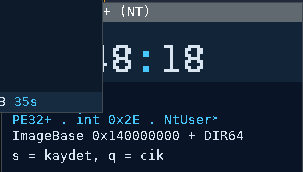

Bicim adi "PE32+"tir, "PE64" degil: dosya duzeni buyuk olcude aynidir,
degisen yalnizca isaretci genisligine bagli alanlardir.

| | PE32 | PE32+ |
|---|---|---|
| optional header magic | `0x010B` | `0x020B` |
| `BaseOfData` alani | var | **yok** |
| `ImageBase` | u32 | u64 |
| veri dizinleri nerede | `opt+96` | `opt+112` |
| yeniden yerlesim turu | `HIGHLOW` (3) | `DIR64` (10) |
| ordinal isareti | `1 << 31` | `1 << 63` |
| IAT yuvasi | 4 bayt | 8 bayt |

`BaseOfData`'nin kaybolmasiyla `ImageBase`'in 8 bayta cikmasi birbirini
goturur; dizinlere kadar olan fark tam 16 bayttir. Bu sayiyi yanlis
almak **sessiz** bir hatadir: dizin RVA'lari sifir gorunur, program
ithalsiz sanilir ve ilk `call [IAT]`'te cakar.

Taban 0x140000000 secilir (64-bit Windows gelenegi) -- kullanici
bolgesinin cok uzerinde, yani yeniden yerlesim burada **zorunludur** ve
her derlemede sinanir.

#### Win64 thunk: golge alan hilesi

Ithal edilen fonksiyonlar icin uretilen thunk'ta i386 ile gercek bir
ayrim var. Win64'te ilk dort arguman registerdadir (RCX, RDX, R8, R9);
cekirdegin "argumanlar tek blokta" sozlesmesi boylece bozulur -- ta ki
Win64'un kendi kurali kullanilana kadar:

> Cagiran, register argumanlari icin de yiginda 32 baytlik yer (**golge
> alan**) ayirmak zorundadir.

O alan tam olarak register argumanlarinin dokulecegi yerdir ve besinci
argumanin hemen oncesindedir. Dort registeri oraya dokmek butun
argumanlari kesintisiz tek bir diziye cevirir:

```asm
    mov [rsp+8],  rcx        ; arg1  \
    mov [rsp+16], rdx        ; arg2   |  golge alan -- cagiran ayirdi
    mov [rsp+24], r8         ; arg3   |
    mov [rsp+32], r9         ; arg4  /
    mov eax, <servis>
    lea rdx, [rsp+8]         ; arg5, arg6... zaten [rsp+40]'tan devam eder
    int 0x2E
    ret                      ; Win64: yigini CAGIRAN temizler
```

Bunun dogrulugu `winpad`'in kaydetme yolunda sinaniyor: `CreateFileA`
**yedi** parametre alir, yani son ucu golge alanin otesinden gelir.
Diske yazilan not geri okunabiliyorsa thunk butun listeyi dogru
tasimistir:

```
tcmk> cat /winpad.txt
pe32 plus calisiyor
```

#### Yakalanan hata: yanlis servis numarasi

Bu is sirasinda gomulu tabloda gercek bir hata cikti: `ExitProcess`,
0x3000 araligindaki `NT_EXIT_PROCESS_W32` yerine 0x1000 araligindaki
`NtTerminateProcess`'e baglanmisti. Ikisinin **cagri sozlesmesi
farklidir** -- ilki cikis kodunu thunk'in kurdugu yigin blogundan,
ikincisi ECX/RCX'ten okur. Sonuc: IAT uzerinden `ExitProcess(0)` cagiran
bir program, o an ECX'te ne varsa onunla cikiyordu (pratikte bir
isaretci: `cikis kodu 12595365`). Iki mimaride de ayni sekilde
gorulduyse de belirtisi yalnizca cikis kodundaydi, bu yuzden uzun sure
fark edilmemisti.

## Level-1: Rust userland (`userland-rs/`)

Ring 3 uygulamalari artik **Rust ile yaziliyor**. `userland-rs` ayri bir
`no_std` crate'tir ve `tcmk` adinda kucuk bir TCMK libc'si sunar
(doc S.2.3'teki "libc / win32_api" ayagi):

| Modul | Icerik |
|---|---|
| `tcmk::sys` | ham `int 0x80` sarmalayicilari + syscall numaralari |
| `tcmk::io` | `print!`/`println!`, `File` (RAII: `Drop` ile `close`) |
| `tcmk::gui` | `Window` (piksel tamponu, `fill`/`disc`/`put`), `mouse()` |
| `tcmk::entry!` | `_start` uretir, `main` dondugunde `exit(0)` cagirir |

Bir uygulama artik siradan Rust'tir:

```rust
#![no_std]
#![no_main]
tcmk::entry!(main);

fn main() {
    let mut win = tcmk::gui::Window::open("Ornek", 30, 60, 320, 200).unwrap();
    loop {
        win.clear(0x0010_2030);
        if win.poll_key() == b'q' { break; }
        win.flush();
    }
}
```

**Baglama.** Taban adres `cargo rustc ... -- -C link-arg=--image-base=`
ile **yalnizca ikili hedefe** verilir; kutuphane ve `core` bir kez
derlenir.

**Slot modeli kaldirildi.** Surec basina adres uzayindan sonra tum
uygulamalar ayni tabana (`0x00C00000`) linkleniyor:

```
cargo rustc --release --bin paint -- -C link-arg=--image-base=0x00C00000
```

`rust-lld` `ET_EXEC`/`EM_386` uretir; Level-0b1'in ELF32 yukleyicisi bu
ikilileri hicbir degisiklik olmadan yukler.

### Tek kutuphane, iki ABI

`tcmk` kutuphanesi hem ELF hem PE uygulamalarina hizmet eder; hangi
tarafta oldugunu **hedef** belirler (`lib.rs` icinde `cfg(target_os)`):

| | ELF (`i686-tcmk`) | PE (`i686-tcmk-win`) |
|---|---|---|
| sistem cagrisi | `int 0x80` -- `sys` | `int 0x2E` -- `nt`, ya da **IAT** -- `winapi` |
| pencere | `gui::Window` | `win32::Hwnd` / `winapi::Window` |
| konsol | `io::Stdout` | `win32::Console` / `winapi::Console` |
| cikis | `sys_exit` | `NtTerminateProcess` / `ExitProcess` |
| **cizim** | `canvas::Canvas` | `canvas::Canvas` |

PE tarafinda iki secenek var: `win32` sistem cagrilarini elle yapar,
`winapi` ise onlari `KERNEL32.dll`/`TCMKGUI.dll`'den **ithal eder**.
Ikincisi gercek bir Windows programinin yaptigidir (bkz. "Ithal
tablosu").

Son satir kasitli: cizim kodu **ortaktir**. `Window` da `Hwnd` de ayni
`Canvas`'a `Deref` eder, yani `win.text(...)`, `win.fill(...)`,
`win.glyph_scaled(...)` iki tarafta ayni fonksiyonlardir. Bir uygulamayi
Windows ikilisi olarak derlemek cizim kodunun tek satirini degistirmez --
ayrisma yalnizca pencere acan ve olay okuyan cagrilarda olur, ki bu da
zaten Level-0b1'in var olma sebebidir.

Kaynak duzeni bu ayrimi yansitir: `src/bin/` ELF uygulamalari (kendiliginden
bulunur), `src/win/` PE uygulamalari (Cargo.toml'da bildirilir).

### Userland ikililerini yeniden uretme

```
make userland          # hepsi
make userland-rust     # ELF32 uygulamalari (src/bin/)
make userland-x86_64   # ayni kaynak, ELF64
make userland-win      # PE32 uygulamalari (src/win/)
make userland-win64    # ayni kaynak, PE32+
make userland-legacy   # elle uretilen en kucuk PE32/ELF64
python3 tools/gen_font.py   # 8x16 bitmap fontu yeniden uret
```

## Level-0b2: Merkezi Denetleyici (ayirt edici ozellikler)

TCMK'yi siradan bir cekirdekten ayiran sey, **her cagrinin tek bir
denetim noktasindan gecmesidir** (doc S.2.2.A "Trafik Polisi"). Bu tek
nokta uc gercek islev sagliyor:

### 1. Yuk Dengeleyici -- olcum + geri baski

Her sistem cagrisi bir **kanala** ve bir **goreve** yazilir; pencere
saniyede bir devrilir ve hizlar hesaplanir.

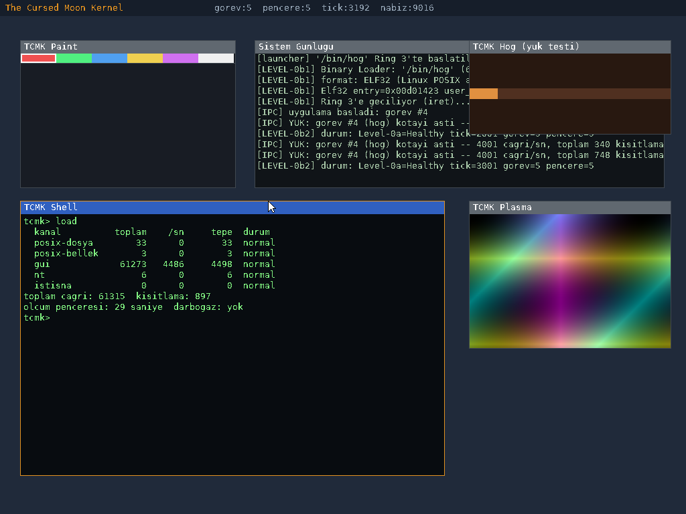

```
tcmk> load
  kanal          toplam    /sn     tepe  durum
  posix-dosya        33      0       33  normal
  posix-bellek        3      0        3  normal
  gui             61273   4486     4498  normal
  nt                  6      0        6  normal
  istisna             0      0        0  normal
toplam cagri: 61315  kisitlama: 897
```

**Neden hala gerekli:** preemption CPU'yu adil bolusturur ama **cagri
hacmini** sinirlamaz. Saniyede on binlerce syscall yapan bir uygulama,
zaman dilimini asmasa bile VFS'i, kompozitoru ve disk yolunu bogar.
Yuk Dengeleyici darbogazi kanal bazinda gorunur kilar ve kotayi asan
gorevi geri baskiya alir.

Bir gorev pencere kotasini (`4000 cagri/sn`) asarsa Dispatcher cagriyi
**islemeden once** o goreve `yield` ettirir. Cagri kaybolmaz, sirasini
bekler.

Kanit: `run hog` -- kasten acgozlu bir test uygulamasi
(`userland-rs/src/bin/hog.rs`). Ekran goruntusunde hog 4486 cagri/sn ile
kosarken kabuk yanit veriyor, Plasma animasyonu suruyor:

```
tcmk> top
  id ad            cagri/sn   kisitlama
   2 paint              243           0
   3 plasma             162           0
   4 hog               4081        1121
```

Normal uygulamalar kotanin cok altinda kalir; yalnizca gercekten donen
bir dongu kisitlanir.

### 2. IPC -- mesaj kuyrugu + paylasimli bolge

Doc S.10 Faz 4+: "Mesaj kuyrugu (ring buffer) ile Level-0b2 <-> Level-0a
iletisimi; heartbeat sayaci paylasimli bellek bolgesinde tutulur."

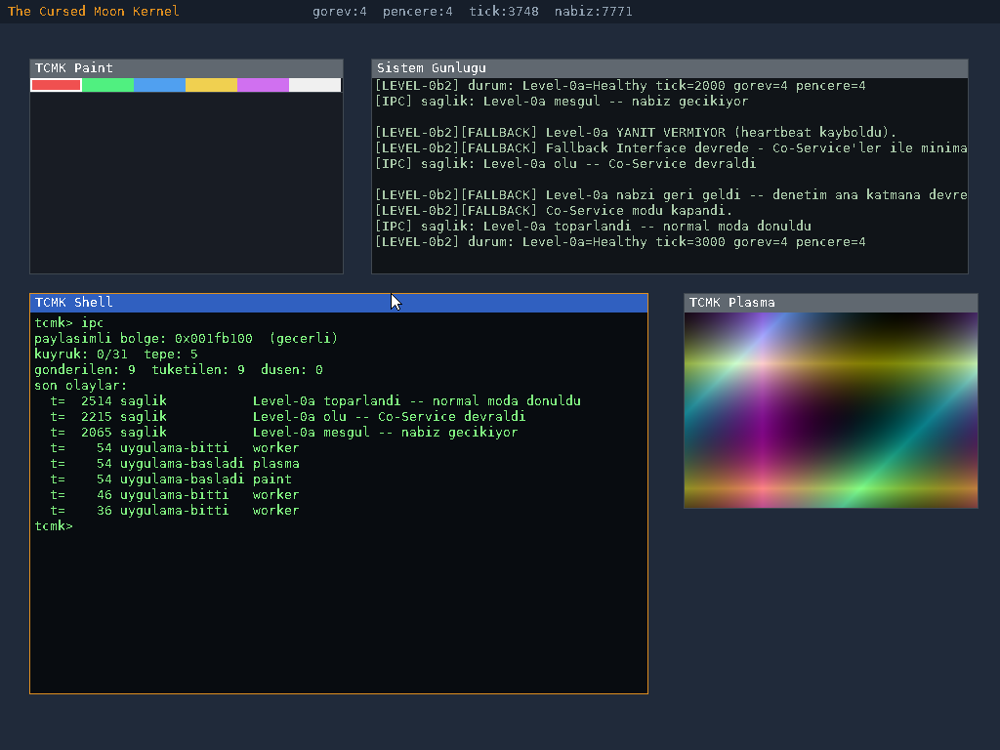

Nabzin paylasimli bolgeden okunmasi mimari bir zorunluluk: State Monitor
Level-0a'nin bir **fonksiyonunu cagirsaydi**, Level-0a kilitlendiginde
izleyici de kilitlenirdi. Izleyicinin izlenene bagimli olmamasi hata
tolerans motorunun onkosuludur.

Olaylar (istisna, kisitlama, saglik degisimi, uygulama yasam dongusu)
uretildikleri yerde -- bazen kesme baglaminda -- kuyruga birakilir ve
masaustu dongusunde, kesmeler acikken tuketilir. Uretici asla beklemez:
kuyruk doluysa mesaj dusurulur ve sayilir.

```
tcmk> ipc
paylasimli bolge: 0x001fb100  (gecerli)
kuyruk: 0/31   tepe: 5
gonderilen: 9  tuketilen: 9  dusen: 0
```

### 3. Co-Service ve toparlanma

Nabiz 300 tick (3 sn) sessiz kalirsa Level-0a "Olu" sayilir ve Fallback
Interface devralir. Minimal kume bilincli olarak kucuktur; amac tam bir
isletim ortami degil, **sistemi uyanik ve etkilesime acik tutmaktir**:
konsola yazma, CPU birakma, kareyi bitirme, olay sorgularina "olay yok"
cevabi.

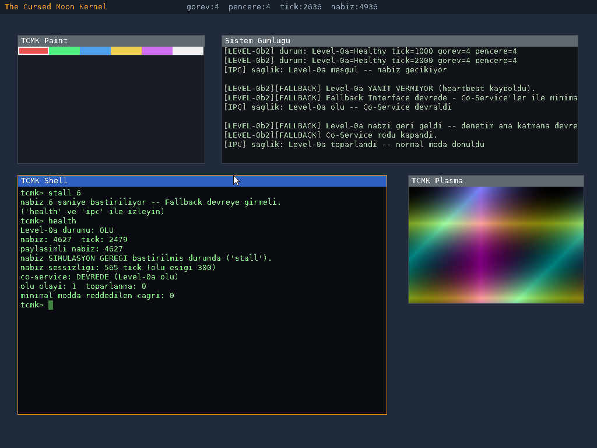

Test etmek icin (doc S.12: "Heartbeat timeout simulasyonunda fallback
devreye girer"):

```
tcmk> stall 6        # nabzi 6 saniye bastir
tcmk> health
Level-0a durumu: OLU
nabiz sessizligi: 565 tick (olu esigi 300)
co-service: DEVREDE (Level-0a olu)
olu olayi: 1  toparlanma: 0
```

Ekran goruntusunde goruldugu gibi masaustu donmaz, kabuk yanit verir,
Plasma cizmeye devam eder -- **Level-0a olu sayilirken bile**.

Nabiz geri geldiginde denetim ana katmana devredilir (doc S.11
"Level-0a yeniden baslatma"): TCMK'de Level-0a ayri bir adres uzayinda
olmadigi icin bu, servislerin yeniden yuklenmesi degil **denetimin geri
verilmesidir** -- Co-Service modundan cikilir, cagrilar yeniden
Level-0b1 cevirmenlerine yonlendirilir.

```
[LEVEL-0b2][FALLBACK] Level-0a nabzi geri geldi -- denetim ana katmana devrediliyor.
[LEVEL-0b2][FALLBACK] Co-Service modu kapandi.
[IPC] saglik: Level-0a toparlandi -- normal moda donuldu
```

## Kalici depolama: disk + TCMKFS

TCMK artik **kendi diskinden acilir ve verisini kalici olarak saklar**.

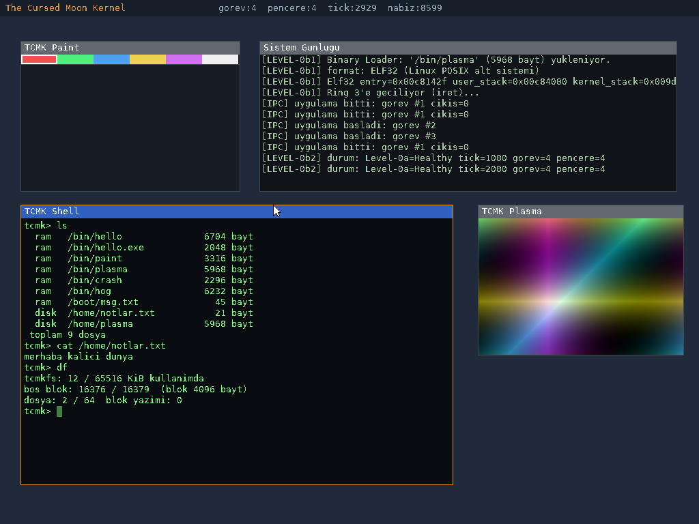

```
tcmk> ls
   ram   /bin/paint               3316 bayt
   ram   /bin/plasma              5968 bayt
   disk  /home/notlar.txt           21 bayt
   disk  /home/plasma             5968 bayt
tcmk> cat /home/notlar.txt
merhaba kalici dunya
tcmk> df
tcmkfs: 12 / 65516 KiB kullanimda
```

Yukaridaki ekran goruntusu **ikinci acilistandir**: QEMU tamamen
kapatilip yeniden baslatildi, dosyalar yerinde.

### Katman katman

| Katman | Dosya | Islev |
|---|---|---|
| Surucu | `drivers/ata.rs` | ATA PIO (LBA28), IDENTIFY, oku/yaz/flush |
| Blok aygiti | `drivers/block.rs` | "LBA'dan sektor oku/yaz" soyutlamasi |
| Bolum | `drivers/partition.rs` | MBR ayristirma, TCMKFS bolumunu bulma |
| Dosya sistemi | `core/tcmkfs.rs` | superblock + inode + blok bitmap, yazma |
| Isim uzayi | `core/vfs.rs` | RAMFS ve TCMKFS'i tek isim uzayinda birlestirir |
| Saat | `drivers/rtc.rs` | CMOS RTC -> zaman damgalari icin Unix zamani |

**ATA PIO neden:** port I/O disinda hicbir sey gerektirmez -- PCI taramasi,
DMA, kesme yonetimi yok. Hem QEMU'da hem gercek (eski) donanimda calisir.
Blok katmani soyut oldugu icin ileride AHCI/virtio surucusu ayni arayuzun
altina takilabilir; dosya sistemi degismez.

**Kendi dosya sistemi neden:** doc S.7 Faz 9 ext2 diyordu. ext2'nin
okunmasi kolaydir ama **yazilmasi** degildir (blok gruplari, dolayli blok
agaclari, dizin karma indeksleri). Bu asamadaki ihtiyac "Linux diskini
okumak" degil "kendi verisini saklamak" oldugu icin, ilk gunden yazma
destegi olan kucuk bir dosya sistemi secildi. ext2 okuyucusu ileride VFS'e
**ikinci bir arka uc** olarak eklenebilir -- katman tam bunun icin var.

### TCMKFS yerlesimi (bolum baslangicina gore, sektor)

```
   0        superblock ("TCMK" imzasi, kapasite, etiket)
   1..32    inode tablosu   (64 inode x 256 bayt)
  33..36    blok bitmap'i   (16384 bit)
  40..      veri bloklari   (blok = 4096 bayt = 8 sektor)
```

Dosya basina 40 **dogrudan** blok isaretcisi -> azami 160 KiB. Inode
tablosu ve bitmap bellekte onbelleklenir, degisiklikler aninda diske
yazilir (write-through), her yazmadan sonra ATA cache-flush verilir.

### IRQ14: disk artik kesmeyle bekliyor

Surucu bugune kadar **yoklamali**ydi: bir sektor icin durum registeri
milyonlarca kez okunuyordu ve o sure boyunca CPU baska hicbir is
yapmiyordu.

Bunun sebebi tembellik degil, bir **vektor catismasiydi**. Alisilmis PIC
yerlesiminde (master 0x20, slave 0x28) IRQ14 vektor 46'ya duser -- ve 46,
TCMK'de `int 0x2E`nin, yani **Windows NT sistem cagrisinin** yeridir. Ayni
IDT girdisini paylasamazlar.

Ilk akla gelen "NT vektorunu tasi"dir, ama 0x2E bir tercih degil **ABI**:
Windows ikilileri onu bekler. Tasinabilir olan taraf PIC'ti, bu yuzden
slave denetleyici 0x70'e alindi:

| hat | eski vektor | yeni vektor |
|---|---|---|
| IRQ0 (PIT) | 32 | 32 |
| IRQ1 (klavye) | 33 | 33 |
| IRQ12 (fare) | 44 | **116** |
| IRQ14 (ATA) | 46 (catisiyordu) | **118** |
| `int 0x2E` (NT) | 46 | 46 (artik yalniz) |

Bekleme yolu icin zamanlayiciya ucuncu bir engelleme durumu eklendi:
`TaskState::IoWait`. `Blocked`'tan farki uyanma kaynagidir -- zaman degil,
donanim. Ayri olmasi sart: yoksa "5 tik sonra uyan" ile "disk hazir olunca
uyan" ayni yuvayi paylasir ve biri otekini yanlislikla uyandirir.

Iki incelik:

* **Kacirilmis uyandirma.** Kesme, gorev `IoWait`'e gecmeden hemen once
  gelebilir. `wait_for_io` bu yuzden uyumadan once kosulu kesmeler kapaliyken
  bir kez daha denetler; aksi halde surec sonsuza kadar beklerdi.
* **Kesmenin gelmedigi an.** Uyanma kosulu iki seydir: kesme geldi,
  **ya da aygit artik mesgul degil**.

  Ikincisi neden sart: bir **yazmada** aygit ilk veri istegi oncesinde
  kesme uretmez -- BSY'yi dusurup DRQ'yu kaldirir, o kadar. Surucu yine
  de kesme bekliyordu, yani her yazma ilk sektorunde zaman asimi
  suresince (iki saniye) bosuna bekliyordu. `create_file` birkac ayri
  sektor yazmasi yaptigi icin Ring 3'ten bir kaydetme onlarca saniye
  suruyor, uygulama donmus gorunuyordu. Olcum: `notes`'un kaydetmesi
  "yirmi bes saniyede bile bitmiyor" halinden **alti saniyeye** indi.

  Yoklama `ALT_STATUS` uzerinden yapilir: onu okumak aygitin kesme
  bayragini **temizlemez**, yani yoklama kesme yolunu bozmaz. Kesmenin
  kendisi calisiyor -- bir okuma + yazma turundan sonra `df` IRQ14
  sayacini 95 gosteriyor. Modul basligindaki "kesme bir hizlandiricidir,
  tek dogruluk kaynagi degil" ifadesi ancak bu satirla gercekten dogru.

Iki yer bilerek yoklamada kaldi: acilis (zamanlayici henuz yok) ve
**uyutulamayan gorevler** -- idle ve masaustu. Masaustu ekrani cizen,
girdiyi dagitan ve kabugu kosturan gorevdir; uyutmak butun arayuzu
dondururdu. Bu ayrim zamanlayicida tutulur (`scheduler::can_block`),
surucude degil: eskiden surucu "gorev 0 mi?" diye bakiyordu ve masaustu
ayri bir goreve tasindiginda sessizce yanlis cevap vermeye basladi --
kabuktan verilen ilk disk yazmasi butun masaustunu donduruyordu.

```
tcmk> df
tcmkfs: 4 / 63488 KiB kullanimda
bos blok: 15871 / 15872  (blok 4096 bayt)
dosya: 2 / 64  (isim uzayinda 17)  blok yazimi: 1  IRQ14: 202  io beklemesi: 1
```

Son iki sayi olcumun kendisi: `IRQ14` gelen kesme sayisi, `io beklemesi`
ise bir gorevin gercekten uyudugu kez sayisi. Ikincisi yalnizca Ring 3
surecleri icin artar (yukaridaki 1, `notes`in diske yazdigi an).

### Dizinler (bicim surumu 2)

TCMKFS onceden **duz** bir isim uzayiydi: `/home/x` bir yol degil,
dosyanin adiydi. Artik gercek bir agac var.

Yontem, dizin icerigini ayri bir blokta tutmak **degil**: her inode
iceren dizininin numarasini (`parent`) tasir, yani agac **cocuktan
ebeveyne** dogru saklanir.

```
inode 0  dizin  ""         parent=0   (kok)
inode 3  dizin  "notlar"   parent=0
inode 5  dizin  "2026"     parent=3
inode 7  dosya  "ocak.txt" parent=5   ->  /notlar/2026/ocak.txt
```

Kazanci: bir dizinin icerigi sabit boyutlu bir listeye sigmak zorunda
kalmaz -- "X'in cocuklari" sorusu inode tablosunun taranmasiyla
cevaplanir ve 64 inode'da bu, bir dizin blogu okumaktan ucuzdur.
Bedeli: tam yolu uretmek icin ebeveyn zinciri **yukari** yurunur
(`path_of`), ki VFS'in mount aninda yaptigi da budur.

```
tcmk> mkdir /notlar
tcmk> mkdir /notlar/2026
tcmk> mkdir /yok/olan
yol gecersiz (ara dizin yok ya da dizin degil)
tcmk> save /notlar/2026/ocak.txt merhaba dizin
14 bayt yazildi: /notlar/2026/ocak.txt

tcmk> ls /notlar
  dizin /notlar/2026
  disk  /notlar/2026/ocak.txt    14 bayt  2026-08-12 09:18
  disk  /notlar/kok.txt          12 bayt  2026-08-12 09:18
 toplam 2 dosya, 1 dizin
```

`rmdir` bos olmayan dizini reddeder; `rm` dizinleri hic gormez. Ara
dizinler **kendiliginden yaratilmaz** -- POSIX `open(O_CREAT)` de boyle
davranir.

`format` yeni bir diskte `/home` ve `/tmp` dizinlerini de yaratir. Duz
isim uzayi doneminde `/home/notes.txt` gecerli bir **addi**; artik gecerli
bir **yol** olmasi icin `/home`in var olmasi gerekiyor. `mkfs`in
`lost+found` yaratmasiyla ayni turden bir kolaylik -- ve mevcut
uygulamalarin (`notes`) calismaya devam etmesini sagliyor.

Bicim degistigi icin superblock surumu 2'ye cikti ve **surum 1 imajlari
baglanmaz**: eski inode'larda `parent` alani yoktur ve `name` tam yolu
tasir, oldugu gibi baglamak agaci rastgele kurardi. `mount` bunu sessizce
denemek yerine acikca reddeder (`format onayla` gerekir).

VFS tarafinda dizin kavrami **yoktur**: agac diskte yasar, VFS mount
aninda her dosyanin tam yolunu `path_of` ile duzlestirip isim uzayina
koyar. Boylece `/bin/paint` gibi RAMFS yollari ile disk yollari ayni
tabloda, ayni bicimde durur.

### Duvar saati (CMOS RTC)

PIT sistemin **ne kadar suredir** calistigini olcer; hangi gunde
oldugumuzu bilmez. Bir dosyanin ne zaman yazildigini kaydetmek icin gercek
tarih gerekir, bu yuzden `drivers/rtc.rs` CMOS saatini okur ve inode'un
`mtime` alani **Unix zamani** olarak doldurulur.

RTC saniyede bir kendini gunceller ve bu guncelleme atomik degildir --
tam o anda okunan alanlar farkli anlara ait olabilir (dakika yeni, saniye
eski). Iki savunma birlikte kullanilir: Status A'nin "guncelleme suruyor"
biti beklenir, **ve** okuma iki kez ust uste ayni sonucu verene kadar
tekrarlanir. Degerler BIOS'a gore BCD veya ikili, saat 12 ya da 24
saatlik olabilir; Status B bunu soyler ve donusum surucude yapilir.

```
tcmk> date
2026-08-11 00:16:08  (UTC, CMOS RTC)
unix zamani: 1786407368

tcmk> ls
  disk  /saat.txt        14 bayt  2026-08-11 00:16
```

`uptime` ayni saatten ikinci bir olcum verir:

```
tcmk> uptime
tick: 2416  (~24 saniye)
duvar saati: 0:00:28  (RTC)
acilis: 2026-08-11 00:15:43 (UTC)
```

Ikisinin farki bilerek gosteriliyor: PIT tick'i **kacirilan kesmeleri**
sayamaz. Aradaki dort saniye, cekirdegin acilista kesmeler kapaliyken
(ATA PIO bekleyisleri, bicimlendirme) gecirdigi suredir -- yani bu iki
satir birlikte ucuz bir saglik gostergesidir.

### Disk imaji nasil uretiliyor (root gerekmeden)

`grub-mkrescue` **hibrit** bir imaj uretir: ayni dosya hem CD hem sabit
disk olarak acilabilir ve gecerli bir MBR tasir. `tools/make_disk.py` bu
imajin sonuna bos bir bolge ekleyip MBR bolum tablosuna ikinci girdiyi
yazar:

```
bolum 1  0xCD  ISO hibrit  -> GRUB + cekirdek (salt okunur)
bolum 2  0x7F  TCMKFS      -> kalici, yazilabilir veri
```

Cekirdek yazilabilir bolumu **sabit bir LBA'ya gomerek degil, bolum
tablosundan bularak** acar; imajin duzeni degistiginde cekirdegi yeniden
derlemek gerekmez.

### Uygulama "kurmak"

`cp` diskteki bir kopyayi olusturur, `run` onu oradan calistirir:

```
tcmk> cp /bin/plasma /home/plasma
5968 bayt kopyalandi -> /home/plasma
tcmk> run /home/plasma
```

Launcher artik sabit bir uygulama listesine bagli degil: VFS'te var olan
her yol calistirilabilir. Yani diske kopyalanan uygulamalar cekirdegi
yeniden derlemeden calisir.

## `execve`: surec kendi yerine baska bir program yukluyor

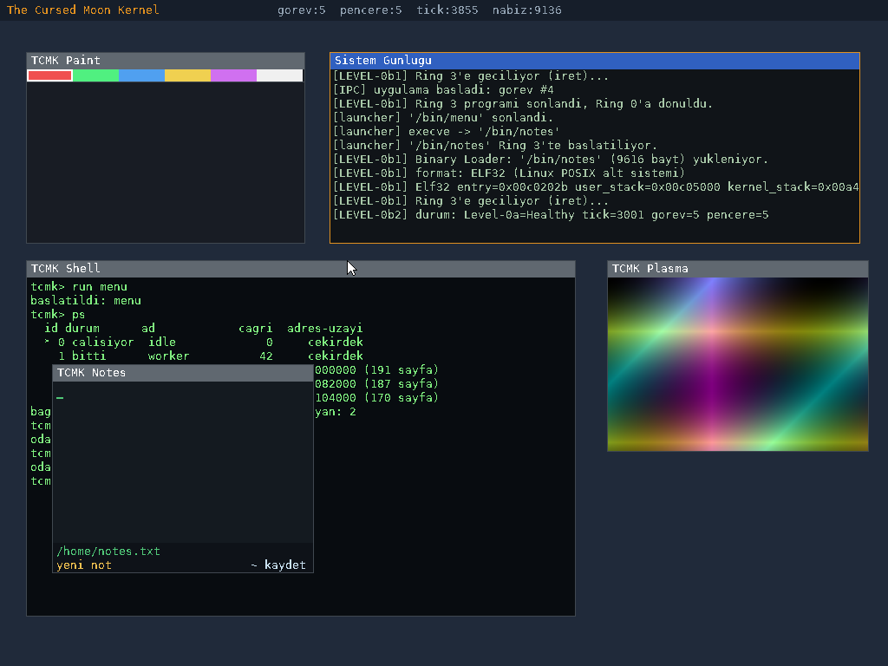

`run menu` bir baslatici acar; bir numaraya basinca secilen uygulama
**menunun yerine** yuklenir. Yeni gorev acilmaz -- ayni gorev numarasi,
yeni bir adres uzayi:

```
[launcher] '/bin/menu' sonlandi.
[launcher] execve -> '/bin/notes'
[launcher] '/bin/notes' Ring 3'te baslatiliyor.
```

### Neden "cik ve yerine sunu yukle"

Imaj **yerinde** degistirilemez: surec o anda kendi kodunun icinde
kosuyor, altindaki sayfalari degistirmek calisan komut akisini yok
ederdi. Bu yuzden `execve` istegi cekirdekte gorev basina bir yuvaya
yazilir, surec Ring 3'ten cikar (`sys_exit` ile ayni yol) ve
`launcher`'in dongusu yeni imaji yukler:

```rust
while let Some(path) = next {
    run_from_vfs_dynamic(path);
    next = take_exec(current_id());   // execve istendi mi?
}
```

Adres uzayi bu arada dogal olarak birakilip sifirdan kuruluyor -- zaten
execve'nin istedigi sey. Surec basina adres uzayi olmadan bu temiz
olmazdi: eski imajin kalintilari yeni programin altinda kalirdi.

## `fork`: tek cagri, iki donus

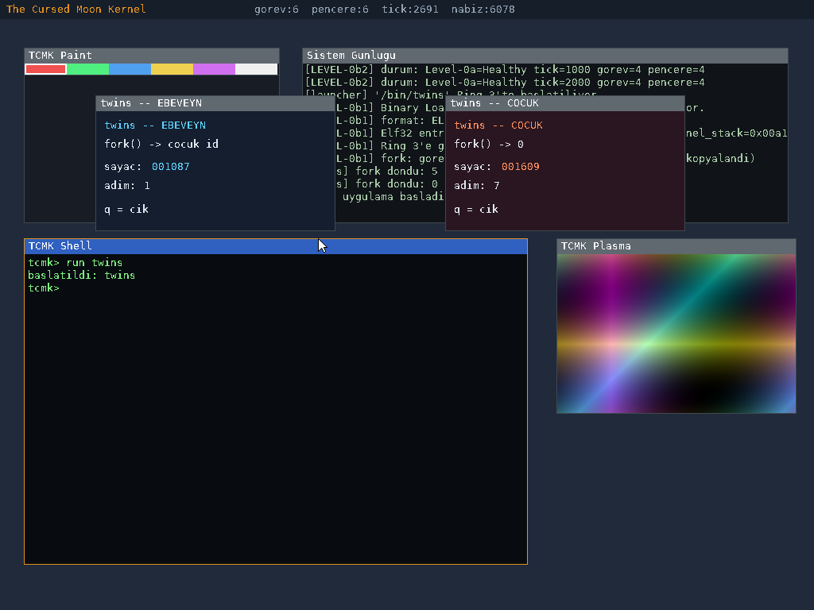

`run twins` **tek** bir program baslatir. Program `fork()` cagirir ve o
noktadan sonra iki surec olur; ekrandaki iki pencere ayni ikilinin iki
ayri kopyasidir.

```
[LEVEL-0b1] fork: gorev #4 -> #5 (eip=0x00c018ba, 128 sayfa kopyalandi)
[twins] fork dondu: 5 -- ben ebeveyn
[twins] fork dondu: 0 -- ben cocuk
```

### Neden diger cagrilardan farkli

Butun syscall'lar "bir sey yap, don" kalibindadir. `fork` **iki kez
doner**: ebeveynde cocugun kimligiyle, cocukta sifirla. Bunun icin cagri
anindaki Ring 3 baglaminin eksiksiz yakalanip ikinci bir gorevde
canlandirilmasi gerekir.

Baglam `pusha` blogunun hemen ustunde durur: CPU kesme girisinde EIP, CS,
EFLAGS ve -- ayricalik degistigi icin -- kullanicinin ESP/SS'ini iter.
`SyscallFrame::user_context` bu duzeni okur. Cocuk icin `eax` sifirlanir;
"hangisiyim?" sorusunun cevabi budur.

**Sadece EIP/ESP yetmez.** Derleyici `int 0x80` sonrasinda
EBX/ESI/EDI/EBP'nin korundugunu varsayar, dolayisiyla cocuk bunlari
ebeveyninkiyle ayni gormezse syscall'dan sonraki ilk erisimde coker. Bu
yuzden Ring 3'e donus icin **butun** genel registerlari yukleyen ayri bir
giris yazildi (`arch_enter_user_mode_regs`).

### Bellek gercekten kopyalaniyor mu?

Ekrandaki iki sayac bunun kanitidir. Ikisi de `fork`'tan **once** 1000'e
kuruldu; sonra ebeveyn 1'er, cocuk 7'ser artiriyor. Goruntudeki degerler
1087 ve 1609: ikisi de 87 kare cizmis, ama **kendi** kopyalarini
artirmis. Bellek paylasilsaydi tek bir sayac gorunurdu.

Kopyalama sanal adresler uzerinden yapilamaz -- kaynak ve hedef ayni
sanal adreste (0x00C00000) ama farkli CR3'lerde durur, yani ikisi ayni
anda gorunmez. Bunun yerine **fiziksel** adresler kullanilir: cerceve
havuzu cekirdegin identity haritasinin icinde oldugu icin her iki
cerceveye de dogrudan yazilabilir, CR3 degistirmeye ya da gecici pencere
eslemeye gerek kalmaz.

Cocuk kendi cekirdek yiginini `scheduler::spawn`'dan alir; ebeveyninkini
paylasmasi, ikisi ayni anda syscall yaptiginda birbirinin cercevesini
ezmek demek olurdu.

### `waitpid`: cocugu toplamak

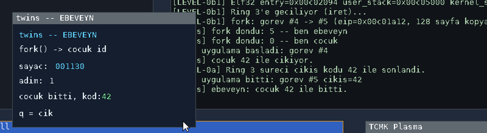

`twins`'te cocuk 60 kare sonra `42` ile cikar. Ebeveyn bunu toplar ve
cikis kodunu ekranda gosterir; goruntude cocugun penceresi kapanmis,
ebeveyn `cocuk bitti, kod:42` yaziyor.

```
[twins] cocuk 42 ile cikiyor.
[LEVEL-0a] Ring 3 sureci cikis kodu 42 ile sonlandi.
[twins] ebeveyn: cocuk 42 ile bitti.
```

Zamanlayiciya bunun icin bir `Waiting` durumu eklendi. Bekleyen gorev
`pick_next` tarafindan **atlanir** -- yani bekleyen bir surec CPU
harcamaz. `Blocked`'dan farki uyanma kosuludur: `Blocked` bir PIT
tick'ini bekler, `Waiting` **baska bir gorevin durumunu**. Ikisi de ayni
yerde, `wake_expired` icinde cozulur.

Ebeveyn dongusunde `WNOHANG` kullanir; boylece cocugu her karede yoklar
ama bloke olmaz ve penceresi akici kalir. Kullanici erken cikarsa
ebeveyn bu kez bloke olarak bekler -- iki yol da `twins` icinde.

Durum kelimesi Linux'un kodlamasini kullanir (`(kod & 0xFF) << 8`), yani
`WEXITSTATUS` beklendigi gibi calisir.

## `pipe`: ayri adres uzaylarindaki iki surec konusuyor

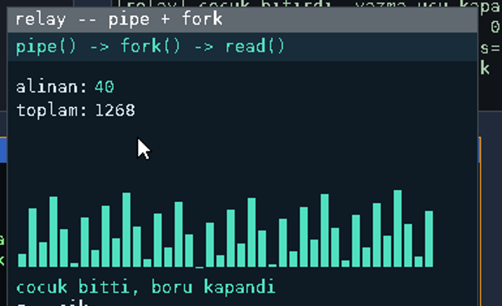

`twins` iki surecin **ayri** oldugunu gosteriyordu: bellek kopyalanir,
sayaclar ayrisir. `run relay` tam tersini gosterir -- ayri adres
uzaylarindaki iki surec nasil konusur.

Kalip UNIX'in klasigidir: **once boru, sonra catallanma**.

```text
  pipe()  ->  (okuma_fd, yazma_fd)
  fork()
    cocuk  : okuma ucunu kapat, olctugu degerleri yazma ucuna yaz
    ebeveyn: yazma ucunu kapat, okuma ucundan okuyup ekrana ciz
```

```
[relay] boru: okuma fd=3 yazma fd=4
[LEVEL-0b1] fork: gorev #4 -> #5 (128 sayfa kopyalandi)
[relay] cocuk 40 olcum gonderiyor.
[relay] cocuk bitirdi, yazma ucu kapandi.
[relay] ebeveyn 40 olcum aldi, cocuk 0 ile bitti.
```

Ekrandaki cubuk grafik cocugun urettigi 40 degerin aynisidir; toplam
1268, `(i * 37 + 11) % 64` dizisinin toplamiyla birebir tutuyor. Yani
veri yalnizca akmiyor, **bozulmadan** akiyor.

Tampon cekirdektedir, `fork`'ta kopyalanmaz -- iki surec de ayni halka
tamponu gorur. Paylasilan bir degisken olsaydi zaten kopyalanirdi ve is
gormezdi; `twins`'teki sayaclarin ayrismasi bunun kanitiydi.

### Surec basina fd tablosu (borularin zorunlu kildigi degisiklik)

Tanimlayici tablosu uzun sure **globaldi**; tek kullanici sureci varken
sorun degildi. Borular bunu surdurulemez hale getirdi: yukaridaki kalipta
her taraf kullanmadigi ucu kapatir, ve paylasilan bir tabloda cocugun
kapattigi tanimlayici ebeveyninkini de yok ediyordu. Ilk denemede
ebeveyn tam olarak bu yuzden **sifir bayt** aldi.

POSIX semantigi zaten dogru olani soyluyor: `fork` tanimlayicilari
*kopyalar*. Tablo surec basina tasindi, `fork` ebeveynin tablosunu
cocuga klonluyor ve boru uclarinin sayaclarini artiriyor. Bir uc ancak
**iki taraf da** kapatinca oluyor; gorev sonlandiginda tanimlayicilari
otomatik birakiliyor, yoksa kapanmayan bir yazma ucu okuyan tarafta
"dosya sonu"nun hic gorunmemesi demek olurdu.

Kabuktan izlenebilir:

```
tcmk> pipes
acik boru: 1 / 4  (tampon 1024 bayt)
  #0  bekleyen:    0  yazan:1  okuyan:1
```

### Bloke etmeyen okuma

Gercek POSIX'te bos bir borudan okumak veri gelene kadar bloke olur.
TCMK'de okuma bloke etmez; veri yoksa `0` doner. Nedeni GUI'dir: bloke
olan bir surec penceresini de dondurur, oysa buradaki uygulamalar kendi
cizim dongulerini surer. `relay`'in ebeveyni her karede yoklar ve grafik
akici kalir.

## `lseek` / `fstat` -- ve Win32'deki ikizleri

Dosyalar yalnizca **bastan sona** okunabiliyordu: konum sadece
`read`/`write` tarafindan ilerliyor, geri alinamiyordu. Ortadan okumak,
basa sarmak, sona eklemek -- hicbiri mumkun degildi. Boyutu ogrenmenin de
yolu yoktu; tek care dosyayi sonuna kadar okuyup saymakti.

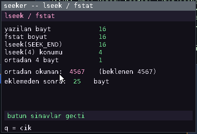

`seeker` bes sinav yapiyor ve besi de geciyor. Ucuncusu olcunun kendisi:
`lseek(4, SEEK_SET)` sonrasi dort bayt okunuyor ve **"4567"** geliyor --
konum gercekten tasindi. Dorduncusu "ekleme" kalibi: `lseek(0, SEEK_END)`
+ `write` sonrasi dosya 16'dan 25 bayta cikiyor ve kabuk
`0123456789ABCDEF++EKLENDI` okuyor.

### Iki ABI, tek cekirdek cagrisi

Ayni yetenek Win32 tarafina da acildi ve **ayni** `kernel_api::lseek`e
iniyor:

| POSIX | Win32 | Level-0a |
|---|---|---|
| `lseek(fd, off, whence)` | `SetFilePointer(h, d, NULL, method)` | `kernel_api::lseek` |
| `fstat(fd)` -> boyut | `GetFileSize(h, NULL)` | `kernel_api::file_size` |

`FILE_BEGIN`/`FILE_CURRENT`/`FILE_END` sayilari POSIX'in `SEEK_*`
degerleriyle **ayni** (0/1/2), yani cevirmenin yapacak isi bile kalmiyor.
Level-0b1'in butun mesele ettigi sey bu: iki ABI, tek Level-0a API'si.

`winpad` artik notunu gercek Windows kalibiyla okuyor: `CreateFileA` ->
`GetFileSize` -> `SetFilePointer(0, FILE_BEGIN)` -> `ReadFile` ->
`CloseHandle`.

### Bilerek yapilmayanlar

* **Negatif goreli kaydirma yok.** Cagri arayuzu isaretsiz kelime tasiyor,
  yani `SEEK_CUR`/`SEEK_END` ileri ya da sifirdir. `lseek(fd, 0, SEEK_END)`
  dosya sonuna gider -- ekleme kalibinin ihtiyaci da budur.
* **`fstat` bir `struct stat` doldurmuyor**, yalnizca boyut donuyor. Izin,
  sahiplik, aygit numarasi, bag sayisi -- hicbiri bu dosya sisteminde yok;
  yapiyi kopyalamak sifir dolu bir kayit tasimak olurdu.
* **Boru bir akistir**, konumu yoktur: boru ucunda `lseek` reddedilir
  (POSIX de `ESPIPE` doner).

## Dizin gezinmesi: `getdents` ve `FindFirstFileA`

Bu cagriya kadar bir uygulama dosya sistemini **goremiyordu**. Adini
onceden bildigi bir dosyayi acabiliyordu (`open`), okuyabiliyordu
(`read`), boyutunu ogrenebiliyordu (`fstat`) -- ama "burada ne var?"
diye soramiyordu. Dizin listesini yalnizca cekirdegin kendi kabugu
biliyordu, ve o da listeyi kendi icinde, iki ayri dongude uretiyordu.

### Tek gezinme, iki ABI

Gezinme `kernel_api::next_entry` icinde **bir kez** yazildi; iki alt
sistem de oraya iner:

| POSIX (ELF) | Win32 (PE) | Level-0a |
|---|---|---|
| `open(yol)` -> dizin fd'si | `FindFirstFileA(desen, &data)` | `kernel_api::open_dir` |
| `getdents(fd, buf, n)` | `FindNextFileA(h, &data)` | `kernel_api::next_entry` |
| `close(fd)` | `FindClose(h)` | `kernel_api::close` |

Goruntuleri farkli -- POSIX tampona **birden cok** kayit paketler, Win32
her cagride bir `WIN32_FIND_DATAA` doldurur -- ama iki listenin
ayrisabilmesi icin cekirdekte ikinci bir gezinme kodu olmasi gerekirdi.
Yok. Kabugun `ls` komutu da ayni cagriyi kullanir, yani `ls` ile bir
Ring 3 tarayicisinin ayni dizinde farkli sey gormesi mumkun degil.

Solda `browse` (ELF, x86_64), sagda `winfiles` (PE32, i386):

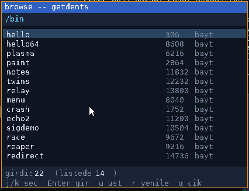
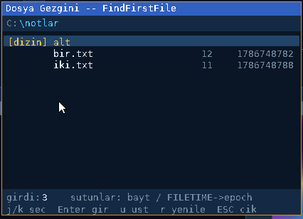

`winfiles` ekranindaki ucuncu sutun olcunun kendisi: cekirdek zaman
damgasini gercek bir `FILETIME`a cevirip yaziyor (1601'den beri gecen
100 ns'lik araliklar), uygulama onu Unix zamanina geri ceviriyor.
Ekrandaki `1786748782`, kabugun `ls` ciktisindaki `2026-08-14 23:06`
ile ayni an -- cevrim iki yonde de dogru.

### Imlec uzayi: uc kaynak, tek sayi

TCMK'de "dizin icerigi" tek bir tabloda durmaz:

| bolge | kaynak | ornek |
|---|---|---|
| 1 | TCMKFS'in alt dizinleri (diskteki inode agaci) | `/notlar/alt` |
| 2 | RAMFS yollarinin **ima ettigi** dizinler | `/bin` |
| 3 | VFS dosyalari (RAMFS + TCMKFS birlesik) | `/notlar/bir.txt` |

Ikinci bolge yeni ve gerekli: RAMFS duz bir isim tablosudur, `/bin`
diye bir kayit **yoktur** -- yalnizca `/bin/paint` yolunun icinde ima
edilir. Oncesinde `ls /` bu yuzden hicbir dizin gostermiyordu.

Uc kaynak tek bir sayi uzayina diziliyor ve imleci **cagiran** tasiyor
(dizin tanimlayicisinin `offset` alaninda). Cagri boylece durumsuz
kaliyor: cekirdek gezinmenin yarisini bir yerde tutmuyor, ve ayni
dizini iki kez acan bir surec iki bagimsiz imlec aliyor.

### Kayit bicimi

```text
  +0  u16 reclen     kaydin toplam uzunlugu (4'un kati)
  +2  u8  kind       1 = dosya, 2 = dizin
  +3  u8  name_len   ad uzunlugu
  +4  u32 size       dosya boyutu (dizinlerde 0)
  +8  u32 mtime      son degisiklik (Unix epoch), bilinmiyorsa 0
 +12  ad             name_len bayt, sonda NUL yok
```

Linux'un `linux_dirent64`u degil: oradaki `d_ino` ve `d_off` 64 bit
alanlarin TCMK'de karsiligi yok (inode numarasi iki arka uc arasinda
anlamli degil, imleci de tanimlayici tasiyor). Buna karsilik `size` ve
`mtime` **var**: bir tarayici boyut ve tarih gostermek icin her girdide
ayri bir `fstat` cagirmak zorunda kalmasin diye. Win32'nin
`WIN32_FIND_DATAA`si da ayni iki alani tasir.

`WIN32_FIND_DATAA` ise **birebir** Windows yerlesiminde doldurulur
(320 bayt, `cFileName` +44'te, `FILETIME` iki `DWORD`): bir PE'nin
derlendigi basliklar bu ofsetleri varsayar, sadelestirilmis bir kayit
ikili uyumu bozardi.

### Bilerek yapilmayanlar

* **Desen esleme yok.** `FindFirstFileA("C:\\dizin\\*.dll")` cagrisinda
  sondaki desen atilir ve dizinin tamami listelenir -- yani her desen
  `*` gibi davranir. Bastaki surucu harfi (`C:`) ve ters bolu
  isaretleri cekirdek tarafinda temizlenir.
* **`.` ve `..` girdileri listelenmez.** TCMKFS'te diskte boyle kayitlar
  yok; ikisi de `resolve` icinde `parent` alanindan cozuluyor. Windows
  gercek dizinlerde bu ikisini listeler, TCMK listelemez.
* **`rewinddir` yok.** Imleci geri sarmak icin dizin yeniden acilir --
  POSIX'te de `rewinddir` ayri bir cagridir.
* **Ayni anda 8 acik dizin** (`core::dir` havuzu). Dizin gezmek kisa
  omurlu bir istir; sayi `df` ciktisinda gorunur.

## Yaratma ve silme: iki ABI, tek dosya sistemi

Gezinme geldikten sonra eksiklik gorunur oldu: bir uygulama artik
dizinleri dolasabiliyordu ama **hicbir sey yaratamiyordu**. Uc cagri o
bosluktur, ve ikisi de ayni `kernel_api` girisine iner:

| POSIX (ELF) | Win32 (PE) | Level-0a |
|---|---|---|
| `mkdir(yol, kip)` | `CreateDirectoryA(yol, NULL)` | `kernel_api::mkdir` |
| `rmdir(yol)` | `RemoveDirectoryA(yol)` | `kernel_api::rmdir` |
| `unlink(yol)` | `DeleteFileA(yol)` | `kernel_api::unlink` |

`kip` ve `lpSecurityAttributes` yok sayilir: TCMKFS'te izin ve sahiplik
kavrami yok, yani ikisi de tasiyacak bilgi bulamaz.

### Olcu: PE yaratir, ELF gorur

Iki gezgin yan yana calisiyor. `winfiles` (PE32) `n` tusuyla iki dizin
yaratti (`win321`, `win322`); `browse` (ELF) acildiginda ikisini de
goruyor ve uzerine kendi `posix1`/`posix2` dizinlerini ekliyor:

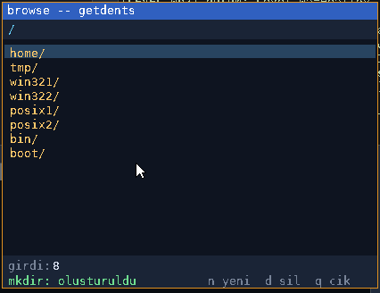

Ad uretimi ayrica `EEXIST`i sinar: her iki program da `1`'den baslayip
bos numara arar, yani `posix1` varken cagri **hata donmek zorunda** --
donmeseydi ikinci dizin hic olusmaz, program ayni ada iki kez basardi
sanirdi.

### Hata kodlari gercek

Uc yeni `KernelError` degeri iki ABI'ye de ayri ayri cevriliyor:

| durum | POSIX | NT |
|---|---|---|
| ayni ad zaten var | `EEXIST` | `STATUS_OBJECT_NAME_COLLISION` |
| dizin bos degil | `ENOTEMPTY` | `STATUS_DIRECTORY_NOT_EMPTY` |
| disk yok/dolu | `ENOSPC` | `STATUS_DISK_FULL` |

Olcum: dolu bir dizini silmeye calisinca `browse` **"dizin bos degil"**
diyor ve girdi sayisi degismiyor; `/bin/hello`yu silmeye calisinca
**"silinemedi"** diyor -- RAMFS dosyalari cekirdek imajinin parcasidir,
Ring 3'ten silinemezler. x86_64'te (disk yok) `mkdir` **"basarisiz"**
donuyor, cekirdek cokmuyor.

### Bilerek yapilmayanlar

* **`mkdir -p` yok.** Ust dizin onceden var olmali; POSIX `mkdir(2)` ve
  Win32 `CreateDirectoryA` da boyledir (`-p` kabugun isidir).
* **RAMFS silinemez.** `unlink`/`DeleteFileA` yalnizca diskteki
  dosyalarda calisir.

## `rename` / `MoveFileA`: tasima veri kopyalamaz

TCMKFS'te bir inode'un **adi ve ebeveyni ayni alanda** yasar. Bu, tek
basina kucuk bir ayrinti gibi duruyor ama sonucu buyuk: "yeniden
adlandir" ile "baska dizine tasi" ayni islem oluyor, ve ikisi de veri
bloklarina hic dokunmuyor.

```text
  /kaynak/veri.txt   ->  mv /kaynak /hedef  ->  /hedef/veri.txt
       ^                                            ^
       ayni bloklar, ayni inode -- degisen yalnizca ad ve ebeveyn
```

`cp` ile farki tam olarak bu: `cp` dosyayi okuyup yeniden yaziyor,
`mv` iki alani degistirip inode tablosunu diske akitiyor.

| POSIX (ELF) | Win32 (PE) | Level-0a |
|---|---|---|
| `rename(eski, yeni)` | `MoveFileA(eski, yeni)` | `kernel_api::rename` |

### VFS'in ikinci isi

Diskteki islem tek bir alan degisikligi, ama VFS'te bir is daha var:
isim uzayi orada **duzdur**, yani her dosyanin tam yolu ayri bir
kayitta durur. Bir dizin tasindiginda altindaki her kaydin yolu da
degismek zorunda -- yapilmasaydi `/kaynak/veri.txt` tabloda kalir,
`/hedef/veri.txt` ise hic bulunamazdi.

Olcu bu yuzden "dizin tasindiktan sonra icerigi hala okunabiliyor mu":

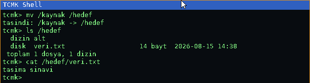

`mv /kaynak /hedef` sonrasi `ls /hedef` hem alt dizini hem dosyayi
gosteriyor, ve `cat /hedef/veri.txt` icerigi basiyor.

### Ucu de reddediliyor

| deneme | sonuc |
|---|---|
| `mv /hedef /dolu2` (hedef var) | `hedef zaten var` |
| `mv /bin/hello ...` (RAMFS) | `RAMFS dosyalari tasinamaz` |
| `mv /hedef /hedef/icine` | `tasinamadi` |

Ucuncusu en onemlisi: bir dizini **kendi altina** tasimak agaci
koparirdi -- dugum kokten erisilemez hale gelir ama var olmaya devam
eder, ve `path_of` ebeveyn zincirini yururken sonsuz donguye girerdi.
Hedefin kaynagin soyundan gelmedigi bu yuzden acikca denetleniyor.

### Ayrisan yan: hedef zaten varsa

POSIX `rename` hedefin **uzerine sessizce yazar** (ayni turdeyse).
TCMK Win32'nin `MoveFileA` davranisini secti: hedef varsa cagri
basarisiz olur. Sebep, sessiz veri kaybini bir ABI ayrintisina
birakmamak -- iki uygulamanin ayni dizinde calistigi bu sistemde
"tasidim" diyen bir cagrinin ayni anda "sildim" demesi, fark edilmesi
zor bir kayip olurdu. Ustune yazmak isteyen once siler.

Yan etkisi olculebilir: `browse` ve `winfiles` `m` tusuyla secili
girdiyi `tasindiN` adina tasiyor ve bos numara ariyor. `winfiles`
(PE32) `tasindi1`i aldiktan sonra `browse` (ELF) ayni adi deneyip
**hata aliyor** ve `tasindi2`ye geciyor -- iki ABI ayni kurala tabi.

## `GetLastError`: iki ABI, iki farkli hata bicimi

POSIX ile Win32'nin hata bildirimi **yapisal olarak** farklidir, ve bu
fark Level-0b1'in nicin var oldugunun en yalin ornegi:

| | POSIX | Win32 |
|---|---|---|
| donus | negatif errno (`-39`) | `BOOL` (`0`) |
| sebep | donus degerinin kendisi | ayri bir surec-basina degiskende |

Onceden Win32 tarafi yalnizca `FALSE` donuyordu, yani gezgin sebebi
**tahmin ediyordu** -- kodda "silinemedi (bos mu?)" yaziyordu. Artik
`GetLastError` gercek kodu veriyor:

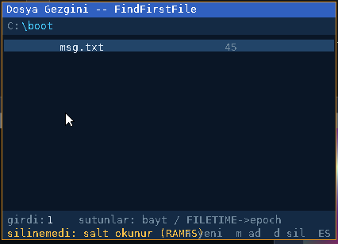

`LAST_ERROR` tablosu bilerek **Level-0b1'de** durur, `kernel_api`de
degil: `GetLastError` bir Win32 sozlesmesidir, cekirdek API'sinin
kavrami degil. POSIX ayni bilgiyi zaten donus degerinde tasidigi icin
boyle bir yan kanala ihtiyaci yok. Ayrimi burada tutmak iki ABI'nin
birbirinin bicimini odunc almamasini sagliyor.

Kodlar Windows'takiyle **ayni sayilar** (`winerror.h`): bir PE bunlari
derlenmis sabitlerle karsilastirir, TCMK'ye ozgu numaralandirma ikili
uyumu bozardi.

| cekirdek hatasi | POSIX | Win32 |
|---|---|---|
| `AlreadyExists` | `EEXIST` (17) | `ERROR_ALREADY_EXISTS` (183) |
| `NotEmpty` | `ENOTEMPTY` (39) | `ERROR_DIR_NOT_EMPTY` (145) |
| `NoSpace` | `ENOSPC` (28) | `ERROR_DISK_FULL` (112) |
| `ReadOnly` | `EROFS` (30) | `ERROR_ACCESS_DENIED` (5) |
| `NotFound` | `ENOENT` (2) | `ERROR_FILE_NOT_FOUND` (2) |

Windows'ta oldugu gibi yalnizca **basarisiz** cagrilar bu degeri yazar;
basarili bir cagri onceki degeri silmez. Gorev yuvalari geri
kazanildigi icin yeni bir imaj yuklenirken sifirlaniyor -- yoksa bir
surec, ayni yuvada calismis oncekinin hatasini gorurdu.

### Olcum bir yanlisi ortaya cikardi

Ilk kosuda RAMFS dosyasi silmeye calismak **"bulunamadi"**
(`ERROR_FILE_NOT_FOUND`) donuyordu -- oysa dosya ekranda duruyordu.
Sebep, `vfs::remove_file`in "diskte degil" ile "yok"u ayni hataya
kapatmasiydi. Ayri bir `KernelError::ReadOnly` eklendi; artik iki ABI
de dogru sebebi soyluyor:

| | mesaj |
|---|---|
| `browse` (ELF) | `silinemedi: salt okunur (RAMFS)` -- `-EROFS`'tan |
| `winfiles` (PE) | `silinemedi: salt okunur (RAMFS)` -- `GetLastError`'dan |

Ayni cumle, iki ayri yoldan. `FindNextFileA` de dizin bitiminde
`ERROR_NO_MORE_FILES` birakiyor: Windows'ta dongunun **normal**
sonlanma sebebi budur, gercek bir hata degil.

## `pause` / `sigsuspend`: sinyali **uyuyarak** beklemek

Sinyal gonderilebiliyor, maskelenebiliyor, `alarm` ile zamanlanabiliyordu
-- ama **beklenemiyordu**. Tek yol yoklamaydi:

```text
  while !bayrak { yield_now(); }     // sinyal gelene kadar CPU yakar
```

Dongu her turda cekirdege girip cikiyor, yani gorev surekli zamanlaniyor.
`pause` gorevi **uyutuyor**: sinyal gelene kadar hic zamanlanmiyor.

### Olcu: ayni bekleyis, iki bicim

`waiter` ayni isi iki kipte yapiyor ve kip degistirme **sinyalle**
surulUyor (`signal <id> 10`), yani olcum sirasinda odak hic degismiyor
-- sayaclar yalnizca bekleyis bicimini olcuyor.

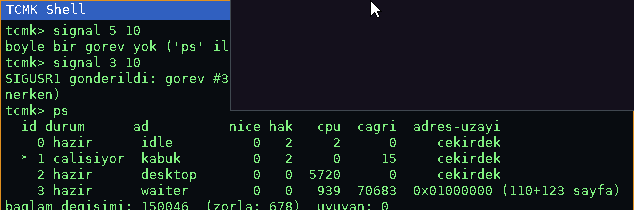

On saniyelik ayni bekleyis, i386:

| kip | durum | cpu tik | sistem cagrisi |
|---|---|---|---|
| **uyku** (`alarm`+`pause`) | `sinyal` | **0 → 0** | 45 → 97 |
| **yoklama** (`yield_now`) | `hazir` | 0 → **944** | 97 → **51023** |

x86_64'te ayni tablo: uykuda cpu **0**, yoklamada **939**; cagri sayisi
97'ye karsi **70683**. Uyku kipinde cpu sayaci **hic** artmiyor --
gorev gercekten zamanlanmiyor, yalnizca saniyede bir alarmla uyanip
ekrani ciziyor.

### Neden ayri bir bekleme durumu

`TaskState::SigWait`, `IoWait`ten **ayri** olmak zorunda:
`wake_io_waiters` butun aygit bekleyenlerini birden kaldirir, yani bir
disk kesmesi sinyal bekleyen sureci de yanlislikla uyandirirdi. Sinyal
beklemesi tek hedeflidir -- yalnizca sinyalin gonderildigi gorev uyanir
(`wake_signal_waiter`).

Yaris da ayni kaliple kapatiliyor: "teslim edilebilir sinyal var mi"
sinamasi **kesmeler kapaliyken** yapilir, cunku sinyal gorev `SigWait`e
gecmeden hemen once gelmis olabilir ve o zaman uyandiracak kimse
kalmazdi.

### `sigsuspend` neden ayri bir cagri

Klasik kalip: sinyali engelle, bayragi kontrol et, gelmemisse bekle.
`sigprocmask` + `pause` olarak yazilirsa arada bir **pencere** kalir --
sinyal tam o araliktaysa `pause` onu kacirir ve surec sonsuza kadar
uyur. `sigsuspend` maskeyi degistirmeyi ve beklemeyi tek, bolunmez
adimda yapar.

Maskenin **geri gelmesi** de sozlesmenin parcasi. POSIX: isleyici
`sigsuspend` maskesiyle kosar, isleyici **dondukten sonra** eski maske
doner. TCMK'de teslim noktasi sistem cagrisi donusu oldugu icin geri
yukleme `sigreturn`da yapiliyor; isleyici yoksa (varsayilan davranis ya
da yok sayma) `deliver_pending` sonunda.

`waiter` bunu acilista kendiliginden sinar: SIGALRM engelliyken
`alarm(1)` + `sigsuspend(0)`. Alarm her zaman geldigi icin sinav
belirlenimli. Seri gunlukte, iki mimaride de:

```text
[waiter] sigsuspend sinavi: maske 16384 -> 16384 (gecti)
```

16384 = `1 << SIGALRM`: maske gecici bosaldi, sinyal teslim edildi, ve
eski maske geri geldi.

## `chdir` / `getcwd`: yolu artik uygulama tasimiyor

Calisma dizini bugune kadar yalnizca **kabuga** aitti: kabuk yolu
cagirmadan once mutlaklastiriyor, uygulama her zaman mutlak yol
goruyordu. Ring 3'te karsiligi yoktu, yani bir uygulama "bulundugum
dizin" diye bir sey bilemiyordu.

| POSIX (ELF) | Win32 (PE) | Level-0a |
|---|---|---|
| `chdir(yol)` | `SetCurrentDirectoryA(yol)` | `kernel_api::chdir` |
| `getcwd(buf, n)` | `GetCurrentDirectoryA(n, buf)` | `kernel_api::getcwd` |

Iki ABI'nin donus sozlesmesi farkli ve **ikisi de** korundu: POSIX
uzunlugu (NUL dahil) doner, tampon kucukse `-ERANGE`; Win32 yer yeterse
**yazilan** uzunlugu (NUL haric), yetmezse **gereken** uzunlugu doner
ki cagiran tamponu buyutup yeniden denesin.

### Olcu: iki gezginden de kod **silindi**

Iki gezgin de gezdikleri yolu kendi iclerinde tutuyordu -- `Path` diye
bir yapi, `push`/`pop`, ve her cagri icin `dizin + "/" + ad`
birlestirmesi. `chdir` geldikten sonra o kodun tamami silindi:

| is | onceden | simdi |
|---|---|---|
| dizine gir | `path.push(ad)` + yol birlestir | `chdir(ad)` |
| ust dizin | `path.pop()` | `chdir("..")` |
| listele | `open(tam_yol)` | `open(".")` |
| dizin ac | `mkdir(dizin + "/" + "posix1")` | `mkdir("posix1")` |
| yolu goster | programin kendi tahmini | `getcwd`in cevabi |

Son satir onemli: ekranda gorunen yol ile cekirdegin cozdugu yol artik
**ayni kaynaktan** geliyor, dolayisiyla ayrisamazlar.

`browse` (ELF) iki seviye inip goreli adla dizin acti:

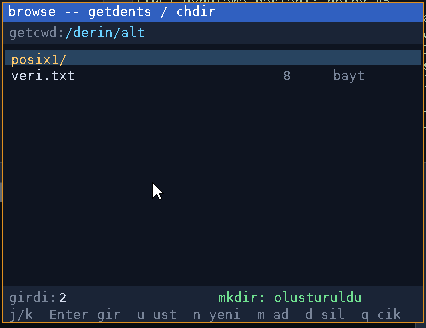

`winfiles` (PE32) aynisini Win32 yuzuyle yapiyor -- `C:/home` icinde,
`CreateDirectoryA("win321")` ile:

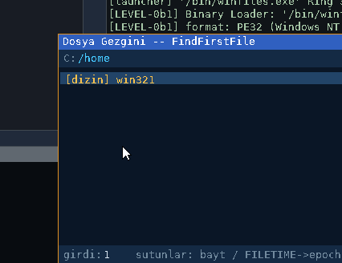

### Sifirlama neden **yuvada**, imajda degil

`cwd::reset` gorev yuvasi ayrilirken cagriliyor, imaj yuklenirken degil.
Bu tek karar POSIX'in iki kuralini birden karsiliyor:

* `execve` yuvayi **yeniden kullanir**, yeni yuva ayirmaz -- yani cwd
  kendiliginden korunuyor, ki POSIX'in istedigi de bu.
* Yeni bir surec her zaman `/`'da baslar; yuvalar geri kazanildigi icin
  bu sart, yoksa yeni surec oncekinin dizininde acilirdi.

`fork` ayri yuva aldigi icin ebeveynin dizinini ayrica kopyalar
(`cwd::clone_into`).

Ikisi de **olculdu**. `heir` uygulamasi once `/miras`a gecip fork
ediyor; cocuk kendi `getcwd`ini ebeveyninkiyle karsilastirip cevabi
**cikis koduyla** birakiyor, ebeveyn `waitpid` ile okuyor. Sonra `x`
tusu `execve("/bin/browse")` cagiriyor -- `browse` acilirken ust
satirda `getcwd`i gosteriyor:

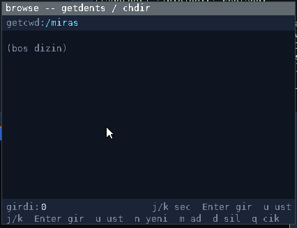

```text
[heir] ebeveyn cwd: /miras
[heir] cocuk cwd: /miras (devralindi)
[heir] fork sinavi: gecti
[heir] execve /bin/browse -- cwd korunmali: /miras
[browse] /miras icinde 0 girdi.
```

Son satir exec sinavinin kendisi: `heir`in yerine yuklenen **baska bir
ikili**, ayni dizinde acildi.

Sinav bir kere de yanlis "kaldi" demisti: karsilastirma sabit bir yola
(`"/miras"`) yapiliyordu ve disk bagli olmayan bir kosuda `chdir`
sessizce basarisiz olunca sinav basarisiz gorunuyordu -- oysa devralma
dogru calisiyordu, yalnizca gidilecek dizin yoktu. Karsilastirma
**ebeveynin gercek dizinine** cevrildi; sinanan sey "cocuk ebeveynle
ayni yerde mi", bir yol adinin kendisi degil. x86_64'te (disk yok) ayni
sinav kokten kosuyor ve yine geciyor.

### Olcum bir hata daha buldu

Win32 tarafinda `FindFirstFileA("*")` -- yalin yildiz -- **koku**
listeliyordu. `SetCurrentDirectoryA` gorunuste calisiyor, ust satirdaki
yol degisiyor, ama liste hep ayni kaliyordu. Sebep, desen atildiktan
sonra geriye kalan bos dizeyi kok saymakti. Iki ayri anlam var ve
ayirmak sart: `\*` (ya da `C:\*`) **mutlak** bir desendir, koku
gosterir; yalin `*` ise gorelidir, "bulundugum dizin" demektir.

### Bilerek yapilmayanlar

* **Kabugun dizini surec dizinlerinden ayri.** Kabuk bir cekirdek
  gorevidir ve komutlari ayri bir gorevde kosturur; "kabugun dizini" ile
  "komutun gorev yuvasinin dizini" ayni sey degil. Buna karsilik
  normallestirme tek yerde (`core::cwd::normalize`) -- yoksa kabuktan
  calisan bir yol ile uygulamadan calisan ayni yol ayrisabilirdi.
* **`fdopendir`/`openat` yok.** Goreli cozum yol adiyla yapilir, dizin
  tanimlayicisina gore degil.

## `sigaction`: ic ice teslim ve bayraklar

Bugune kadar bir isleyici koşarken **hicbir** sinyal teslim
edilmiyordu. Sebep tasarimdaydi: saklanan Ring 3 baglami tek yuvaydi,
ikinci bir teslim onu ezer ve surec asla eski yerine donemezdi. Yani
suren bir `SIGUSR1` isleyicisi, gelen bir `SIGALRM`i bekletiyordu.

POSIX kurali daha dar: **yalnizca ayni sinyal** engellenir. Farkli
sinyaller ic ice teslim edilir. Baglam artik **dort katmanli bir yigin**
oldugu icin TCMK de bunu yapabiliyor:

| | onceden | simdi |
|---|---|---|
| farkli sinyal, isleyici icinde | bekler | **teslim edilir** |
| ayni sinyal, isleyici icinde | bekler | bekler (POSIX kurali) |
| ayni sinyal + `SA_NODEFER` | -- | **teslim edilir** |
| engelleme mekanizmasi | "hicbir sinyal" bayragi | gercek maske |

Yigin dolduğunda teslim **ertelenir** -- sinyal `PENDING`de kalir,
kaybolmaz; `sigs` ciktisinda hem en derin katman hem ertelenen sayisi
gorunur.

### Bayraklar ve `sa_mask`

`sigaction`, `signal(2)`den iki sey daha tasir: bayraklar ve
isleyici suresince eklenecek engel maskesi.

| bayrak | ne yapar |
|---|---|
| `SA_NODEFER` | isleyici kendi sinyalini engellemez |
| `SA_RESETHAND` | teslimden once yerlestirme `SIG_DFL`e doner |
| `sa_mask` | isleyici suresince **ek** sinyaller engellenir |

Yapi cekirdege **isaretciyle** gecer (dort kelime: isleyici, tramplen,
bayrak, maske), tipki gercek `rt_sigaction` gibi. Registerlere
sigdirmak icin sadelestirmek, bayrak eklendikce yeniden bozulacak bir
ABI demek olurdu.

Kullanici tarafinda `signal()` artik `sigaction()` **uzerine kurulu** --
libc'de de oyledir. Bunun bir yan faydasi x86_64'te goruldu: orada 13
numara gercekten `rt_sigaction`dir, ve sadelestirilmis `signal` yuzu o
numarayi odunc almayi birakti.

### Dort sinav, hepsi belirlenimli

`nested` uygulamasi sinyalleri **kendine** gonderiyor ve `alarm` her
zaman firliyor; yani sinavlarin hicbiri zamanlama sansina bagli degil:

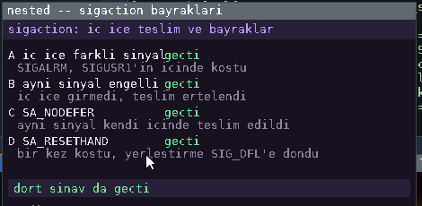

```text
[nested] A ic ice farkli sinyal: gecti (SIGALRM, SIGUSR1'in icinde kostu)
[nested] B ayni sinyal engelli:  gecti (ic ice girmedi, teslim ertelendi)
[nested] C SA_NODEFER:           gecti (ayni sinyal kendi icinde teslim edildi)
[nested] D SA_RESETHAND:         gecti (bir kez kostu, yerlestirme SIG_DFL'e dondu)
```

B ile C ayni programin ayni isleyicisi, tek farki bayrak -- yani
karsilastirma baska hicbir degiskene bagli degil. Iki mimaride de dort
sinav geciyor. `masked`, `waiter` ve `sigdemo` da teslim makinesi
degistikten sonra ayni sekilde calisiyor (regresyon kosusu).

### Bilerek yapilmayanlar

* **`SA_RESTART` ve `SA_SIGINFO` yok** ve **kabul de edilmiyor**:
  taninmayan bayraklar `set_handler`da atiliyor. Saklamak, karsiligi
  olmayan bir bayragin calistigi izlenimini verirdi. `SA_RESTART`in
  anlamli olmasi icin once kesilebilir bir bloklayan cagri gerekir;
  `pause`/`sigsuspend` POSIX'te zaten hicbir kosulda yeniden
  baslatilmaz.
* **Dort katman siniri.** Gercek programlarda ikiden derin ic ice
  sinyal patolojiktir; sinira dayanildiginda teslim ertelenir.

## Program argumanlari: aynı yetenek, iki ayri sozlesme

Uygulamalar bugune kadar **hicbir arguman almiyordu**. `run browse`
diyebiliyordunuz ama "hangi dizin" diyemiyordunuz; her uygulama ne
yapacagini kendi icinde sabitlemek zorundaydi.

Bu, iki ABI'nin **en gorunur** ayrildigi yerlerden biri -- ve ikisi de
oldugu gibi korundu:

```text
  POSIX (ELF)   yiginda:  [argc][argv0][argv1]..[NULL][envp NULL]
                bir DIZI -- her arguman ayri, NUL ile biter

  Win32 (PE)    GetCommandLineA() -> "browse /notlar"
                tek bir DIZE -- bolmek cagirana kalir
```

Gercek Windows'ta o bolme isini CRT yapar (`CommandLineToArgvW`).
Cekirdek argumanlari **bir kez** aliyor; ayrilan yalnizca sunum
(`process::build_start_stack`). Ayni sozlesmeyi tek bicime indirmek iki
taraftan birinin beklentisini bozardi: bir Windows programi `argv`
aramaz, bir Linux programi tek dize beklemez.

### Giris noktasi da ayrisiyor

POSIX tarafinda `argc`/`argv` yiginda oldugu icin giris anindaki yigin
isaretcisi gerekli -- ama Rust'in `extern "C" fn` prologu onu bozar.
`_start` bu yuzden kucuk bir asm sarmalayici: yigin isaretcisini ilk
arguman olarak Rust'a geciriyor (i386'da yigindan, x86_64'te RDI ile).
PE hedefinde boyle bir sey yok; orada `_start` sade kaliyor ve
argumanlar cagriyla okunuyor.

Uygulama tarafinda ikisi de ayni yuze cikiyor: `tcmk::args::get(1)`.

### Olcu

```text
tcmk> run browse /notlar      -> [browse] /notlar icinde 1 girdi (2 arguman)
tcmk> run winfiles /notlar    -> C:/notlar
```

Solda ELF, sagda PE -- ayni argumani, iki ayri yoldan alip ayni yerde
aciliyorlar:

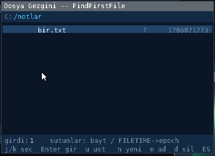

x86_64'te de ayni: `run browse /bin` -> `/bin icinde 25 girdi (2
arguman)`. Argumansiz calisan uygulamalar (`notes`, `menu`) etkilenmedi.

### Bilerek yapilmayanlar

* **`execve` dizi degil dize aliyor.** Gercek `execve` bir
  `char *const argv[]` alir; TCMK tek bir dize alip bolmeyi cekirdege
  birakiyor -- cunku ayni dize Win32 tarafinda **bolunmemis** halde
  gerekiyor.
* **En fazla sekiz arguman** ve tirnak/kacis yok: bolme sade bosluk
  ayrimi.

## Ortam degiskenleri: ayni tablo, iki ayri erisim bicimi

Argumanlar geldiginde yigina bir `envp` sonlandiricisi konmustu ama
**icerik yoktu**: onu okuyan bir program bos bir dizi goruyordu. Simdi
dolu.

Fark, argumanlardakinden bir adim daha derin. Orada ayrisan yalnizca
**bicimdi** (dizi mi, tek dize mi); burada ayrisan **kimin aradigi**:

```text
  POSIX (ELF)   yiginda:  [argv NULL]["HOME=/tmp"]["PATH=/bin"][NULL]
                cekirdek TABLOYU verir, aramayi program yapar
                (gercek libc'de `getenv` de tam olarak bunu yapar)

  Win32 (PE)    GetEnvironmentVariableA("HOME", buf, 64) -> 4
                program ADI verir, aramayi CEKIRDEK yapar
                (deger tampona yazilir; yer yetmezse gereken boy doner)
```

Bu yuzden `GetEnvironmentVariableA`nin donus sozlesmesi
`GetCurrentDirectoryA` ile ayni kaliptadir: yer yeterse **yazilan**
uzunluk (NUL haric), yetmezse **gereken** uzunluk (NUL dahil), degisken
yoksa `0` ve `GetLastError` -> `ERROR_ENVVAR_NOT_FOUND` (203). POSIX
tarafinda boyle bir hata kodu yok, cunku hata da yok: dizide ad
bulunmazsa `None`.

Cekirdekte tek bir tablo var (`level0a/core/env.rs`, 8 degisken x 64
bayt) ve **her yeni surec baslangicta onun anlik goruntusunu aliyor**.
Acilista `env::init()` uc degeri koyuyor; `HOME` disk bagliysa `/home`,
degilse `/` -- var olmayan bir dizin vermek, `cd $HOME` diyen ilk
programi bozardi.

Kabuk tabloyu `set` ile degistiriyor:

```text
tcmk> env
  HOME=/home
  PATH=/bin
  SHELL=tcmk
tcmk> set HOME=/tmp
ayarlandi: HOME=/tmp
tcmk> run browse            -> getcwd:/tmp     (ELF, environ dizisi)
tcmk> set HOME=/home
tcmk> run winfiles          -> C:/home         (PE, GetEnvironmentVariableA)
```

Ekranda ikisi yan yana: solda `/tmp`'te acilmis `browse`, sagda
`/home`'da acilmis `winfiles`. Ikisi de argumansiz calistirildi; yolu
**ortamdan** aldilar, iki ayri ABI'den:

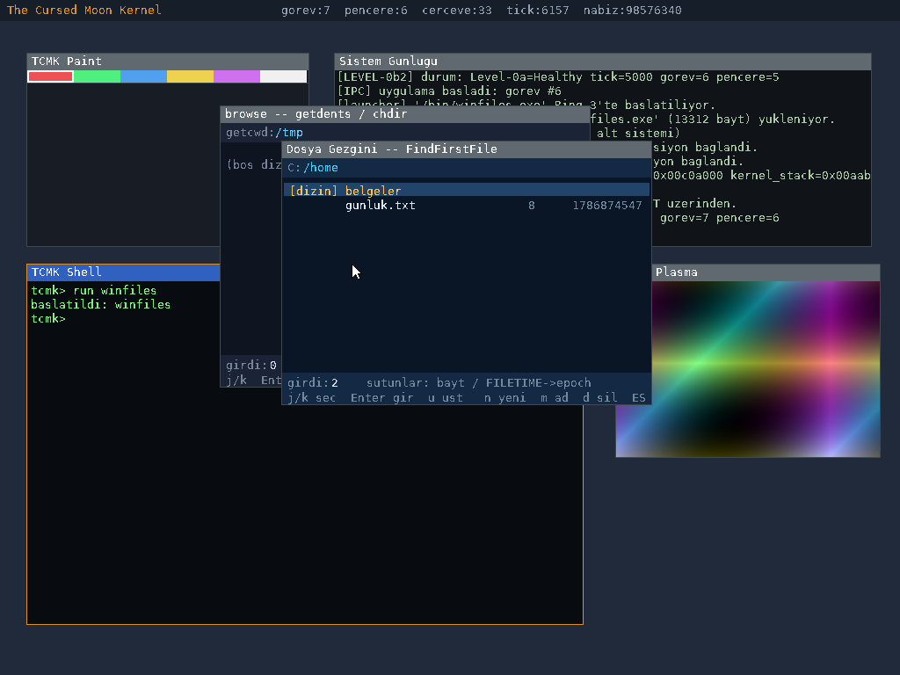

x86_64'te de ayni: `set HOME=/bin` -> argumansiz `browse` ->
`getcwd:/bin`.

### Buyuk harf: eksik olan konfor degil, yetenekti

Bu is sirasinda gercek bir bosluk ortaya cikti. Klavye surucusu
**yalnizca kucuk harf** uretiyordu -- ilk gunden beri oyleydi ve uzun
sure fark edilmemisti, cunku komutlar (`ls`, `run`, `mkdir`) ve yollar
hep kucuktu. Ortam degiskenleri gelenek geregi **buyuk** harflidir:
`set HOME=/tmp` yazilamayan bir kabukta `HOME` kullanilamaz.

Olcum bunu dogrudan gosterdi: `set HOME=/tmp` diye gonderilen tuslar
ekrana `set home=/tmp` diye dustu ve tabloya **ayri bir** `home`
degiskeni eklendi. Surucu artik shift ve caps lock tasiyor; ikisi ayri
calisiyor, cunku etki alanlari ayri:

* **Shift** her tusu etkiler (`1` -> `!`, `[` -> `{`) ve basili oldugu
  surece gecerlidir -- birakma kodu (bit 7) ile duser. Noktalama esleri
  icin ayri bir tablo var; `ch - 32` aritmetigi `/` -> `?` esini
  veremezdi.
* **Caps lock** yalnizca **harfleri** etkiler ve bir anahtardir: basma
  aninda devrilir, birakma yok sayilir. Durum cubugunda `CAPS` yaziyor
  -- gostergesiz bir kilit, tuslarin neden beklenmedik ciktigini
  aciklanamaz kilardi.

Harflerde ikisi birbirini **gotururur**: caps acikken `shift+a` yine
kucuk `a` verir. Gercek klavyelerin davranisi budur.

### Ortam artik surecin

Ilk surumde tablo **sistem geneliydi** ve her surec baslangicta onun
anlik goruntusunu aliyordu. Okumak icin yetiyordu, ama bir sureci kendi
ortamini degistiremez birakiyordu: `setenv` yoktu, cunku yazacak yer
yoktu.

Artik her gorev yuvasinin kendi tablosu var ve POSIX'in uc kurali --
`cwd`de oldugu gibi -- oldugu gibi geciyor:

| olay | ortam |
|---|---|
| yeni gorev yuvasi | **oturum tablosunun** kopyasi (`spawn_inner`) |
| `fork` | ebeveynden kopyalanir |
| `execve` | **degismez** -- yuva ayni kaldigi icin kendiliginden |

Ucuncu satir yine tasarimin sonucu, ayri bir kod degil: sifirlama imaj
yuklenirken degil **yuva ayrilirken** yapiliyor, `execve` de yuvayi
yeniden kullaniyor. Gercek POSIX ayni sonuca `execve(path, argv,
environ)` deyimiyle varir -- cagiran kendi ortamini acikca aktarir.

Tablolar `MAX_TASKS + 1` satirlik tek bir dizi; son satir (`SESSION`)
hicbir goreve ait degil, kabugun `set` ile duzenledigi **oturum
ortamidir**. Ayri bir tur yerine ayni dizinin bir satiri olmasi,
"kopyala" isleminin her yerde tek bir kalip olmasini sagliyor.

#### `bequest`: dort sinav, hepsi belirlenimli

```text
tcmk> run bequest
[bequest] A setenv kendinde:  gecti (get() yeni degeri gordu)
[bequest] B fork mirasi:      gecti (cocuk 'alfa' gordu)
[bequest] C kardes yalitimi:  gecti (cocugun yazdigi ebeveyne sizmadi)
[bequest] D: TCMK_MIRAS=beta yazildi, execve...
[bequest] D miras execve sonrasi: gecti (TCMK_MIRAS=beta, HOME=/)
```

D sinavi programin **kendisini** yeniden yukluyor: ayni ikili, iki
asama, ayrimi arguman yapiyor. Cocugun cevabi ekrana yazarak degil
**cikis koduyla** geliyor -- iki surecin ciktisi ayni konsolda
karisabilir, cikis kodu karisamaz.

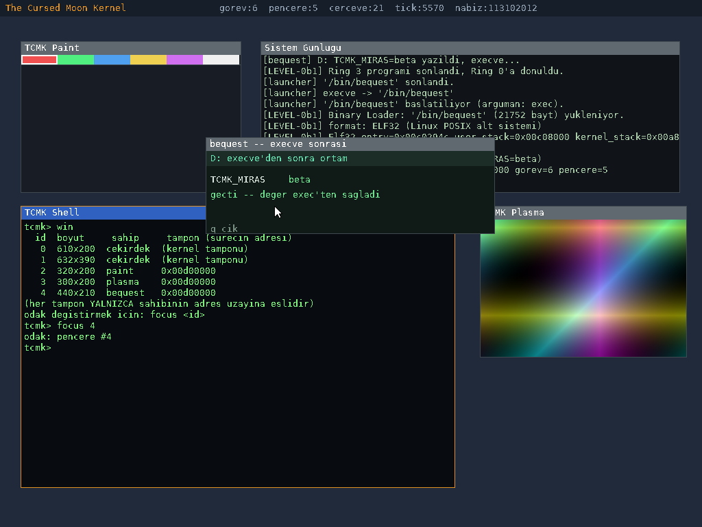

x86_64'te de altisi birden geciyor.

#### `setenv` neden bir sistem cagrisi (ve Win32'de neden dogal)

Gercek POSIX'te `setenv` **cekirdege hic ugramaz**: ortam surecin kendi
belleginde bir dizidir, libc onu dogrudan duzenler. TCMK'de tablo
cekirdekte oldugu icin bir cagri gerekiyor -- numarasi da bu yuzden
Linux araliginda degil TCMK araliginda (`0x50B`).

Win32 tarafinda ayni islev **zaten** bir cekirdek cagrisidir:
`SetEnvironmentVariableA` sureci temsil eden blogu degistirir, kullanici
dizisini degil. Yani TCMK'nin sadelestirmesi bir tarafta ayrilik, oteki
tarafta tam isabet.

Bunun gorunur bir sonucu var: POSIX tarafinda okuma yigindaki **anlik
goruntuden** yapildigi icin, cekirdege yazmak o goruntuyu degistirmez.
`tcmk::env::set` bu yuzden iki is yapiyor -- cekirdege bildiriyor
(cocuklarin gorecegi ortam) **ve** yerel bir katmani guncelliyor (bu
surecin `get`inin gorecegi deger). Gercek libc'nin `setenv`i de tam
olarak ikincisini yapar. Win32 tarafinda yerel katman yok, cunku okuma
zaten cekirdege soruluyor.

#### `execve`nin ucuncu parametresi

Ilk surumde `execve` yalnizca yol ve arguman aliyordu: yeni imaj
**yuvada duran** tabloyu devraliyordu ve cagiranin baska bir ortam
vermesi mumkun degildi. Artik ucuncu parametre var ve gercek POSIX
anlamini tasiyor -- verilen dizi yeni surecin ortaminin **tamamidir**,
eskisinin uzerine eklenmez.

```text
  execve(yol, argv, NULL)        -> ortam KORUNUR   (TCMK genislemesi)
  execve(yol, argv, ["A=1"])     -> ortam bu DIZIYE esitlenir
```

Ilk satir gercek POSIX'te yoktur: orada cagiran kendi `environ`unu
vermek zorundadir. TCMK'de gorev yuvasi exec boyunca ayni kaldigi icin
"koru" bedava geliyor, ve `execve(path, argv, environ)` deyiminin
sonucuyla ayni yere cikiyor.

Kopyalama sirasi burada bir zorunluluk: `envp` isaretcileri **cagiranin**
adres uzayina bakiyor ve o uzay exec ile gidecek, yani satirlar imaj
birakilmadan **once** cekirdege alinmak zorunda. Uygulama sirasi da
onemli: once yolun gecerliligi sinaniyor, sonra tablo degistiriliyor --
basarisiz bir `execve` cagiranin ortamini bozmamali.

`bequest`in besinci sinavi tam olarak bunu olcuyor. `TCMK_MIRAS=beta`
yazilip `["TCMK_MIRAS=gamma"]` ile exec ediliyor; yeni imaj `gamma`
gormeli **ve** oturumdan gelen `HOME`u **gormemeli**:

```text
[bequest] E: envp=[TCMK_MIRAS=gamma], execve...
[bequest] E envp execve sonrasi: gecti (TCMK_MIRAS=gamma, HOME=<yok>)
```

`HOME=<yok>` satiri sinavin asil yeri: dizinin "tamami" olmasi, eksilen
seyle kanitlaniyor.

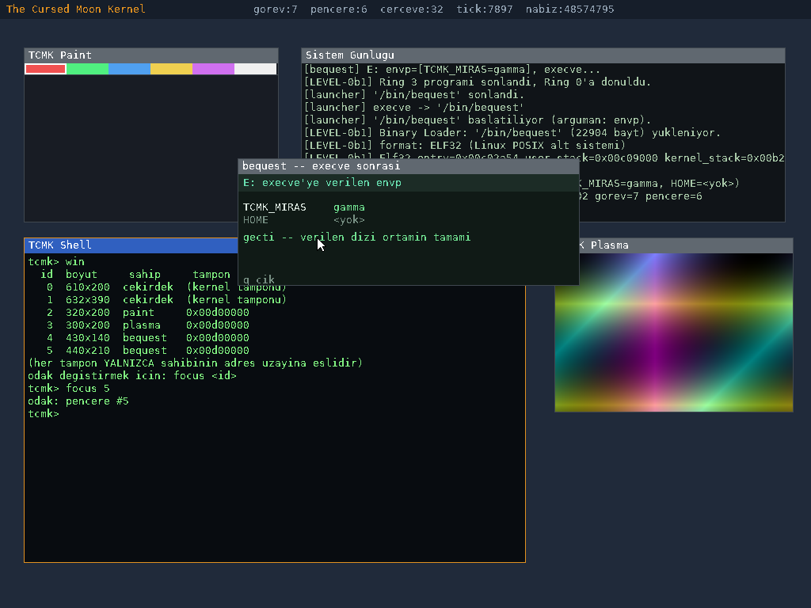

#### `PATH` nihayet okunuyor -- ve yaninda `PATHEXT`

Ortam tablosu ilk gunden `PATH=/bin` tasiyordu ama **hicbir sey onu
okumuyordu**: kabuk uygulamalari gomulu bir listeden buluyor, `execve`
tam yol istiyordu. Degisken vardi, anlami yoktu.

Artik hem `run` hem `execve` aramadan geciyor. Ad bir egik cizgi
iceriyorsa yol olarak alinir (POSIX'te de oyle: `./a.out` aranmaz);
icermiyorsa `PATH` bilesenleri sirayla denenir.

Ikinci degisken burada devreye giriyor ve TCMK'de **gercek bir ise
yariyor**:

```text
  PATH=/bin   PATHEXT=.exe

  "browse"    -> /bin/browse           bulundu (uzantiya gerek yok)
  "winfiles"  -> /bin/winfiles         yok
                 /bin/winfiles.exe     bulundu
```

`PATHEXT` Windows'un kalibidir; POSIX'te karsiligi yoktur, cunku orada
dosya adi neyse odur ve calistirilabilirlik izin bitinden gelir. TCMK'de
izin biti yok -- ama **iki bicimli** bir isim uzayi var (`browse` ELF,
`winfiles.exe` PE), yani Windows'un cozdugu sorun burada da gercek. Iki
gelenek tek aramada bulusuyor: once yalin ad, sonra uzantilar.

Arama `which` ile dogrudan gorulebiliyor:

```text
tcmk> which browse
/bin/browse
tcmk> which winfiles
/bin/winfiles.exe
  (PATHEXT: .exe eklendi)
tcmk> which /bin/plasma
/bin/plasma
tcmk> which yokboyle
bulunamadi (PATH: /bin)
```

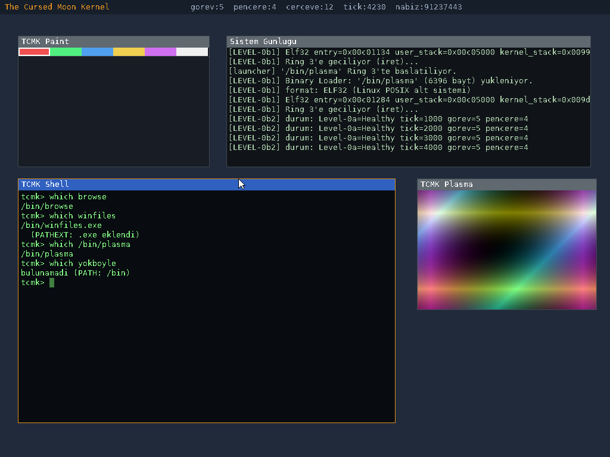

Kabugun gomulu listesi boylece bir **kolaylik** oldu, zorunluluk degil:
listede olmayan `hello` artik `run hello` ile calisiyor (once
calismiyordu -- eski yedek yol yalnizca tam yol deniyordu). `bequest`in
altinci sinavi ayni seyi `execve` tarafinda olcuyor:

```text
[bequest] F: execve("bequest") -- egik cizgisiz
[bequest] F PATH aramasi: gecti (argv[0]=/bin/bequest)
```

Kanit `argv[0]`: onu **cekirdek** yerlestiriyor ve oraya cozulmus yolu
yaziyor. Program `bequest` diye cagirdi, `/bin/bequest` gordu.

#### `winenv`: Win32'nin donus sozlesmesi

POSIX'in `getenv`i isaretci ya da NULL doner, baska bilgi tasimaz.
`GetEnvironmentVariableA`nin donusu **uc anlam** tasir ve gercek Windows
programlari ucune de bagimlidir:

```text
  0            -> degisken yok      (GetLastError = ERROR_ENVVAR_NOT_FOUND)
  <= nSize     -> yazildi, boyu bu
  >  nSize     -> yazilmadi, GEREKEN boy bu (NUL dahil)
```

Ucuncusu "once kucuk tamponla sor, gerekirse buyut" kalibinin temeli.
Taklit edilmezse o kalibi kullanan bir ikili degeri sessizce kirpilmis
alirdi -- `winenv.exe` bunu dogrudan olcuyor:

```text
tcmk> run winenv
[winenv] A oturum mirasi:            gecti (HOME okundu)
[winenv] B SetEnvironmentVariableA:  gecti (yazilan deger geri okundu)
[winenv] C gereken boy:              gecti (6 dondu, tampon bozulmadi)
[winenv] D NULL ile silme:           gecti (silindi, GetLastError = 203)
```

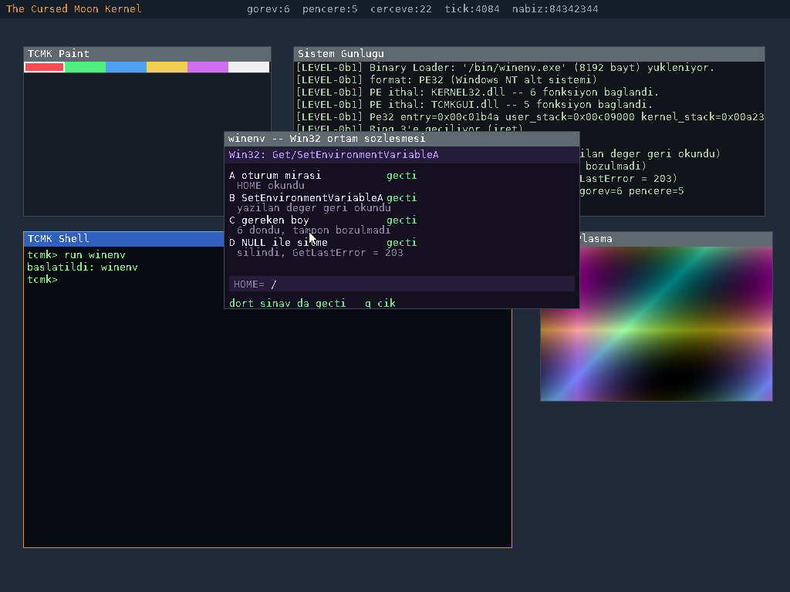

PE32 (i386) ve PE32+ (x86_64) ikilisinde de ayni dort sonuc.

### Bilerek yapilmayanlar

* **`CreateProcess`in `lpEnvironment`i yok.** Win32 tarafinda yeni
  surece ortam vermenin yolu `CreateProcess`tir; TCMK'de o cagri hic
  yok, dolayisiyla PE tarafi ortami yalnizca **devralir**.
* **`envp` sekiz satir, satir basi 64 bayt.** Fazlasi sessizce atilir --
  cekirdek tablosunun siniri zaten bu.
* **`GetEnvironmentStringsA` yok.** Win32'nin toplu okuma cagrisi; TCMK
  yalnizca adla sorgulamayi destekliyor.
* **Yerel katman dort girdilik.** POSIX tarafinda bir surec dortten
  fazla degiskeni kendi icinde degistirirse `set` basarisiz bildiriyor --
  sessizce eski degeri gostermektense.
* **Sekiz degisken, 64 bayt** -- sabit tablo, dinamik ayirma yok.
* **TR klavye duzeni yok.** Shift tablosu US; bir gun duzen eklenirse
  degisecek yer o tek tablo.

## Sormak icin acmak gerekmiyor: `stat`, saat, `uname`

Bu turdeki cagrilar uzun sure eksikti ve eksiklikleri **sessizdi** --
hicbir sey bozulmuyordu, yalnizca uygulamalar dolambacli yollar
kullaniyordu.

| soru | onceki tek cevap | simdi |
|---|---|---|
| bu yol var mi? | `open` deneyip sonuca bakmak | `stat` / `access` |
| bu bir dizin mi? | **cevap yoktu** (`open` dizinde calismiyordu) | `stat` |
| saat kac? | POSIX'te **cevap yoktu** | `time` / `clock_gettime` |
| hangi sistemdeyim? | cevap yoktu | `uname` |
| yazdiklarim diskte mi? | yalnizca kabugun `sync` komutu | `fsync` |

Saat satiri en carpici olani: RTC surucusu bastan beri oradaydi ve bir
**PE** onu `NtQuerySystemTime` ile okuyabiliyordu. Ayni cekirdekte kosan
bir **ELF** okuyamiyordu. Asimetri kaynakta degil, yalnizca ceviri
katmanindaydi.

### Ayni cagri, iki sozlesme

Her biri tek bir `kernel_api` girisine iniyor; ayrisan cevabin bicimi,
ve her satirin kendi sebebi var:

```text
  stat(yol, buf)            -> 0/-errno, bilgi TAMPONA yazilir
  GetFileAttributesA(yol)   -> bilgi DONUS DEGERINDE, bayrak kumesi;
                               hata 0 degil 0xFFFFFFFF

  time()                    -> 1970'ten beri SANIYE
  GetSystemTimeAsFileTime   -> 1601'den beri 100 NANOSANIYELIK ARALIK

  uname(buf)                -> alti DIZE (sysname, release, machine...)
  GetVersionExA(buf)        -> uc SAYI + servis paketi dizesi
```

Birinci satirda hata degerinin `0` olmamasi rastlanti degil: sifir
"hicbir ozellik yok" demek olurdu ve o **gecerli bir durum**
sayilabilirdi. Windows bu yuzden `INVALID_FILE_ATTRIBUTES`i tum bitler
bir secmis.

Ucuncu satir pratikte fark yaratiyor: bir Windows programi
`dwMajorVersion >= 5` diye **sayi** karsilastirir; ayni is POSIX'te
dizeyi ayristirmakla yapilir.

Ikinci satirda cevrim (`filetime_of`) tek yerde duruyor. Iki taraftan
birine otekinin cagini dayatmak, o tarafta derlenmis her programin tarih
hesabini kaydirirdi.

### `stat` neden `struct stat` degil

Gercek `struct stat`in yirmi alani var; TCMK ucunu veriyor: boyut, dizin
mi, salt okunur mu. Sebep, `uname`de tam tersini yapmis olmamizla ayni:

* `utsname` **oldugu gibi** dolduruluyor (alti alan, her biri 65 bayt),
  cunku alanlarin karsiligi var -- yalnizca degerler TCMK'nin. Yapi glibc
  basliklarinda sabittir ve alanlara ofsetle erisilir.
* `stat`in on yedi alaninin ise **karsiligi yok**: izin, sahiplik, aygit
  numarasi, bag sayisi. Sifirla doldurmak, "bilinmiyor" ile "sifir"
  arasindaki farki silerdi.

`read_only` da bir izin biti degil, **arka uc** bilgisi: RAMFS dosyalari
cekirdek imajinin icindedir. Win32 tarafinda ayni gercek
`FILE_ATTRIBUTE_READONLY` olarak gorunuyor -- iki dunyada da dogru olan
tek cumle bu.

### Olcum

```text
tcmk> run probe
[probe] A stat dosya:      gecti (var, salt okunur, boyu dolu)
[probe] B stat dizin:      gecti (ima edilen dizin gorundu)
[probe] C stat yok:        gecti (olmayan yol None dondu)
[probe] D access:          gecti (F_OK gecti, W_OK RAMFS icin gecmedi)
[probe] E uname:           gecti (sysname ve machine dogru)
[probe] F monotonik saat:  gecti (400 ms uykudan sonra ilerlemis)

tcmk> run winprobe
[winprobe] A dosya ozellikleri: gecti (READONLY var, DIRECTORY yok)
[winprobe] B dizin ozellikleri: gecti (DIRECTORY bayragi var)
[winprobe] C olmayan yol:       gecti (0xFFFFFFFF + GetLastError = 2)
[winprobe] D GetVersionExA:     gecti (platform NT(2), bos boyut reddedildi)
[winprobe] E saat:              gecti (takvim ve FILETIME dolu)
```

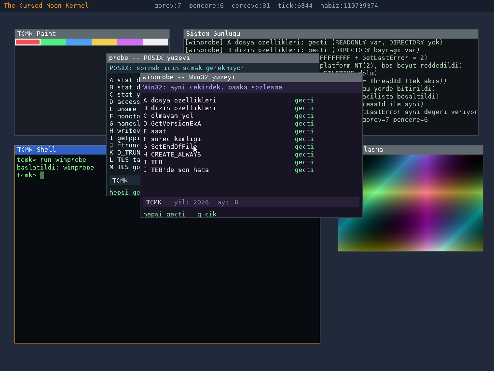

Iki sinav ozellikle **olumsuz** tarafi olcuyor, cunku asil kanit orada:

* `probe` F'de tek okuma bir sey kanitlamaz -- saatin calismasi demek
  **ilerlemesi** demek, o yuzden uyku oncesi/sonrasi fark bakiliyor.
* `winprobe` D'de ikinci cagri bilerek **bos** bir yapiyla yapiliyor.
  Windows `dwOSVersionInfoSize`i dogrular ve doldurulmamis bir yapiyi
  reddeder; kabul etseydi cagiranin hangi surumu bekledigi bilinemezdi.

On bir sinav da iki mimaride geciyor (i386/ELF32+PE32,
x86_64/ELF64+PE32+).

### Bilerek yapilmayanlar

* **`CLOCK_MONOTONIC` cozunurlugu 10 ms** (PIT 100 Hz). Nanosaniye alani
  dolduruluyor ama o kadar ince degil; sozlesmeyi tutmak icin var.
* **`lstat` yok** -- sembolik bag da yok, ayrimin karsiligi olmazdi.
* **`fsync` dosya basina degil**: TCMKFS'te dosya basina tampon yok, tek
  bir ortak tablo var. Cagri yine de `fd` aliyor ve gecerliligini
  siniyor -- iki ABI'nin de sozlesmesi oyle.
* **`GetLocalTime` yok**: saat dilimi kavrami yok, `GetSystemTime` ile
  ayni seyi dondururdu.

## Kabuk komutlari artik ekrani dondurmuyor

Kabuk masaustu gorevinde kosuyordu ve o gorev **uyutulamaz** (ekrani o
ciziyor). Sonuc iki katliydi: kabuktan verilen bir disk komutu kesmeyle
bekleyemiyor, yoklamak zorunda kaliyordu -- ve yoklarken masaustu
dongusu ilerlemiyordu. `format onayla` boyunca ekran otuz saniye
donuyor, o sirada basilan tuslar kuyruk dolunca dusuyordu.

Komut artik **kendi gorevinde** kosuyor. `ps` tablosunda gorunur:

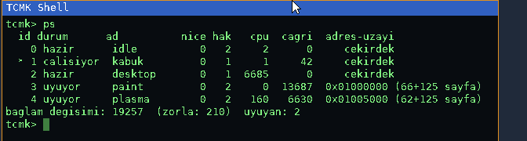

Ikisi birden duzeldi:

| | once | sonra |
|---|---|---|
| `format` sirasinda masaustu | donuk | **caliyor** (tik ilerliyor) |
| `format` suresi | 30 sn+ | **8 sn** |
| `df` -> io beklemesi | 0 | **101** |

Son satir olcumun kendisi: "io beklemesi" bir gorevin disk icin
gercekten **uyudugu** kez sayisidir. Sifir olmasi, kabugun butun disk
isini yoklayarak yaptigi anlamina geliyordu. Komut uyutulabilir bir
baglama tasininca kesmeyle bekleme yolu ilk kez kabuk icin de devreye
girdi -- ve sure de bu yuzden dortte bire indi.

Komut kosarken tuslar yok sayilir: yarim kalan satir sonraki komuta
karisirdi. Gorev tablosu doluysa eski yola dusulur (komut yine calisir,
yalnizca ekran o sure boyunca donar) -- yeni bir hata yolu acmamak icin.

## `WriteFile`: Windows ikilisi artik diske yaziyor

`KERNEL32.dll` tablosunda `CreateFileA` ve `ReadFile` vardi; **`WriteFile`
yoktu.** Yani PE uygulamalari dosya okuyabiliyor ama yazamiyordu.
`winpad` notunu `WriteConsoleA`'ya bir dosya tutamagi vererek
kaydediyordu -- calisiyordu (ikisi de ayni `kernel_api::write`'a iner)
ama Win32 sozlesmesi degildi: `WriteConsoleA`'nin dorduncu parametresi
"yazilan **karakter** sayisi"dir ve konsol icin tanimlidir. Uygulamanin
kendi yorumu bunu zaten itiraf ediyordu.

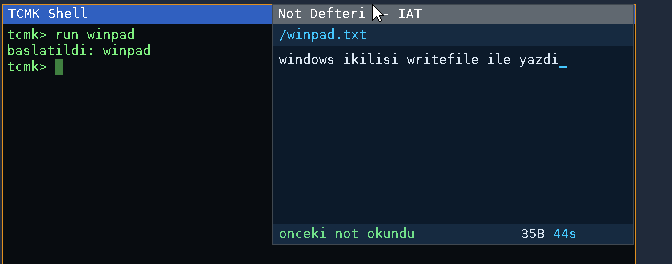

Artik dizi tam: `CreateFileA` -> `WriteFile` -> `CloseHandle`. Windows'ta
bir dosyayi kaydetmenin gercek yolu budur ve `lpNumberOfBytesWritten`
cikti parametresi de dolduruluyor -- uygulama onu dogruluyor.

Dogrulama iki mimaride de ayni: `winpad` (PE32 ve PE32+) nota yazdi,
sistem yeniden basladi, kabuk `cat /winpad.txt` ile geri okudu ve
`winpad` acilista `ReadFile` ile ayni metni buldu.

`KERNEL32.dll` artik **8 fonksiyon** bagliyor (biri ordinal ile).

## Calisma dizini ve `.` / `..`

Yollar "her zaman mutlak" idi: `cat /home/alt/derin.txt` yazmak
zorundaydiniz. Artik kabugun bir **calisma dizini** var ve komut istemi
de onu tasiyor.

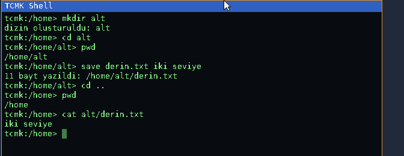

`cd ..` sonrasi `pwd` `/home/alt/..` degil `/home` diyor: yol
**sadelestirilerek** saklaniyor. Sadelestirilmeseydi her `cd ..` yolu
uzatir ve birkac adimda derinlik sinirina takilirdi.

### Sadelestirme neden kabukta, `..` neden dosya sisteminde

Ikisi ayri sorun ve ayri yerde cozuldu:

* **`tcmkfs::resolve`** `.`/`..` bilesenlerini anlar. Diskte `.`/`..`
  diye girdi **yoktur**; `..` icin gereken bilgi inode'un `parent`
  alaninda zaten duruyordu (dizin agaci cocuktan ebeveyne saklanir), yani
  eklenen tek sey yol yurutucusundeki iki dal oldu. Bu, Ring 3
  uygulamalarinin kabuktan gecmeden `open("../x")` diyebilmesi icin
  gerekli.
* **Kabuk** yolu ayrica **sadelestirir**. Cunku VFS'in oteki ucu,
  cekirdek imajina gomulu RAMFS, duz bir isim tablosudur ve yolu birebir
  karsilastirir: `/./bin/hello` TCMKFS'te calisirken RAMFS'te
  bulunamazdi. Kabuk tek bir yerde sadelestirerek iki dosya sistemini de
  ayni girdiyle besliyor -- `run ./bin/hello` bu yuzden calisiyor.

`run` bir istisna tasiyor: `run paint` kisa addir, yol degil. Yalnizca
icinde egik cizgi olan argumanlar calisma dizinine gore cozuluyor.

Kokun ebeveyni kendisidir: `/..` yine koktur. POSIX de boyle davranir;
aksi halde yol agacin disina cikardi.

### Bilerek yapilmayan: surec basina `cwd`

Calisma dizini **kabuga** ait, surece degil. POSIX'te `cwd` surec
basinadir ve `fork` ile devredilir; `chdir` de bir syscall'dir. Burada
kabuk yolu cagirmadan once mutlaklastirdigi icin `run notes` ile
`run ./notes` ayni sonucu veriyor -- uygulama yine mutlak yol goruyor.
Ring 3 tarafinda `chdir`/`getcwd` yok.

## `mmap` / `munmap`: ilk gercek "geri verme"

`brk` tek bir siniri iter ve geri cekildiginde cerceve **iade etmez** --
adres hala surecin sayilir, cerceve surec olene kadar durur. `mmap`
bagimsiz bloklar verir, `munmap` ise cerceveleri gercekten havuza
dondurur. Sistemdeki ilk calisma-zamani geri verme yolu budur.

### Defter neden yok

Ayri bir "hangi sayfa bos" tablosu tutulmuyor: **sayfa tablosunun kendisi
zaten o defter.** Bir PTE'nin uc hali var ve ucu de ayirt edilebilir:

| PTE | anlam |
|---|---|
| `0` | bos -- `mmap` buradan verebilir |
| `PTE_DEMAND` | ayrildi, henuz dokunulmadi |
| `PRESENT` | ayrildi ve cerceve verildi |

`mmap` ardisik sifir girdi arar, bulunca `PTE_DEMAND` yazar; cerceveyi
ilk dokunusta sayfa hatasi verir (talep uzerine sayfalama zaten oradaydi).
Ikinci bir veri yapisi tutmak, `fork`/`execve`/surec olumu yollarinin
hepsinde ayrica guncellenmesi gereken bir sey demek olurdu -- ve senkron
kalmadigi gun sessizce yanlis cevap verirdi.

Bolge de ayri: ilk pencere (`USER_MAP_SIZE`, 512 KiB) imaj + yigin +
`brk` icin, `mmap` penceresi (0x00C80000, 512 KiB) calisma aninda istenen
bloklar icin. Ikisinin ayri olmasi birbirlerine girmelerini engelliyor.

### Olcum

Durum cubugundaki `cerceve` sayaci butun hikayeyi anlatiyor -- `arena`
32 KiB'lik bloklarla calisiyor (blok = 8 sayfa):


| adim | cerceve |
|---|---|
| taban (`arena` yok) | 10 |
| 10 blok ayrildi ve dolduruldu | 97 |
| `z` -- hepsi `munmap` | **17** |
| 4 blok yeniden ayrildi | 49 |

10 blok = 80 sayfa; `arena`'nin kendi sayfalariyla 87 artis. `munmap`
sonrasi 17'ye dusuyor: **80 cerceve gercekten geri geldi.** Yeniden dort
blok (32 sayfa) alininca 49 -- bosalan adresler de tekrar kullanilabiliyor.

x86_64'te ayni test 0 -> 90 -> 10 -> 42 veriyor.

`ps` satirinda ucuncu bir sayi belirdi: `(123+123+16m sayfa)` --
yerlesik, ayrilmis ve **`mmap` penceresinde tutulan** sayfalar.

### Cerceveler sifirlanmis geliyor

`arena` her blogu **once okuyor**, sonra dolduruyor: sifir olmayan bayt
sayaci 0 kaliyor. Cekirdek cerceveyi vermeden once temizliyor;
temizlemeseydi onceki surecin verisi yeni surece sizardi -- izolasyonun
tam da engellemesi gereken sey. Desen de adrese bagli, yani bir blok
digerinin uzerine yazsa dogrulama bunu yakalardi (0 bozuk bayt).

### Bilerek yapilmayanlar

POSIX `mmap` alti argumanlidir. TCMK yalnizca **anonim ve ozel**
eslemeyi destekler: `addr` sifir olmak zorunda (yeri cekirdek secer),
`prot` yok sayilir (butun kullanici sayfalari okuma+yazma), dosya
destekli esleme yok. Desteklenmeyen bir cagriyi sessizce baska bir sey
gibi davranmak yerine reddetmek dogru olan -- `addr != 0` gelirse
`-EINVAL` doner.

## Sinyal maskesi ve `alarm`

Sinyaller teslim ediliyordu ama **ertelenemiyordu**. POSIX'te bir
sinyali engellemek onu yok saymak degildir: engelli sinyal bekleyenler
maskesinde durur ve engel kalkinca teslim edilir. Kritik bolge kalibi
budur -- bolunmemesi gereken is maskeyle cevrelenir, sinyal kaybolmaz,
yalnizca **ertelenir**.

```
sigprocmask(SIG_BLOCK,   1<<SIGUSR1)   -> artik gelmez, birikir
... kritik bolge ...
sigprocmask(SIG_UNBLOCK, 1<<SIGUSR1)   -> biriken ANINDA teslim
```

`masked` uygulamasi SIGUSR1 **engelli** baslar. Kabuktan uc kez sinyal
gonderildiginde:

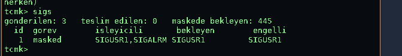

**Gonderilen 3, teslim edilen 0.** Sinyal kaybolmadi -- `bekleyen`
sutununda duruyor, `engelli` sutunu nedenini soyluyor. Odak uygulamaya
verilip engel kaldirilinca sayac aninda 1 oluyor.

Ikinci kanit da orada: uc sinyal gonderildi, sayac **bir** artti.
Standart sinyaller siraya girmez; maske bir bittir, sayac degil.

### `alarm`: zamanlayici da bir sinyal kaynagi

`alarm(3)` cagiran gorev icin PIT tik'i cinsinden bir uyanma ani
saklanir. Her tikte suresi dolan gorevlere `SIGALRM` konur -- kesme
baglaminda yalnizca bir bit; teslim, hedef Ring 3'e donerken olur. Yani
zamanlayici ayri bir mekanizma degil, var olan sinyal yolunun bir
kaynagi.

POSIX sozlesmesi de yerinde: `alarm` **onceki alarmdan kalan saniyeyi**
doner. Ust uste iki `alarm(3)` cagrisinin ikincisi `3` donuyor, `alarm(0)`
iptal edip kalani veriyor.

### Bilerek yapilan tasima farki

Gercek POSIX `sigprocmask` iki `sigset_t` **isaretcisi** alir. TCMK
maskeyi deger olarak gecirir ve eskisini donus degeriyle verir: 32
sinyal tek bir kelimeye sigdigi icin isaretci dogrulamak gereksiz bir
yol olurdu (ayni sadelestirme `pipe` ve `poll`'da da yapildi).

`SIGKILL` maskeye **giremez**. Girebilseydi bir surec kendini
oldurulemez yapabilirdi; POSIX'in bu yasagi da tam olarak bunun icin.

`fork` maskeyi devralir (bekleyenleri ve alarmi almaz); `execve` maskeyi
ve alarmi korur, isleyicileri sifirlar -- adresleri eski imaja aitti.

## Talep uzerine sayfalama

`fork` COW oldu ama `execve` hala pahaliydi: her surec, tek bir bayta
bile dokunmadan, pencerenin tamami kadar cerceve tuketiyordu -- 512 KiB
= 128 cerceve. Oysa tipik bir uygulama imaji, yigininin tepesi ve biraz
veri disinda hicbir yere dokunmaz.

Artik esleme degil **ayirma** yapiliyor: girdi "yok" olarak ama
`PTE_DEMAND` isaretiyle yaziliyor. Adres gecerlidir; ilk dokunus bir
sayfa hatasi uretir ve cekirdek o sayfaya -- yalnizca ona -- cerceve
verir. Ayrilmamis bir adrese dokunmak ise hala gercek bir hatadir;
ikisini ayiran sey bu bayraktir.

Altyapi zaten hazirdi: copy-on-write, vektor 14'u **geri donebilen** tek
istisna haline getirmisti. Talep uzerine sayfalama ayni kapiya ikinci bir
dal ekliyor; hata kodunun 0. biti ikisini ayiriyor.

| hata kodu | anlam | dal |
|---|---|---|
| bit 0 = 0 | sayfa yok | talep uzerine doldur |
| bit 0 = 1, bit 1 = 1 | var ama yazma reddedildi | copy-on-write |
| digerleri | gercek hata | surec sonlandirilir |

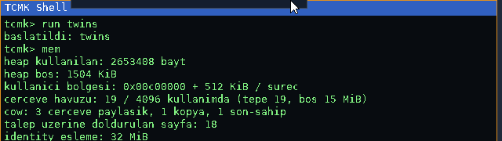

### Olcum

Ayni ikili (`twins`), ayni an: uygulama yuklendi ve catallandi, ebeveyn
ve cocuk ikisi de yasiyor. Uc cekirdek, ayni test:

| | acilis tabani | `run twins` sonrasi | toplam |
|---|---|---|---|
| tam kopya | 260 cerceve | 520 | 2,0 MiB |
| + copy-on-write | 260 cerceve | 393 | 1,5 MiB |
| + talep uzerine | **10 cerceve** | **19** | **76 KiB** |

Acilis tabaninin 260'tan 10'a dusmesi rastlanti degil: masaustu
uygulamalari da (paint, plasma) ayni yoldan geciyor. `fork` gunlugu de
degisti -- eskiden "128 sayfa", simdi **"4 sayfa paylasildi/COW"**:
`twins` gercekten dort sayfaya dokunuyor (imajin uc sayfasi + yigin).

Bes Ring 3 sureci (winclock, notes, mux, paint, plasma) ve yedi pencere
ayni anda acikken sistemin tamami **31 cerceve** kullaniyor.

`ps` tablosu ikisini ayri gosteriyor: `(51+121 sayfa)` = 51 yerlesik,
121 ayrilmis-ama-verilmemis.

### Ring 0'dan gelen hatalar da bu yoldan geciyor

`CR0.WP` copy-on-write icin aciktir; talep uzerine sayfalamada ise
"sayfa yok" hatasi zaten ayricalik seviyesine bakmaz. Yani cekirdegin
kullanici bellegine yazdigi her yol -- `waitpid`'in durum kelimesi,
`poll`'un `revents` geri yazimi, sinyal cercevesi, ELF/PE yukleyicisinin
imaji kopyalamasi -- ayrilmis bir sayfaya denk geldiginde hatayi alir ve
sayfa doldurulup komut tekrarlanir. Yukleyicinin kendisi de boyle
calisiyor: imaji kopyalarken dokundugu sayfalar aninda doluyor, geri
kalan pencere bos kaliyor.

## Copy-on-write `fork`

`fork`'un tanimi "adres uzayini kopyala"dir, ama **kopyalamak** tanimin
bir parcasi degil; gozlemlenebilir sonucun bir parcasi. Iki surec
birbirinin bellegini goremesin yeter. Kopya, bu sonucu vermenin en kaba
yoludur -- ve `fork`'tan hemen sonra `execve` cagiran klasik kalipta
kopyanin tamami **aninda cope gider**.

Copy-on-write ayni sonucu erteleyerek verir:

```
fork()   ->  iki adres uzayi AYNI cercevelere bakar
             ikisinin de PTE'si salt okunur + PTE_COW
ilk yazma ->  sayfa hatasi (#PF)
             cekirdek O sayfayi -- yalnizca onu -- cogaltir
             komut tekrarlanir, uygulama hicbir sey fark etmez
```

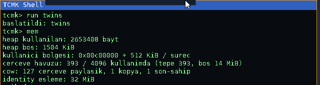

### Olcum

Ayni ikili (`twins`), ayni an: uygulama yuklendi ve catallandi, ebeveyn
ve cocuk ikisi de yasiyor. Iki cekirdek, ayni taban (260 cerceve):

| | `run twins` sonrasi | `fork`'un bedeli |
|---|---|---|
| tam kopya | 520 cerceve | **130 cerceve** (520 KiB) |
| copy-on-write | 393 cerceve | **3 cerceve** (12 KiB) |

Uygulamanin kendisi 130 cerceve (128 sayfa + sayfa dizini + tablo);
gerisi `fork`. 43 kat ucuzladi. `mem` bunu dogrudan gosteriyor:
**127 cerceve paylasik, 1 kopya, 1 son-sahip** -- 128 sayfadan yalnizca
bir tanesine yazildi.

### Uc ayrinti

**Ebeveynin sayfalari da salt okunur yapilir.** Yapilmasaydi ebeveyn
paylasilan cerceveyi degistirir ve cocuk bunu gorurdu; `fork`'un tek
vaadi cokerdi. Ayrica `fork` sonunda TLB temizlenir: eski yazilabilir
ceviri onbellekte kalirsa ilk yazma hatayi hic uretmez ve COW sessizce
delinir.

**`CR0.WP` acildi.** Bu bit kapaliyken **cekirdek** salt okunur sayfalara
yazabilir. COW icin olumcul olurdu: `read(2)` bir kullanici tamponuna
yazarken sayfayi cogaltmadan, paylasan butun sureclerin gordugu cerceveyi
degistirirdi. Acik olunca cekirdek yazmasi da hata uretir ve ayni COW
yoluna girer -- `waitpid`'in durum kelimesi, `poll`'un `revents` geri
yazimi ve sinyal cercevesi bu yoldan geciyor.

Bunun bir yan sonucu var: **vektor 14 artik geri donebilen tek
istisnadir.** Digerleri `-> !` imzasiyla yazilir (hata olumcul, donus
yok); sayfa hatasi ise bir hata olmak zorunda degil.

**Son sahip kopyalamaz.** Referans 1'e dusmusse cogaltacak kimse yok,
sayfa yalnizca yeniden yazilabilir yapilir. Bu dal olmasaydi her surec
kendi sayfasini bir kez daha kopyalar, kazanilan yeri geri verirdi.
Ekrandaki "1 son-sahip" tam olarak bu.

### Sayacin ortaya cikardigi sizinti

COW'un referans sayaci, uzun suredir orada duran bir hatayi gorunur
kildi: **`fork` cocuklarinin adres uzayi hic birakilmiyordu.**

`terminate_current` yalnizca gorev yuvasini geri verir, adres uzayini
degil; kabuktan baslatilan uygulamalarda bunu `process::release_space`
yapar, ama `fork` cocugu o yoldan gecmez. Tam kopya doneminde bu gorev
basina ~130 cerceveydi ve fark edilmemisti -- `mem`'e bakan biri
"uygulama calisiyor" diye dusunurdu.

Sayac bunu saklayamadi: cocuk ciktiktan **sonra da** "cerceve paylasik"
sayisi 127'de duruyordu. Duzeltmeden sonra ayni olcum 0 veriyor.

## `dup` / `dup2`: stdout'u baska bir yere baglamak

Borular iki surecin konusmasini sagliyordu. `dup2` bunun uzerine ikinci
bir sey koyar: bir tanimlayiciyi **baska bir numaraya** tasimak.

Kritik nokta numaralarin sabit olmasidir. Bir program stdout'a yazarken
1 numaraya yazar; nereye baglandigini sormaz, soramaz. `dup2(hedef, 1)`
o numaranin arkasindaki nesneyi degistirir ve program -- tek satiri
degismeden -- baska bir yere yazmaya baslar. UNIX kabugunun
`komut > dosya` yonlendirmesi tam olarak budur: kabuk `fork`'tan sonra,
`execve`'den once `dup2` yapar; calisan program nereye yazdigini hic
bilmez.

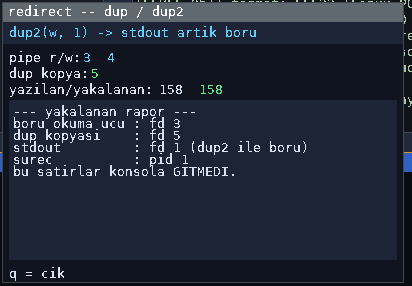

`redirect` bunu tek surecte gosterir:

```
pipe()            ->  (r=3, w=4)
dup(r)            ->  5            en kucuk bos numara
dup2(w, 1)                         ARTIK 1 = borunun yazma ucu
close(w)                           1 numara ayni ucu tutuyor
rapor_yaz()                        stdout'a yazar; boruyu BILMEZ
close(1)                           yonlendirme geri alinir
read(5, ...)                       yazilanlar burada
```

Iki dogrulama ayni ekranda duruyor:

* **158 yazildi, 158 yakalandi.** Rapor satirlarinin tamami boruya
  gitti, tek bayt kaybolmadi.
* **Seri konsolda o satirlarin hicbiri yok.** Yonlendirmeden onceki ve
  sonraki satirlar konsolda; aradakiler degil. Kanit, gorunmeyen seyde.

Okuma `dup`'in verdigi **5** numarasindan yapiliyor, orijinal `3`'ten
degil -- kopyanin ayni boruya baktiginin kaniti.

### 0/1/2 nasil yonlendirilebilir hale geldi

Cekirdek eskiden once **numaraya** bakiyordu: `write` cagrisi 1 ya da 2
gorunce dogrudan konsola yaziyor, tabloya hic bakmiyordu. Bu siralamayla
`dup2(w, 1)` gorunmez olurdu -- yuva dolar, kimse okumaz.

Sira tersine cevrildi: **once tablo, sonra varsayilan.**

| 0/1/2'nin yuvasi | davranis |
|---|---|
| bos | varsayilan: stdin klavye kuyrugu, stdout/stderr konsol |
| dolu | yuvadaki nesne (dosya ya da boru ucu) |

Boylece varsayilan davranis bir **ozel durum** degil, "yonlendirme
yoksa" halidir. `close(1)` yuvayi bosaltir ve konsol geri gelir; POSIX'te
de `close` yonlendirmeyi kaldirmanin yoludur.

### Bilerek yapilmayan: paylasilan konum

Gercek POSIX'te `dup` **ayni acik dosya tanimini** paylastirir: iki
tanimlayici tek bir konumu kullanir, birinden okumak digerinin konumunu
da ilerletir. TCMK'de tanimlayici degerle kopyalandigi icin konumlar
kopyadan sonra ayrisir. Yonlendirme bundan etkilenmez (orada onemli olan
nesnenin kendisidir); fark yalnizca ayni dosyayi iki tanimlayiciyla
okuyup "ikisi ayni yerden devam etsin" beklendiginde gorunur.

Sayaclar ise dogru tutuluyor: her kopya bir sahiptir, `pipes` komutu uc
kez ust uste `run redirect` sonrasinda da `acik boru: 0 / 4` gosteriyor.

## `poll`: "hangisi hazir?"

Buraya kadar cevap **yoklamaktan** geciyordu: uygulama her tanimlayiciyi
sirayla `read` ediyor, sifir donerse uyuyordu. Iki sorunu vardi -- veri
gelse bile uyku suresi kadar gecikiyor, ve ikinci bir kaynak (klavye)
eklendiginde ikisini sirayla yoklamaktan baska yol kalmiyordu.

`poll` soruyu tersine cevirir: **sen bekle, hangisi hazir olursa beni
dondur.**

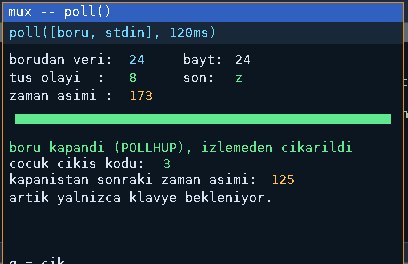

`mux` bir boru ile klavyeyi tek cagriyla bekler:

```
poll([ boru: POLLIN, stdin: POLLIN ], 120 ms)
```

Cocuk 24 bayti 300 ms araliklarla yaziyor, yani ebeveyn cogu turda zaman
asimina dusuyor -- ekrandaki uc sayac tam olarak `poll`'un dondugu uc
nedeni sayiyor. Iki mimaride de ayni sonuc: **24 veri, 8 tus, 173 zaman
asimi**, cocuk cikis kodu 3.

Hazirlik kurallari tanimlayici turune gore:

| tanimlayici | hazir sayilma kosulu |
|---|---|
| dosya | her zaman (yerel dosya okumasi beklemez) |
| boru okuma ucu | bekleyen bayt varsa `POLLIN`; yazan uc bittiyse `POLLHUP` |
| boru yazma ucu | tamponda yer varsa `POLLOUT`; okuyan kalmadiysa `POLLERR` |
| yonlendirilmemis stdin | pencerede bekleyen tus varsa `POLLIN` |
| yonlendirilmemis stdout/stderr | her zaman `POLLOUT` (konsol) |

Tus kuyruguna **bakilir, tuketilmez**. `poll` tusu yeseydi arkasindan
gelen `read(0, ...)` bos donerdi.

`POLLHUP` kalicidir: boru kapandiktan sonra izlemede birakilirsa `poll`
bir daha hic beklemez. `mux` bu yuzden kapanan boruyu `fd = -1` yaparak
izlemeden cikariyor -- POSIX'in negatif tanimlayiciyi yok saymasi tam da
bunun icin. Ekrandaki "kapanistan sonraki zaman asimi: 125" sayaci bunun
kaniti: cikarildiktan sonra `poll` yeniden **beklemeye** basliyor.

### Olcumun eledigi ilk hal: `yield` bir bekleme degil

Ilk uygulamada bekleme dongusu `yield_now()` cagiriyordu: "hazir yoksa
sirayi birak, tekrar bak". `ps` tablosunda masum gorunuyordu --
`poll` yapan surecin `cpu` sutunu **1 tik**ti, cunku gorev her turda
hemen devredip hemen geri geliyor ve tik sayimina neredeyse hic
yakalanmiyordu.

Baglam degisimi sayaci gercegi soyledi:

| durum | baglam degisimi / saniye |
|---|---|
| `mux` yokken (taban) | 316 |
| `mux` `yield` ile bekliyor | **104.000** |
| `mux` bir tik uyuyarak bekliyor | 313 |

Tek bir bekleyen surec sistemi 330 katina cikariyordu. "Sifir CPU"
olcusu yaniltmisti: is surecin kendisinde degil, **zamanlayicida**
yaniyordu.

Dongu artik `sleep_ticks(1)` cagiriyor. Bedeli en fazla bir tiklik
(10 ms) gecikme, ki `poll`'un zaman asimi cozunurlugu zaten PIT tiki
oldugu icin yeni bir sinirlama getirmiyor. Islevsel sonuc degismedi:
ayni test aynen 24 veri / 8 tus / 173 zaman asimi verdi.

Dogrusu bir **bekleme kuyrugu** olurdu -- her nesnenin (boru, tus
kuyrugu) uyandirma listesi tutmasi ve veri gelince bekleyeni `Ready`
yapmasi. O zaman gecikme sifira inerdi; tik cozunurlugunun 10 ms oldugu
bir sistemde deger etmedi.

## Gorev yuvasi geri kazanimi ve `waitpid(-1)`

Gorev tablosu sekiz yuvalidir (`MAX_TASKS`). Uzun sure `spawn` yalnizca
tablonun **sonuna ekliyordu**: sonlanan bir gorevin yuvasi hicbir zaman
geri alinmiyordu. Yani sistem acilistan itibaren toplam sekiz gorev
baslatabiliyor, sonra hicbir uygulama acilamiyordu -- kalici bir sinir
degil, sizan bir kaynak.

Artik yuva geri veriliyor. Yigin bellegi **birakilmiyor**, yuvada
saklaniyor ve bir sonraki `spawn` onu yeniden kullaniyor: `kmalloc` bir
bump ayiricidir ve `free` sunmaz, yani her geri kazanimda yeniden
ayirmak gorev basina 32 KiB'lik sessiz bir sizinti olurdu.

Ne zaman geri verilecegi, gorevi kimin bekledigine bagli:

| gorev turu | cikista |
|---|---|
| kabuktan baslatilan uygulama | yuva **hemen** geri verilir |
| `fork` cocugu | **zombi** kalir, `waitpid` toplayana kadar |
| ebeveyni olmus zombi | `reap_orphans` temizler |

Ayrim bilincli: cikis kodunu toplayacak bir ebeveyn yalnizca `fork`
yolunda vardir. Kabuktan baslatilan uygulamalari kimse beklemez, onlari
zombi tutmak tabloyu birkac uygulama sonra doldururdu.

### `waitpid(-1)`

POSIX'in en cok kullanilan bicimi: "hangi cocuk once biterse onu topla".
Bir kabuk cocuklarinin hangisinin once bitecegini bilmez.

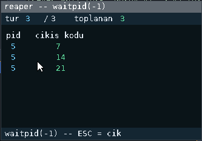

`reaper` sirayla uc cocuk uretir ve her birini `waitpid(-1)` ile toplar.
Ekrandaki `pid` sutununun kaniti tam da burada: **ucu de ayni yuvada**
(#5) dogdu -- yuva geri kazanilmasaydi ucuncusu icin yer kalmazdi.

Olcum, iki mimaride de: `reaper`in uc cocugundan sonra ardi ardina **on**
uygulama daha baslatildi ve hepsi yuklendi (`/bin/hello`, 11 yukleme --
biri acilistaki dogrulama). Duzeltmeden once bes canli gorev varken bu
sayi sifir olurdu.

## Sinyaller: cekirdek uygulamanin akisini kesip isleyicisini cagiriyor

Butun diger sistem cagrilarinda **kullanici cagirir, cekirdek doner**.
Sinyalde bu ters doner: cekirdek cagirir, kullanici doner. Bir surece
sinyal geldiginde cekirdek onun Ring 3 baglamini kenara koyar, yigininin
ustune sahte bir cagri cercevesi kurar ve donusu isleyicinin adresine
cevirir. Surec hicbir sey cagirmadigi halde kendini isleyicinin icinde
bulur.

```
tcmk> run sigdemo
tcmk> signal 4 10        # SIGUSR1
tcmk> signal 4 12        # SIGUSR2
tcmk> signal 4 15        # SIGTERM -- isleyici kuruldugu icin uygulama YASAR
tcmk> kill 4             # SIGKILL -- yakalanamaz, aninda sonlanir
```

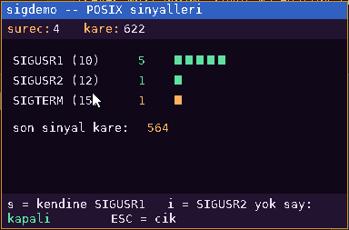

Ekrandaki "kare" sayaci sinyalin nerede yakalandigini gosterir: sayac
kesintisiz artmaya devam eder, cunku isleyici dondugunde surec **tam
kaldigi komuttan** devam eder. "son sinyal kare" alani ise isleyicinin
cizim dongusunun ortasinda calistigini kanitlar.

### Isleyiciden nasil geri donuluyor

Isleyici siradan bir fonksiyondur; bitince `ret` yapar. Ama donulecek bir
"cagiran" yoktur -- cagri gercek bir cagri degildi. Cozum, cekirdegin
yigina bir donus adresi koymasi: kullanici kutuphanesindeki kucuk bir
**tramplen**. Tek isi `sigreturn` cagirmaktir; cekirdek de saklanan
baglami geri koyar.

```asm
__tcmk_sigreturn:            ; i386
    mov eax, 119             ; sys_sigreturn
    int 0x80
```

Tramplenin kullanici tarafinda olmasi bilincli: aksi halde cekirdegin
surecin adres uzayina **kod yazmasi** gerekirdi. Gercek i386 Linux'ta da
cozum aynidir (`sigaction.sa_restorer`).

Cerceve duzeni mimariye gore degisir ve iki incelik tasir:

| | i386 | x86_64 |
|---|---|---|
| sinyal no | `[esp+4]` (cdecl) | `RDI` (SysV) |
| donus adresi | `[esp]` | `[rsp]` |
| hizalama | `esp % 16 == 12` | `rsp % 16 == 8` |
| kirmizi bolge | yok | `rsp`'nin 128 bayt alti **atlanir** |

Kirmizi bolge atlanmazsa, cerceve o anda calisan yaprak fonksiyonun
yerel degiskenlerinin ustune kurulur ve surec sinyalden sonra bozuk
verilerle devam eder -- teshisi cok zor bir hata. (Linux de ayni 128 bayti
atlar.)

### Teslim ne zaman olur

Sinyal aninda calismaz; bekleyenler maskesine yazilir ve surec bir
sonraki sefer **cekirdekten Ring 3'e donerken** teslim edilir -- yani
teslim noktasi bir syscall donusudur (`level0b2::dispatcher`). TCMK
uygulamalari her karede `win_flush` cagirdigi icin gecikme bir kareden
kucuktur.

`SIGKILL` bu kuralin disindadir: beklemeye alinmaz, gonderen taraf hedefi
dogrudan sonlandirir. Beklemeye alinsaydi hicbir syscall yapmayan bir
surec (`spin` gibi) oldurulemezdi -- yani "her seyi durdurabilen komut"
olma ozelligi kaybolurdu.

### `fork` ve `execve` ile iliskisi

* **`fork`**: isleyiciler cocuga kopyalanir (POSIX), bekleyen sinyaller
  kopyalanmaz -- cocuk temiz baslar.
* **`execve`**: butun isleyiciler sifirlanir. Kayitli adresler artik var
  olmayan bir programa aittir; devralinsalardi surec kendi kodunun
  ortasina dallanirdi.

Kabuk tarafinda `sigs` komutu hangi gorevin hangi sinyalleri yakaladigini
ve bekleyenleri listeler.

## Standart girdi: `read(0, ...)` gercekten klavye

Bu ana kadar TCMK uygulamalari tuslari **TCMK'ye ozgu** bir cagriyla
(`win_poll_key`, 0x502) aliyordu. Artik ayni tuslar POSIX'in kendi
yolundan, `read(0, ...)` ile de okunabiliyor.

Baglanti sudur: her pencerenin bir **sahibi** (gorev kimligi) vardir;
`read(FD_STDIN)` cagiran gorevin ilk penceresini bulur
(`wm::first_window_of`) ve o pencerenin tus kuyrugunu bosaltir. Yani
"standart girdi" = odakli pencereye giden tuslar. Once bu cagri kosulsuz
`Ok(0)` donuyordu ("stdin henuz bir cihaza bagli degil"); simdi bagli.

`echo2` bunu gosterir: pencere acmak disinda **hicbir** TCMK cagrisi
kullanmaz, girdiyi `read(0, ...)`, ciktiyi `write(1, ...)` ile yapar --
yani yazilan metin hem pencerede hem seri konsolda gorunur.

```
tcmk> run echo2
tcmk> focus 4          # odagi kabuktan uygulamaya ver
merhaba stdin          # -> pencerede goruntulenir
                       # -> seri gunlukte de "merhaba stdin" cikar
```

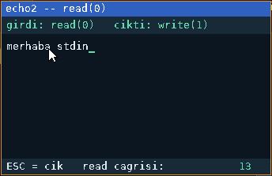

Sag alttaki sayac gerceklesen `read` cagrisi sayisidir: 13 karakter, 13
cagri -- kuyruk her karede bosaltildigi icin cagri basina bir tus dusuyor.

Ikisi de aynen x86_64'te de calisir; `sys.rs` cagri numarasini ve
mekanizmasini (`int 0x80` / `syscall`) `cfg` ile ayirir, geri kalan kod
tektir.

### Bloke etmeyen `read`

Gercek bir terminalde `read(0)` veri gelene kadar bekler. Burada beklemez:
o an ne varsa doner, yoksa `0`. Neden borularla ayni: bloke olan bir surec
kendi penceresini de dondurur. Terminal disiplini de yok -- satir tamponu,
otomatik yankilama, `termios` yok; yankiyi uygulama kendi yapar (`echo2`
okudugunu hem ekrana cizer hem `write(1)` ile geri yazar).

### Surec basina program break

Bu isle birlikte `brk` de surec basina tasindi. Onceden tek bir global
`PROGRAM_BREAK` vardi: iki surec ayni anda `brk` cagirdiginda birinin
yigin ustu otekinin heap tabanini kaydiriyordu -- fd tablosunda yasanan
hatanin tipki aynisi. Artik gorev basina bir `Break { current, start,
limit }` var ve `fork` bunu cocuga **kopyalar** (adres uzayi zaten
kopyalandigi icin degerler oldugu gibi gecerlidir).

## Notes: yaz, kaydet, kapat, ac

Ring 3 uygulamasi metnini kendi ciziyor, POSIX `open(O_CREAT)`/`write` ile
kalici dosya sistemine yaziyor ve acilista geri okuyor.

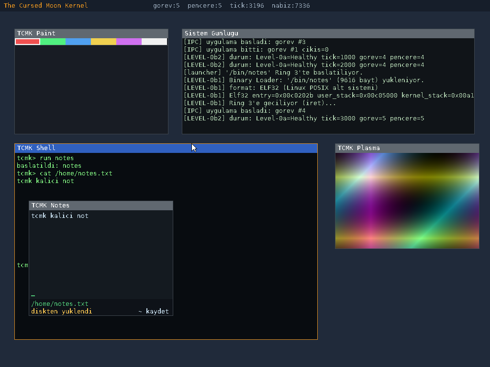

Ekran goruntusu **ikinci acilistan**: makine tamamen kapatildi, yeniden
acildiginda Notes dosyayi diskten yukledi ("diskten yuklendi") ve kabuktaki
`cat /home/notes.txt` ayni metni gosteriyor.

Bu uygulama TCMK'nin parcalarini tek yerde birlestiriyor:

| Parca | Nerede |
|---|---|
| Pencere + **kendi cizdigi metin** | `tcmk::gui::Window::text/glyph` |
| Klavye olaylari | `win_poll_key` (0x504) |
| Kalici yazma | `File::create` -> `open(O_CREAT)` + `write` |
| Uyku | `win.frame(30)` -> `sleep` (0x508) |

**Metin cizimi bilerek uygulamada.** Cekirdekte bir "metin ciz" syscall'i
olsaydi her karakter icin Ring 0'a gecilirdi. Font cekirdekle ayni
(`tools/sync_font.py` kopyalar), yani kabuktaki yaziyla uygulama yazisi
ayni gorunur.

**Dosyaya yazma yolu.** `kernel_api::write` artik stdout disindaki
tanimlayicilar icin VFS'e gidiyor; `open` POSIX `O_CREAT` bayragini
tanidigi icin uygulama olmayan bir dosyayi kendisi olusturabiliyor.
Yazma yalnizca TCMKFS dugumlerinde calisir -- RAMFS dosyalarinin icerigi
cekirdek imajinin `.rodata`'sindadir.

## Oncelik: `nice` ve donem butcesi

Zamanlama uzun sure **onceliksizdi**: preemption vardi ama butun gorevler
esitti. Artik POSIX `nice` degeri var (-20 en yuksek, 19 en dusuk) ve
gorevin CPU payini belirliyor.

```
tcmk> run race
tcmk> run race
tcmk> nice 4 -20
tcmk> nice 5 19
```

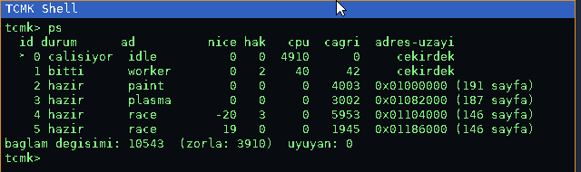

`race` ayni programin iki kopyasidir ve **CPU'ya baglidir** (her turda
sabit miktarda hesap yapar). Esit oncelikle kosarken tur sayaclari ayni
hizda artar; oncelikler ayrilinca ayrisir.

Olcum, uygulamanin kendi sayacindan degil, **cekirdegin gorev basina
saydigi tiklerden** (`ps`'in `cpu` sutunu) alinir -- uygulama sayaci
uyku ve G/C ile bozulabilir, tik sayaci bozulmaz:

| | i386 | x86_64 |
|---|---|---|
| nice -20 | 1072 tik | 1817 tik |
| nice 19 | 536 tik | 948 tik |
| oran | **2.0 : 1** | **1.9 : 1** |

Butce orani nominalde 8:1'dir. Olculenin altinda kalmasinin iki sebebi
var: hak hem tik hem tur basina harcanir (ince taneli isler turlarini
tiklerinden once tuketir), ve masaustu gorevi de ayni havuzdan pay alir
-- `ps`'te onun `cpu` sutunu digerlerininkiyle yarisir.

### Nasil calisiyor

Her gorev donem basinda `nice` degerine gore bir **hak** (tik cinsinden
butce) alir:

```
nice -20..-10 -> 8 tik      nice 0..4  -> 2 tik  (varsayilan)
nice  -9..-1  -> 4 tik      nice 5..19 -> 1 tik
```

Hak iki yerde harcanir: her zamanlayici tikinde **ve** her tur
degisiminde. Hakki biten gorev, donem yenilenene kadar secilmez; donem,
"hakki kalan calistirilabilir gorev yok" aninda yenilenir. En dusuk
oncelik bile en az bir tik aldigi icin hicbir gorev tamamen ac kalmaz.

Kabuktaki `ps` uc yeni sutun gosterir: `nice`, `hak` (donem icinde kalan
butce) ve `cpu` (gorevin CPU'da gecirdigi toplam tik).

### Olcumun duzelttigi iki yanlis

Tasarimin ilk iki hali **calismadi**, ve ikisini de ancak olcum
gosterdi -- kod okuyarak degil.

**1. "Oncelik = daha uzun zaman dilimi" yetmiyor.** Ilk surumde `nice`
yalnizca dilim uzunlugunu belirliyordu. Sonuc: -20 ve 19 ile kosan iki
surecin sayaclari **tipatip ayni** artti (+385 / +386). Sebep, GUI
uygulamalarinin her karede `win_flush` ile CPU'yu **gonullu** birakmasi:
dilimlerini hicbir zaman doldurmuyorlar, yani dilim uzunlugu hicbir sey
degistirmiyor. Dilim ancak zorla kesilen bir gorev icin anlamlidir.
Cozum, hakki tur basina da harcamak oldu -- yani oncelik "ne kadar uzun
kostugu"nu degil "kac kez secildigi"ni belirliyor.

**2. Donem kosulu kosan gorevi saymiyordu.** Ikinci surumde hak
muhasebesi dogru calisiyordu (`ps`'te hak sutunu 7'ye karsi 0
gosteriyordu) ama iki surec hala ayni hizda kosuyordu. Sebep: "hakki
kalan gorev var mi" denetimi yalnizca `Ready` durumundakilere bakiyordu
-- oysa `pick_next` cagrildigi anda kosan gorevin durumu `Running`'dir.
Iki gorevli bir sistemde biri kosuyor, oteki hakkini bitirmisse denetim
"kimsede hak kalmadi" der ve donem **her turda** yenilenirdi. Hakki biten
gorev aninda yeniden hak kazandigi icin oncelik hicbir sey ifade etmezdi.

### Masaustu artik ayri bir gorev

Bir donem 0 numarali gorev (idle) ayni zamanda **masaustu dongusuydu**:
girdiyi isliyor, pencereleri birlestiriyor, State Monitor'u besliyordu.
Olcum bunun bedelini gosterdi -- zamanlayici tiklerinin ~%95'i oraya
yaziliyordu ve zamanlayici muhasebesinin disinda kaldigi icin kimse onu
sinirlayamiyordu.

Artik masaustu kendi gorevindedir ve **normal kurallara tabidir**:
`nice`, donem hakki, preemption. 0 numaranin tek isi bos beklemek kaldi;
`pick_next` onu yalnizca calistirilabilir baska gorev yokken secer, o da
`hlt` ile CPU'yu tamamen birakir. `ps`'te idle'in `cpu` sutununun 2'de
kalmasi bunun olcusudur -- yani CPU bosa gitmiyor.

Bu ayrimin iki yan etkisi de var: kabuk artik masaustu gorevinde kostugu
icin disk komutlari **kesmeyle bekleyebiliyor** (bkz. IRQ14), ve
masaustunun gercek CPU maliyeti `ps`'te gorunur hale geldi.

#### Yol boyunca cikan uc hata

**1. Baglam degisimi bolunemez degildi.** Masaustu ayri goreve tasinir
tasinmaz sistem `#DB` (debug) istisnasiyla coktu; hata adresi her
seferinde `arch_context_switch` icindeki `popfl`'in bir sonraki
komutuydu. Yani takas edilen baglamin EFLAGS'i bozuktu ve icinde TF
(single-step) biti vardi.

Sebep: `yield_now` yalnizca **secimi** kesmelere karsi koruyordu, takasin
kendisi acikti. O aralikta gelen bir zamanlayici kesmesi
`preempt_from_timer` uzerinden `yield_now`'a **ic ice** girebiliyordu:
`CURRENT` yeni goreve yazilmis ama yigin henuz degismemis oluyor, bu
yuzden ic cagri ESKI yigini YENI gorevin yuvasina kaydediyordu. Cozum,
secim ve takasi tek bir kesmesiz bolgeye almak. Bu hata masaustu
ayrimindan onceki kodda da vardi; oradaki yield sikligi onu gun yuzune
cikarmamisti.

**2. Kosan gorev hicbir zaman aday olamiyordu.** `pick_next` yalnizca
`Ready` durumundakileri tarar, oysa cagri aninda mevcut gorevin durumu
`Running`'dir. Baska aday yoksa sistem, kosmaya hazir bir gorev VARKEN
idle'a dusuyordu -- ve idle artik `hlt` ettigi icin CPU gercekten bosa
gidiyordu (tiklerin %60'i idle'a yazildi). Duzeltme: baska aday yoksa
hakki duran mevcut gorev surdurulur.

**3. Kullanilmayan hak devrediyordu.** Yukaridaki duzeltmenin ilk hali
"hakki varsa hep devam etsin" diyordu; bu sefer yuksek oncelikli gorev
sirayi hic birakmadi ve oran 8:1 yerine **163:1** oldu (1305 tike karsi
8 tik). Donem kapandiginda kullanilmamis hak artik **silinir**.

#### Denenip geri alinan

Idle dongusunde her turda kosulsuz `yield` denendi ve sistemi kilitledi:
uygulamalar da her karede biraktigi icin saniyede binlerce baglam
degisimi olusuyor, is yapmaya zaman kalmiyordu (olcum: 151 zamanlayici
tikine karsilik 815 bin baglam degisimi). Baglam degisimi ucuz degildir
-- CR3 dahil butun baglam yenilenir. Dogru cozum, yukaridaki gibi,
masaustunu ayri bir goreve tasiyip idle'i gercekten bos birakmakti.

## Preemptive zamanlama

Zamanlayici kesmesi artik gorevi **kendi istegi olmadan** birakiyor.

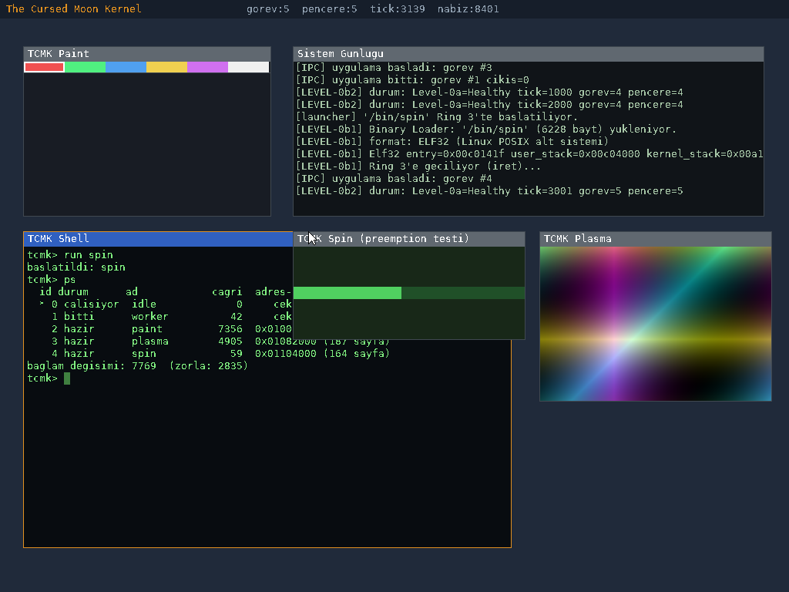

`run spin` -- hicbir sistem cagrisi yapmayan saf hesap dongusu
(`userland-rs/src/bin/spin.rs`). Ekran goruntusunde spin kosarken:

```
tcmk> ps
   id durum      ad            cagri  adres-uzayi
 *  0 calisiyor  idle              0     cekirdek
    2 hazir      paint          7356  0x01000000 (128 sayfa)
    3 hazir      plasma         4905  0x01082000 (187 sayfa)
    4 hazir      spin             59  0x01104000 (164 sayfa)
baglam degisimi: 7769  (zorla: 2835)
```

spin yalnizca **59** cagri yapmis (plasma 4905) -- yani neredeyse tum
zamanini cekirdegi hic cagirmadan geciriyor. Buna ragmen kabuk `ps`'e
yanit verdi ve Plasma cizmeye devam etti. Isbirlikci modelde masaustu bu
dongu boyunca donardi; Yuk Dengeleyici de caresizdi, cunku kisitlayacak
bir cagri yoktu.

### Nasil calisiyor

Yapisal olarak syscall yolundan farki yok: orada da baglam degisimi kesme
yigininda (Ring 3 icin `TSS.esp0`) yapiliyor ve donuste ayni noktaya
donulup `iret` calisiyor. Zamanlayici kesmesi de aynisini yapiyor --
`pit_handler` once EOI gonderiyor (baglam degisiminden **once**, yoksa PIC
hala hizmet bekler ve bir daha IRQ0 gelmez), sonra
`scheduler::preempt_from_timer()`.

Kesme kapisi IF=0 ile girildigi icin ic ice preemption olmaz;
`without_interrupts` bolgeleri de dogal olarak korunur.

### Uyku: `TaskState::Blocked`

Preemption CPU'yu adil bolusturur ama uygulamalarin **istemedigi** zamani
geri vermez: sadece `flush` cagiran bir GUI dongusu sirasi geldiginde
hemen bir kare daha cizer, yani ekranin yenilenme hizindan bagimsiz olarak
CPU'yu doldurur.

`sleep` (0x508) bunu kapatir. Uyuyan gorev `pick_next` tarafindan **hic
secilmez**; suresi dolunca `wake_expired` onu yeniden hazir yapar.
Uyandirmayi secim aninda yapmak ayri bir zamanlayici kuyruguna gerek
birakmiyor -- gorev sayisi kucuk oldugu icin dogrusal tarama kuyruk
yonetiminden ucuz.

Userland tarafinda tek satir:

```rust
win.frame(30);   // flush + 30 ms uyku
```

```
tcmk> ps
   id durum      ad            cagri  adres-uzayi
    2 uyuyor     paint          3635  0x01000000 (191 sayfa)
    3 hazir      plasma         2018  0x01082000 (187 sayfa)
    4 uyuyor     plasma          405  0x01104000 (187 sayfa)
    5 uyuyor     spin             81  0x01186000 (164 sayfa)
baglam degisimi: 6056  (zorla: 2943)  uyuyan: 3
```

Idle gorevi uyutulmaz: masaustu dongusudur ve uyanacak baska gorev
kalmadiginda sistemi ilerletecek tek akistir. `sleep_ticks`'in dongusu de
bu garantiye dayanir -- idle her zaman hazir oldugu icin `yield_now`
mutlaka baska bir goreve gecer.

### Bolunemez isler: aygit kilidi

Kesmeleri kapatmak yerine yalnizca **baglam degisimini** erteleyen bir
sayac var (`preempt_disable`). Bir donem tek kullanicisi diskti: bir ATA
komutu (surucu secimi -> LBA -> komut -> veri) bir butundur ve ortasinda
baska bir gorev ikinci bir komut baslatirsa denetleyicinin durumu bozulur.

O kullanim **kaldirildi**. "Kimse calismasin" demek, korunmasi gereken sey
yalnizca *bir aygit* iken fazla genis bir cozumdu -- ve kesmeyle beklemeyi
bastan imkansiz kiliyordu. Artik surucu kendi **aygit kilidini** tutuyor
(`DeviceLock`): yalnizca ATA'ya dokunmak yasak, baska gorevler serbestce
kosuyor. Kilit `Drop` ile birakiliyor, yani `?` ile erken donen her hata
yolu da onu geri veriyor.

## Surec basina adres uzayi

Her Ring 3 sureci artik **kendi sayfa tablosunu** alir. Ayni ikilinin uc
kopyasi ayni anda, hepsi `0x00C00000`'de, birbirine dokunmadan calisiyor:

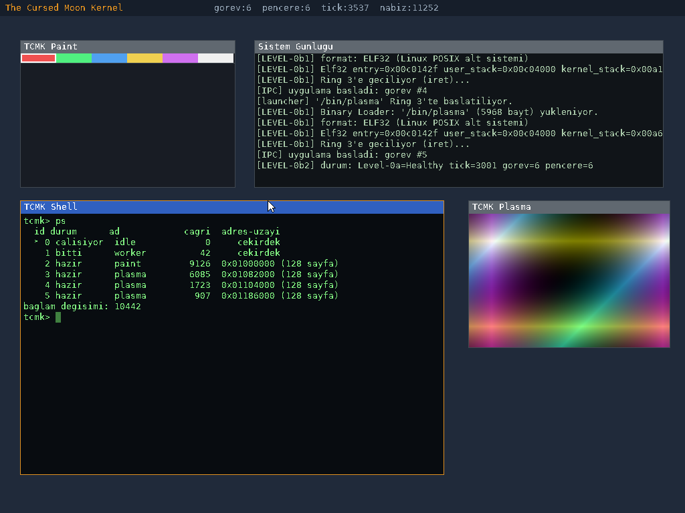

```
tcmk> ps
  id durum      ad            cagri  adres-uzayi
 * 0 calisiyor  idle              0     cekirdek
   1 bitti      worker           42     cekirdek
   2 hazir      paint          9126  0x01000000 (128 sayfa)
   3 hazir      plasma         6085  0x01082000 (128 sayfa)
   4 hazir      plasma         1723  0x01104000 (128 sayfa)
   5 hazir      plasma          907  0x01186000 (128 sayfa)
```

### Neden ucuz

Kullanici bolgesi (`0x00C00000`, 2 MiB) tam olarak **tek bir PDE'nin**
(indeks 3) icine duser. Her surec yalnizca kendi PDE 3 sayfa tablosunu
alir; cekirdek, heap ve MBR/MMIO eslemeleri tum adres uzaylarinda
**paylasilir**. Baglam degisiminde tek yapilan CR3'u degistirmek.

| Katman | Dosya | Islev |
|---|---|---|
| Cerceve ayirici | `core/frames.rs` | 4 KiB'lik cerceveler uzerinde bit haritasi, 16 MiB havuz |
| Adres uzayi | `core/mmu_i386.rs` | `create_user_space` / `map_user_range` / `switch_to` / `destroy_user_space` |
| Zamanlayici | `core/scheduler.rs` | `Task.address_space`, baglam degisiminde CR3 |
| Surec | `level0b1/process.rs` | yuklemeden **once** uzay kurar, cikista cerceveleri havuza verir |

### Ne degisti

**Slot modeli bitti.** Onceden her uygulama derleme aninda farkli bir
taban adrese linkleniyordu (`--image-base=0x00C40000` gibi), cunku hepsi
ayni adres uzayini paylasiyordu. Iki bedeli vardi: ayni ikilinin iki
kopyasi birbirinin **kodunu eziyordu** ve her uygulama digerinin
bellegini **okuyabiliyordu**. Artik hepsi `0x00C00000`'e linkleniyor.

**Kullanici bolgesi cekirdek uzayinda hic yok.** Acilis testi bunu
gosteriyor:

```
[worker] izolasyon: user@0xc00000=false kernel@0x100000=false heap@0x800000=false
```

Uc deger de `false`: kullanici bolgesi yalnizca bir surecin adres
uzayinda **vardir**. Onceki modelde ilk deger `true` idi -- bolge tum
sistemde acikti.

**Cerceveler geri veriliyor.** `kmalloc` bir bump ayiricidir (serbest
birakma yok) ve cekirdek yapilari icin dogru secim. Surecler ise gelip
gidiyor; bu yuzden ayri bir cerceve ayiricisi eklendi. `mem` sayaci
tutuyor: dort surec = 520 cerceve (surec basina 128 veri + 1 sayfa dizini
+ 1 sayfa tablosu).

### Surec olurken

Bir surec bittiginde (normal cikis ya da `kill`) uc sey birakilir:
adres uzayi, cerceveleri ve **pencereleri**. Pencere kapatilmazsa
ekranda artik kimsenin cizmedigi olu bir dikdortgen kalir ve tamponu
bosuna tutulur.

```
tcmk> mem                       tcmk> kill 4
cerceve havuzu: 520 / 4096      tcmk> kill 5
                                tcmk> mem
                                cerceve havuzu: 260 / 4096 (tepe 520)
```

Iki surec = 260 cerceve, birebir geri dondu. Pencere yuvalari da serbest
kalir; `create` once bos yuva arar, aksi halde uygulamalar acilip
kapandikca sekiz pencerelik tablo dolardi.

### Sinirlar

- Surec basina **512 KiB** ayrilir (`USER_MAP_SIZE`), tum 2 MiB degil.
  Bu bir *ayirma*dir, esleme degil: cerceveler ilk dokunusta veriliyor
  (bkz. "Talep uzerine sayfalama"). Pencerenin kendisi hala sabit --
  `mmap` ile buyutulemez.
- Pencere tamponlari da **surece ozeldir**: WM tamponu cekirdek
  heap'inden ayirir ama Ring 3'e yalnizca **sahibinin** adres uzayinda,
  `0x00D00000`'den itibaren eslenir. Cekirdek ayni bellegi identity
  adresinden gormeye devam eder -- kompozitor oradan okur. Eskiden tampon
  identity haritasinda aciliyordu, yani her uygulama her pencerenin
  piksellerini okuyabiliyordu.

  ```
  tcmk> win
    id  boyut     sahip     tampon (surecin adresi)
     0  632x390   cekirdek  (kernel tamponu)
     2  320x200   paint     0x00d00000
     3  300x200   plasma    0x00d00000
  ```

  Ayni adres, farkli adres uzaylari -- yani farkli fiziksel bellek.
  `win_buffer` cagrisi sahiplik denetimi de yapar.
- x86_64 portu **tek adres uzayinda** kaldi; dort seviyeli tablo + 2 MiB
  huge page bolunmesi ayni isi daha fazla muhasebeyle gerektiriyor.
  Ust katmanlar farki gormuyor: `create_user_space()` orada `None` doner
  ve cagiran paylasimli yola duser.

## Kendi onyukleyicisi: TCMK kendi kendini aciyor

Buraya kadar acilisi hep GRUB yapiyordu. Artik TCMK'nin **kendi iki asamali
onyukleyicisi** var (`boot/tcmkboot/`) ve `install` komutundan sonra disk
GRUB'a hic ugramadan aciliyor.

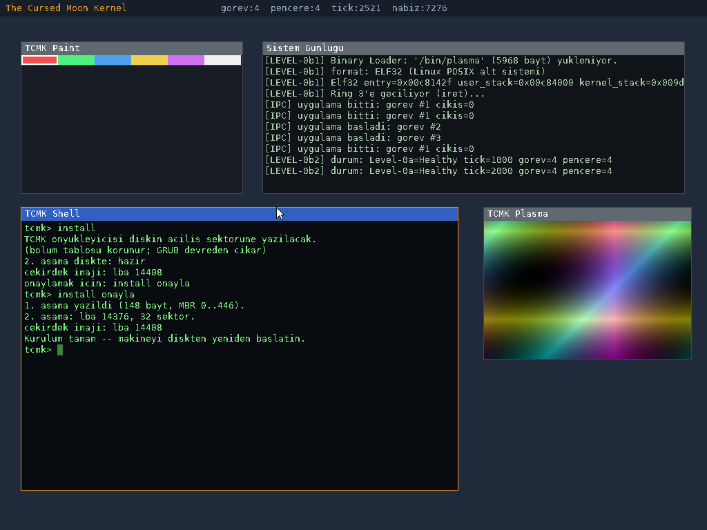

```
tcmk> install onayla
1. asama yazildi (148 bayt, MBR 0..446).
2. asama: lba 14376, 32 sektor.
cekirdek imaji: lba 14408
Kurulum tamam -- makineyi diskten yeniden baslatin.
```

Yeniden baslatildiginda ekrandaki her sey TCMK'nin kendi zinciriyle geliyor:

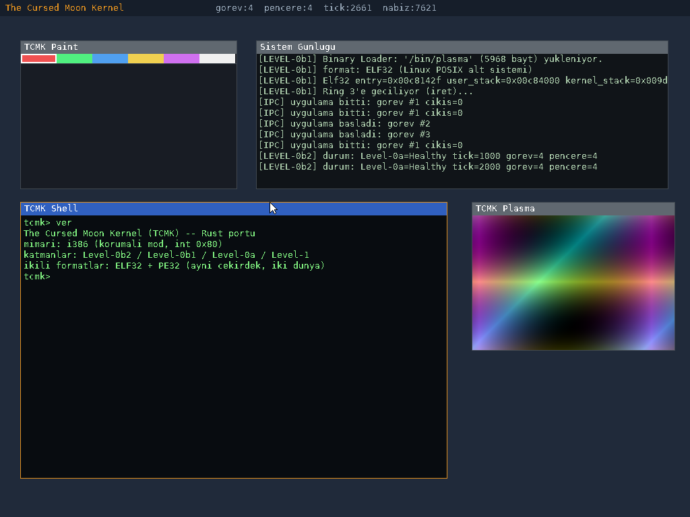

### Zincir

| Asama | Nerede | Ne yapiyor |
|---|---|---|
| BIOS | — | MBR'nin ilk 446 baytini 0x7C00'e yukler |
| **1. asama** | MBR (148 bayt) | int 0x13 AH=0x42 ile 2. asamayi 0x8000'e okur |
| **2. asama** | bolum + 40 (548 bayt) | VBE modu kurar, korumali moda gecer, cekirdegi ATA PIO ile 1 MiB'a okur, `.bss`'i sifirlar, Multiboot1 sozlesmesiyle atlar |
| Cekirdek | 0x100000 | degismedi -- GRUB'dan gelmis gibi acilir |

**Cekirdek tek satir degismedi.** 2. asama, cekirdegin bekledigi
Multiboot1 bilgi yapisini (flags bit 12 + framebuffer alanlari) kendisi
kuruyor; cekirdek acisindan GRUB ile TCMK onyukleyicisi ayirt edilemez.

### Tasarim kararlari

**Cekirdek diske "cozulmus" yaziliyor.** ELF'in PT_LOAD segmentleri
kurulum ortami uretilirken (`tools/make_disk.py`) bellekteki yerlerine gore
tek bir ardisik bloga yerlestiriliyor. Boylece 2. asamanin ELF
ayristirmasina ihtiyaci yok: "su LBA'dan su kadar sektoru 0x100000'e oku"
yetiyor.

**Diski BIOS yerine ATA PIO ile okuyoruz.** Cekirdek imaji 1 MiB'i asiyor;
BIOS int 0x13 ise gercek mod segment:ofset ile yalnizca ilk 1 MiB'a
yazabilir. Klasik cozum "unreal mode"dur; korumali moda bastan gecip diski
cekirdegin zaten kullandigi port dizisiyle okumak hem daha kisa hem daha
az kirilgan. Bedeli: 2. asama IDE disk varsayiyor.

**Onyukleyici alani dosya sisteminin icinde.** TCMKFS bolumunun 40..4095
sektorleri (2 MiB) bitmap'e hic girmez; ayirici oraya asla dosya yazamaz.
Boylece MBR'nin dort bolum yuvasindan biri daha harcanmiyor.

**Assembler eklenmedi.** Iki asama da `global_asm!` icinde `.code16` /
`.code32` ile yazildi, `rust-lld --oformat=binary` ile duz ikiliye
linklendi. Arac zinciri hala Rust + GRUB + QEMU.

### 16-bit assembly tuzaklari (yasananlar)

- LLVM'in Intel sozdiziminde **ciplak sembol bir bellek operandidir**:
  `mov si, msg` sembolun adresini degil, o adresteki **degeri** yukler.
  Adres icin `offset` sart. (Cekirdegin `_start`'indaki
  `mov esp, stack_top` tuzaginin aynisi.)
- `.code16` icinde `call`/`ret`/`retf` LLVM tarafindan **32-bit** uretilir
  (0x66 onekiyle) -- gercek mod yigininda 4 baytlik itme/cekme demektir ve
  donus adresi bozulur. `callw`/`retw` da kabul edilmiyor; cozum
  altyordamdan tamamen vazgecmek oldu.
- 16->32 bit uzak atlama ham baytla kodlandi (`66 EA <ofset32> <segment16>`).

### Neden GRUB yerine kendi zinciri

Alternatif FAT bolumu + `grub-install` yoluydu; ama GRUB'un 1. asamasi yine
**host araclariyla** yazilmak zorunda kalirdi -- yani "kurulum" aslinda
kurulum olmazdi. Kendi zinciri TCMK'yi gercekten kendi kendini kurar hale
getiriyor.

## Hata izolasyonu (kararlilik)

Tum 32 CPU istisna vektoru baglidir. Bir Ring 3 uygulamasi hata uretirse
**yalnizca o surec sonlandirilir**, sistem calismaya devam eder:

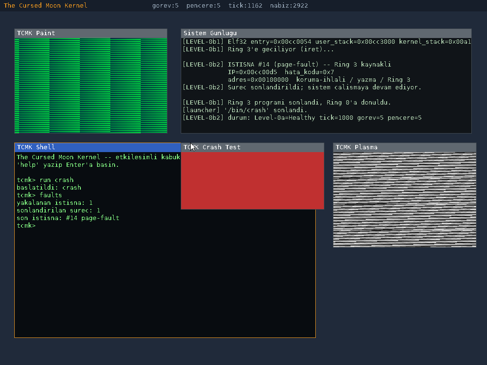

`run crash` ile baslatilan test uygulamasi kasten cekirdek adresine yazar:

```
[LEVEL-0b2] ISTISNA #14 (page-fault) -- Ring 3 kaynakli
            IP=0x00cc00d5  hata_kodu=0x7
            adres=0x00100000  koruma-ihlali / yazma / Ring 3
[LEVEL-0b2] Surec sonlandirildi; sistem calismaya devam ediyor.
```

Ekran goruntusunde goruldugu gibi Paint ve Plasma animasyonlarina devam
eder, kabuk yanit verir. **Bu degisiklikten once ayni hata triple fault
uretip tum makineyi yeniden baslatiyordu** -- cunku yalnizca vektor 0
bagliydi ve baglanmamis bir istisnanin gidecek yeri yoktu.

Hata Ring 0'dan gelirse bu bir cekirdek hatasidir; Level-0b2 Fallback
Interface devreye girip sistemi guvenli duruma alir.

Kabuktan `faults` komutu istatistikleri gosterir.

## Alfa'nin bilinen sinirlari

Durustce: bu **minimal grafiksel alfa**dir, masaustu ortami degil.

- **Gercek zamanli sinif yok.** `nice` ve donem butcesi var (yukari
  bkz.) ama son teslim tarihi garantisi veren bir sinif (`SCHED_FIFO`,
  `SCHED_DEADLINE` karsiligi) yok. Ayrica masaustu dongusu tiklerin
  cogunu tuketiyor, bu yuzden olculen oncelik orani nominalin altinda
  kaliyor.
- **PE ikililerinde `.reloc` zorunlu.** Yukleyici imaji her zaman
  kullanici bolgesinin basina koyar; `/fixed:no` ile linklenmemis, yani
  yeniden yerlesim tablosu tasimayan bir ikili yuklenemez. Windows'ta bu
  ikilinin tercih ettigi tabana bagli olarak calisabilirdi.
- **Diske takas (swap) yok.** `munmap` cerceveleri geri veriyor (yukari
  bkz.) ama kullanilan bir sayfayi diske atip yerini bosaltmak yok;
  havuz dolarsa `fork`/`execve` reddedilir. `mmap` penceresi de surec
  basina sabit 512 KiB ve yalnizca anonim -- dosya destekli esleme yok.
- **Boru okumasi bloke etmez** ve boru sayisi dorttur. `dup`/`dup2` ve
  `poll` var (yukari bkz.); `select` yok -- `poll` onu kapsadigi icin
  ayrica yazilmadi. `poll` bir bekleme kuyrugu degil, tik cozunurluklu
  bir dongudur: uyanma gecikmesi en fazla 10 ms. `dup` ayrica konumu
  paylastirmaz, kopyalar.
- **Standart girdi bloke etmez.** `read(0, ...)` sahibinin penceresinde
  biriken tuslari **o an ne varsa** dondurur, tus yoksa 0. Bloke eden bir
  `read` GUI dongusunu de dondururdu; terminal disiplini (satir tamponu,
  yankilama, `termios`) da yok -- yankiyi uygulama kendi yapar.
- **Sinyal teslimi syscall donusune baglidir.** Hicbir syscall yapmayan
  saf hesap dongusu sinyali gormez (`spin` boyle); `SIGKILL` ise
  isbirligi gerektirmedigi icin her zaman calisir. Ayrica maskeleme
  `siginfo`/`sigaction` bayraklari ve
  gercek-zamanli sinyaller yok; isleyici icinde ikinci bir sinyal teslim
  edilmez (ic ice cagri yok). Maskeleme (`sigprocmask`) ve `alarm` var
  (yukari bkz.), ama `sigaction` bayraklari (`SA_RESTART`, `SA_SIGINFO`)
  ve `sigsuspend`/`sigwait` yok.
- **Surec gruplari yok.** `waitpid` belirli bir cocugu ve `-1`
  ("herhangi bir cocuk") bicimlerini destekler, ama `pid < -1` (surec
  grubu) ve `WUNTRACED`/`WCONTINUED` yok.
- **Surec basina 512 KiB eslenir**, talep uzerine sayfalama yok.
- **TCMKFS'te toplam 64 inode var** (dizinler de sayilir), dosya basina
  160 KiB (yalnizca dogrudan blok isaretcileri) ve azami 8 seviye
  derinlik. Dizin agaci gercek ve `.`/`..` calisiyor (yukari bkz.), ama
  sembolik baglar, izinler ve sahiplik yok. Calisma dizini **kabuga**
  aittir **degil**: her surecin kendi dizini var (yukari bkz.).
- **DMA yok**: veri hala `in/out` ile kelime kelime tasinir. (Kabuk
  komutlari artik ayri bir gorevde kostugu icin kesmeyle bekliyor --
  yukari bkz.)

## Kapsam Disi (sonraki fazlar)

AArch64 portu (Faz 6), ext2/tmpfs ve genis POSIX (Faz 9-10),
musl/busybox + shell (Faz 11-12), framebuffer/virtio-net (Faz 13-14).

## Lisans

MIT -- bkz. [LICENSE](LICENSE). Kullanabilir, degistirebilir, kendi
projene katabilirsin; tek sart telif bildiriminin kopyalarda kalmasi.
